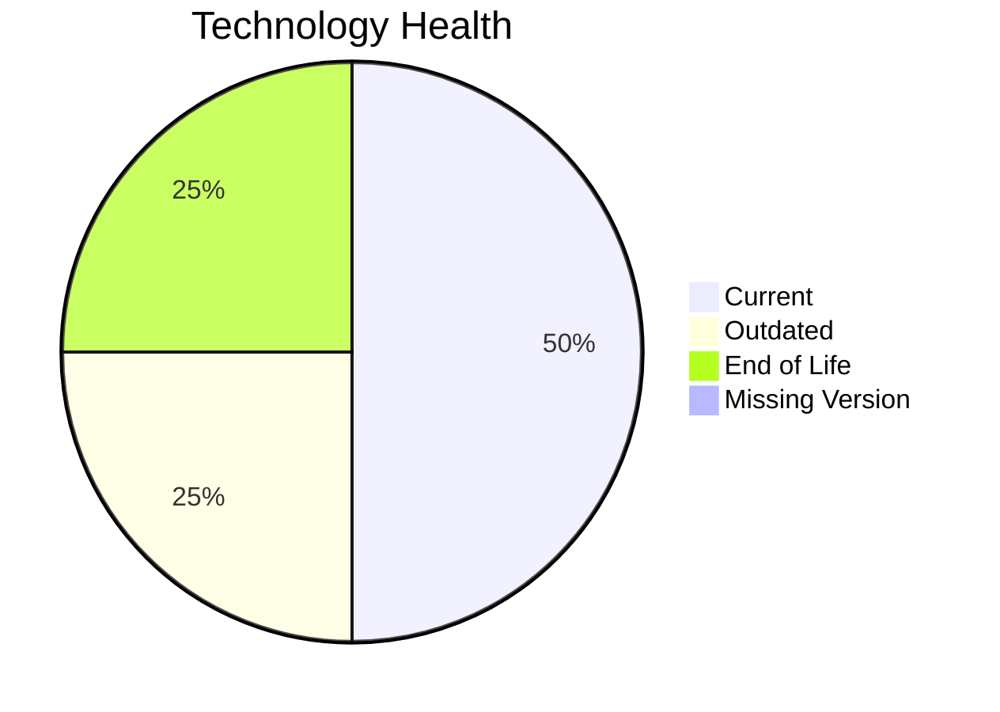

# Application Report: FleetApp-021

**ID:** app021
**Generated:** 2026-05-07

## Overview

| Attribute | Value |
|-----------|-------|
| Owner | N/A |
| Environment | On-Premise |
| Business Criticality | High |
| Users | 420 |
| Servers | 2 |

## Technology Stack

| Component | Technology | Version | Status |
|-----------|-----------|---------|--------|
| Operating System | Windows Server | 2022 | 🟢 CURRENT_VERSION |
| Database | Oracle Database | 11g | 🔴 EOL |
| Language | C++ | 17 | 🟡 OUTDATED |
| Framework | N/A | N/A | ⚪ NO_KNOWLEDGE |
| App Server | IIS | 10.0 | 🟢 CURRENT_VERSION |

## Complexity Assessment

**Score:** 7/10 — **HIGH**
**Confidence:** 8

| Factor | Score | Notes |
|--------|-------|-------|
| Technology Age | 8/10 | At least one EOL component was found in the application stack. |
| Integration | 5/10 | The application has 4 interfaces, indicating moderate integration. |
| Infrastructure | 5/10 | 2 servers and 3 environments indicate moderate infrastructure complexity. |
| Business Criticality | 8/10 | Criticality is 'High' with 420 users. |
| Architecture | 6/10 | A 2-tier architecture suggests some legacy coupling. |
| Data | 7/10 | Database footprint (400 GB) and/or legacy database technology increase data migration complexity. |

## Modernization Scenarios

### Applicable Scenarios

#### ✅ Application Migration to Cloud Infrastructure (Lift & Shift)

- **Priority:** High
- **Effort:** Low
- **Effects:** security, agility
- **Cost:** €6,650 (one-time)
- **Savings:** €2,400/year
- **Reasoning:** Application is still on-premise, which is the primary trigger for lift-and-shift cloud migration.

#### ✅ Application Refactoring and De-coupling

- **Priority:** High
- **Effort:** High
- **Effects:** agility, cost, sustainability
- **Cost:** €332,502 (one-time)
- **Savings:** €120,000/year
- **Reasoning:** The architecture indicates coupling or legacy structure that would benefit from refactoring.

#### ✅ Upgrade Legacy Databases

- **Priority:** High
- **Effort:** Medium
- **Effects:** security, agility
- **Cost:** €13,300 (one-time)
- **Savings:** €10,000/year
- **Reasoning:** Oracle 11g is long out of support.

#### ✅ Switch DB Engine to open-source database solution

- **Priority:** High
- **Effort:** Medium
- **Effects:** cost
- **Cost:** €N/A (one-time)
- **Savings:** €N/A/year
- **Reasoning:** The application uses a commercial/proprietary database engine, which is a primary trigger for open-source migration.

#### ✅ Update outdated components

- **Priority:** High
- **Effort:** High
- **Effects:** security, agility, cost
- **Cost:** €N/A (one-time)
- **Savings:** €N/A/year
- **Reasoning:** At least one language, framework, or application server component is outdated or EOL.

### Not Applicable / Other

| Scenario | Status | Reason |
|----------|--------|--------|
| Operating System Update | FULFILLED | Windows Server 2022 is in its active support lifecycle. |
| Switch to standard Linux Operating System | NOT_APPLICABLE | The scenario excludes Windows-based operating systems. |
| Switch to ARM-based CPU | LACK_OF_DATA | CPU architecture is not present in the workbook, so ARM suitability cannot be validated. |
| Applications Server replacement | FULFILLED | IIS 10.0 remains supported on current Windows Server releases. |
| Application Containerization | NOT_APPLICABLE | The application runs on Windows without evidence of a .NET 6+ runtime, so the containerization trigger is not met. |

## Financial Summary

| Metric | Value |
|--------|-------|
| Total One-Time Cost | €352,452 |
| Total Yearly Savings | €132,400 |
| Break-Even | 2.7 years |
