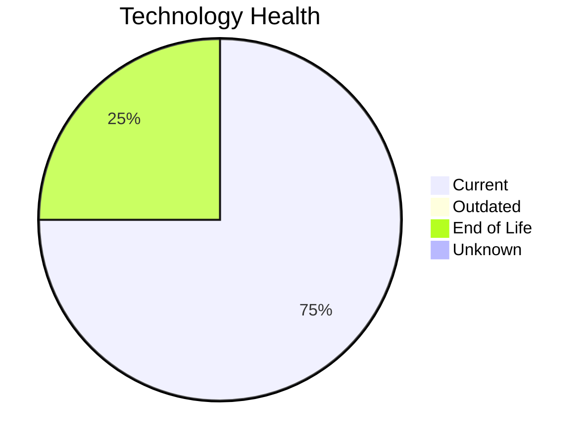

# Application Report: FleetApp-021

**ID:** app021
**Generated:** 2026-05-14

## Overview

| Attribute | Value |
|-----------|-------|
| Owner | Operations |
| Environment | On-Premise |
| Business Criticality | High |
| Users | 420 |
| Servers | 2 |
| Solution Type | Custom made |
| Architecture | 2-Tier |
| Containerized | No |
| CI/CD | No |

## Technology Stack

| Component | Technology | Version | Status |
|-----------|-----------|---------|--------|
| Os | Windows Server 2022 | Server 2022 | 🟢 CURRENT_VERSION |
| Database | Oracle 11g | 11g | 🔴 EOL |
| Programming Language | C++ 17 | 17 | 🟢 CURRENT_VERSION |
| Application Server | Microsoft IIS 10.0 | IIS 10.0 | 🟢 CURRENT_VERSION |

## Complexity Assessment

**Score:** 7/10 — **HIGH**
**Confidence:** 8/10

| Factor | Score | Notes |
|--------|-------|-------|
| Technology Age | 7/10 | 1 EOL, 0 outdated components |
| Integration | 5/10 | 4 external interfaces |
| Infrastructure | 6/10 | 2 server(s), 3 environment(s) |
| Business Criticality | 7/10 | High criticality |
| Architecture | 8/10 | Containerized: No, CI/CD: No |
| Data | 5/10 | DB: Oracle 11g |

## Modernization Scenarios

### Applicable Scenarios

#### ✅ Application Migration to Cloud Infrastructure (Lift & Shift)

- **Priority:** High
- **Effort:** Low
- **Effects:** security, agility
- **Cost:** €6,650 (one-time)
- **Savings:** €2,400/year
- **Reasoning:** Application is on-premise. Cloud migration (Lift & Shift) offers improved scalability, security, and compliance benefits.

#### ✅ Application Refactoring and De-coupling

- **Priority:** High
- **Effort:** High
- **Effects:** agility, cost, sustainability
- **Cost:** €332,502 (one-time)
- **Savings:** €120,000/year
- **Reasoning:** Application has 2-Tier architecture which may have coupling between layers. Refactoring to modular/microservices architecture would improve agility.

#### ✅ Upgrade Legacy Databases

- **Priority:** High
- **Effort:** Medium
- **Effects:** security, agility
- **Cost:** €13,300 (one-time)
- **Savings:** €10,000/year
- **Reasoning:** Database Oracle 11g is End of Life and no longer receives security patches. Upgrade or migration is urgently needed.

#### ✅ Switch DB Engine to open-source database solution

- **Priority:** High
- **Effort:** Medium
- **Effects:** cost
- **Cost:** €33,250 (one-time)
- **Savings:** €15,000/year
- **Reasoning:** Application uses Oracle 11g with required license. Migrating to PostgreSQL would significantly reduce licensing costs.

### Not Applicable / Other

| Scenario | Status | Reason |
|----------|--------|--------|
| Operating System Update | ✔️ FULFILLED | Operating system Windows Server 2022 is on a current, supported version. |
| Switch to standard Linux Operating System | ❌ NOT_APPLICABLE | Application runs on Windows OS. Switching to Linux would require significant re-platforming; not app... |
| Switch to ARM-based CPU | 🚫 BLOCKED | Application runs on Windows Server which has legacy dependencies incompatible with ARM CPU migration... |
| Applications Server replacement | ✔️ FULFILLED | Application server Microsoft IIS 10.0 is on a current, supported version. No replacement needed. |
| Application Containerization | ⚠️ PARTIALLY_FULFILLED | Application runs on Windows Server with potentially pre-.NET 6 stack. Containerization may be limite... |
| Update outdated components | ✔️ FULFILLED | All assessed application components are on current, supported versions. |

## Financial Summary

| Metric | Value |
|--------|-------|
| Total One-Time Cost | €385,702 |
| Total Yearly Savings | €147,400 |
| Break-Even | 2.6 years |
