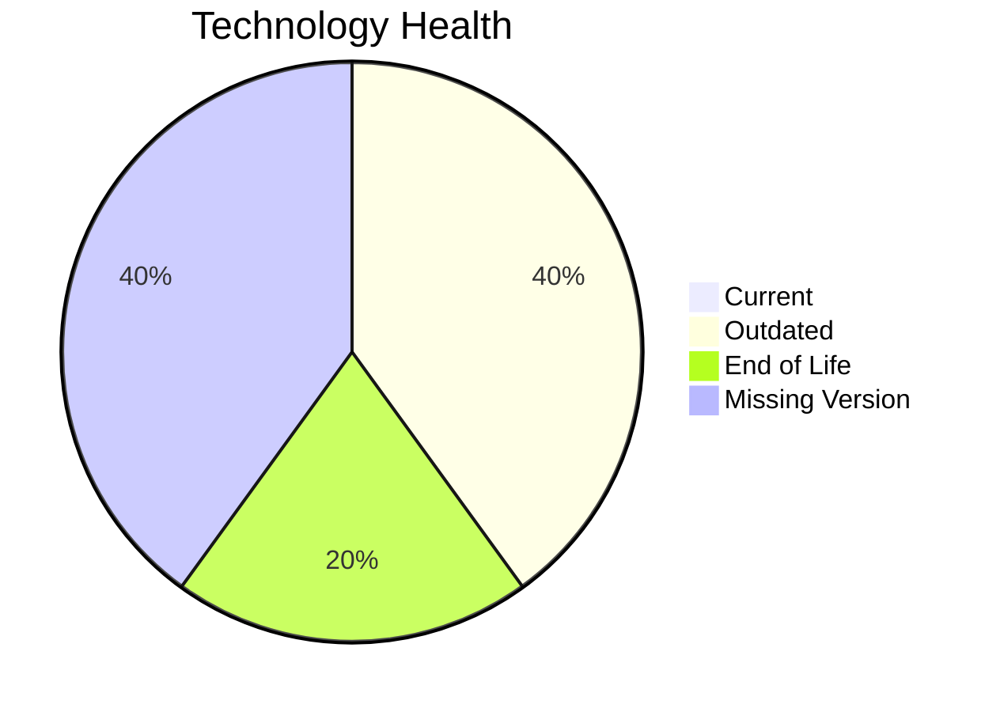

# Application Report: FleetApp-021

**ID:** app021  
**Generated:** 2026-05-14

## Overview

| Attribute | Value |
|-----------|-------|
| Owner | unknown |
| Environment | On-Premise |
| Business Criticality | High |
| Users | 420 |
| Servers | sv30, sv31 |

## Technology Stack

| Component | Technology | Version | Status |
|-----------|-----------|---------|--------|
| os | Windows Server 2022 | 2022 | 🟡 OUTDATED |
| database | Oracle 11g | 11 | 🔴 EOL |
| language | C++ 17 | 17 | ⚪ NO_KNOWLEDGE |
| framework | Framework | unknown | ⚪ NO_KNOWLEDGE |
| app_server | Microsoft IIS 10.0 | 10.0 | 🟡 OUTDATED |

## Complexity Assessment

**Score:** 6/10 — **MEDIUM**  
**Confidence:** 8

**Reasoning:** Tech age 7/10 (1 EOL, 2 outdated components), integrations 4 interfaces and 0 dependencies, infrastructure 2 servers/3 environments, criticality High, architecture score 6/10, data score 7/10.

## Modernization Scenarios

### Applicable Scenarios

#### ✅ Operating System Update
- **Cost:** €1157 (one-time)
- **Savings:** €500/year
- **Reasoning:** Windows Server 2022 requires upgrade/security patching.
#### ✅ Switch to standard Linux Operating System
- **Cost:** €347 (one-time)
- **Savings:** €400/year
- **Reasoning:** Current OS (Windows Server 2022) is non-standard for Linux consolidation.
#### ✅ Applications Server replacement
- **Cost:** €11565 (one-time)
- **Savings:** €10800/year
- **Reasoning:** Application server Microsoft IIS 10.0 is outdated/EOL.
#### ✅ Application Migration to Cloud Infrastructure (Lift & Shift)
- **Cost:** €5783 (one-time)
- **Savings:** €2700/year
- **Reasoning:** Application appears on-premise and is a cloud migration candidate.
#### ✅ Application Containerization
- **Cost:** €115653 (one-time)
- **Savings:** €90000/year
- **Reasoning:** Containerization could improve portability and operations.
#### ✅ Application Refactoring and De-coupling
- **Cost:** €289133 (one-time)
- **Savings:** €135000/year
- **Reasoning:** Application modernization can include decoupling improvements.
#### ✅ Upgrade Legacy Databases
- **Cost:** €11565 (one-time)
- **Savings:** €10000/year
- **Reasoning:** Database Oracle 11g is legacy/outdated.

### Not Applicable / Other

| Scenario | Status | Reason |
|----------|--------|--------|
| Switch to ARM-based CPU | NOT_APPLICABLE | On-premise hosting makes ARM migration less direct. |
| Switch DB Engine to open-source database solution | APPLICABLE | Proprietary database engine indicates open-source migration opportunity. |
| Update outdated components | APPLICABLE | Outdated or EOL components identified in technology assessment. |

## Financial Summary

| Metric | Value |
|--------|-------|
| Total One-Time Cost | €435203 |
| Total Yearly Savings | €249400 |
| Break-Even | 1.7 years |
