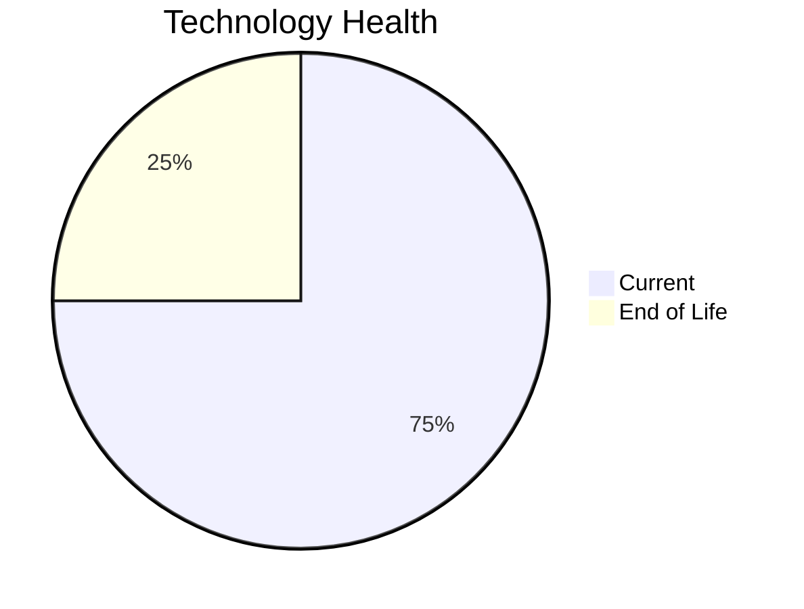

# Application Report: ComplianceApp-022

**ID:** app022  
**Generated:** 2026-05-05

## Overview

| Attribute | Value |
|-----------|-------|
| Business Unit | Compliance |
| Deployment Type | AWS, On-premise |
| Business Criticality | Critical |
| Users | 310 |
| Servers | sv32, sv33 |
| Environments | 3 |
| Architecture | 3-Tier |
| Containerized | Yes |
| CI/CD | Yes |
| Solution Type | Custom made |
| Data Classification | Confidential |

> Comprehensive compliance management platform for regulatory adherence and risk management

## Technology Stack

| Component | Technology | Version | Status |
|-----------|-----------|---------|--------|
| Os | RHEL | 7 | 🔴 EOL |
| Database | PostgreSQL | 14 | 🟢 CURRENT_VERSION |
| Language | Scala | 2.13 | 🟢 CURRENT_VERSION |
| Application Server | Payara | 6.0 | 🟢 CURRENT_VERSION |

## Complexity Assessment

**Score:** 5/10 — **MEDIUM**  
**Confidence:** 7

> Score 5/10 (MEDIUM). EOL components: 1, Outdated: 0. External interfaces: 12. Servers: 2. Criticality: Critical. Architecture: 3-Tier. DB storage: 500.0GB.

| Factor | Value |
|--------|-------|
| Servers | 2 |
| Environments | 3 |
| External Interfaces | 12 |
| Business Criticality | Critical |
| EOL Technologies | 1 |
| Outdated Technologies | 0 |
| CI/CD | Yes |
| Containerized | Yes |

## Modernization Scenarios

### ✅ Applicable Scenarios

#### ✅ Operating System Update

- **Priority:** High
- **Effort:** Low
- **One-Time Cost:** €1,006
- **Yearly Savings:** €500
- **Reasoning:** OS RHEL 7 is EOL. RHEL 7 reached End of Maintenance Support on June 30, 2024. No security updates without ELS. OS update is required.

#### ✅ Application Migration to Cloud (Lift & Shift)

- **Priority:** High
- **Effort:** Low
- **One-Time Cost:** €5,028
- **Yearly Savings:** €2,700
- **Reasoning:** Application has hybrid deployment (on-premise + cloud). Remaining on-premise components can be migrated to cloud.

### Other Scenarios

| Scenario | Status | Reason |
|----------|--------|--------|
| Switch to Standard Linux OS | ✔️ FULFILLED | Application already runs on a Linux-based OS (RHEL 7). However, OS version is EOL; upgrade (os_update_security_patch) is... |
| Switch to ARM-based CPU | ❓ LACK_OF_DATA | CPU architecture is not explicitly documented in the application record. ARM eligibility cannot be confirmed. |
| Application Server Replacement | ✔️ FULFILLED | Application server Payara 6.0 is current. |
| Application Containerization | ✔️ FULFILLED | Application is already containerized. |
| Application Refactoring and De-coupling | 🔶 PARTIALLY_FULFILLED | Application uses 3-tier architecture with CI/CD and containerization. Some decoupling is in place, but microservices mig... |
| Upgrade Legacy Databases | ✔️ FULFILLED | Database PostgreSQL 14 is on a current supported version. |
| Switch DB Engine to Open-Source | ✔️ FULFILLED | Application already uses an open-source database engine (PostgreSQL 14). |
| Update Outdated Components | ✔️ FULFILLED | All application language and server components are on current, supported versions. |

## Financial Summary

| Metric | Value |
|--------|-------|
| Total One-Time Cost | €6,034 |
| Total Yearly Savings | €3,200 |
| Break-Even | 1.9 years |
