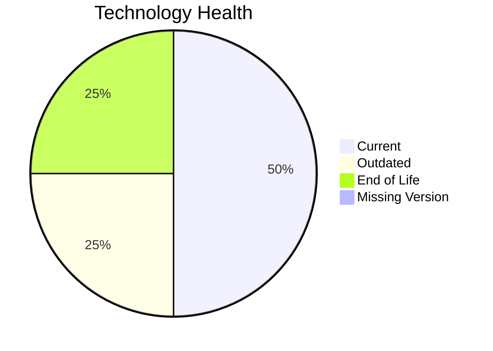

# Application Report: ComplianceApp-022

**ID:** app022
**Generated:** 2026-05-11

## Overview

| Attribute | Value |
|-----------|-------|
| Owner | Compliance |
| Environment | AWS, On-premise |
| Business Criticality | Critical |
| Users | 310 |
| Servers | 2 |

## Technology Stack

| Component | Technology | Version | Status |
|-----------|-----------|---------|--------|
| Operating System | RHEL | RHEL 7 | 🔴 EOL |
| Database | PostgreSQL | PostgreSQL 14 | 🟡 OUTDATED |
| Language | Scala | Scala 2.13 | 🟢 CURRENT_VERSION |
| Framework | N/A | N/A | ⚪ |
| App Server | Payara | Payara 6.0 | 🟢 CURRENT_VERSION |

## Complexity Assessment

**Score:** 7/10 — **HIGH**
**Confidence:** 8

Technology age score 8/10 (EOL=1, outdated=1, unknown=0); integration score 8/10 (interfaces=12, api_endpoints=16); infrastructure score 5/10 (servers=2, environments=3); business criticality score 9/10 (Critical, users=310); architecture score 3/10 (architecture=3-Tier, CI/CD=Yes, containerized=Yes); data score 5/10 (db_count=1, db_storage_gb=500).

## Modernization Scenarios

### Applicable Scenarios

#### ✅ Operating System Update

- **Priority:** High
- **Effort:** Low
- **Effects:** security
- **Cost:** €1330 (one-time)
- **Savings:** €500/year
- **Reasoning:** Operating system is outdated or end-of-life per technology assessment.

#### ✅ Application Migration to Cloud Infrastructure (Lift & Shift)

- **Priority:** High
- **Effort:** Low
- **Effects:** security, agility
- **Cost:** €6650 (one-time)
- **Savings:** €2400/year
- **Reasoning:** On-premise deployment indicates lift-and-shift opportunity to cloud.

#### ✅ Application Refactoring and De-coupling

- **Priority:** High
- **Effort:** High
- **Effects:** agility, cost, sustainability
- **Cost:** €332502 (one-time)
- **Savings:** €120000/year
- **Reasoning:** Architecture and integration profile indicate decoupling/refactoring opportunity.

#### ✅ Upgrade Legacy Databases

- **Priority:** High
- **Effort:** Medium
- **Effects:** security, agility
- **Cost:** €13300 (one-time)
- **Savings:** €10000/year
- **Reasoning:** Database engine is outdated or end-of-life.

### Not Applicable / Other

| Scenario | Status | Reason |
|----------|--------|--------|
| Switch to standard Linux Operating System | FULFILLED | Application already runs on a standard Linux distribution. |
| Switch to ARM-based CPU | LACK_OF_DATA | CPU architecture (x86/x64/ARM) is not provided in source data. |
| Applications Server replacement | FULFILLED | Application server is already on a supported version. |
| Application Containerization | FULFILLED | Application is already containerized. |
| Switch DB Engine to open-source database solution | FULFILLED | Database engine is already open-source compatible. |
| Update outdated components | FULFILLED | Application components are on supported versions. |

## Financial Summary

| Metric | Value |
|--------|-------|
| Total One-Time Cost | €353782 |
| Total Yearly Savings | €132900 |
| Break-Even | 2.7 years |
