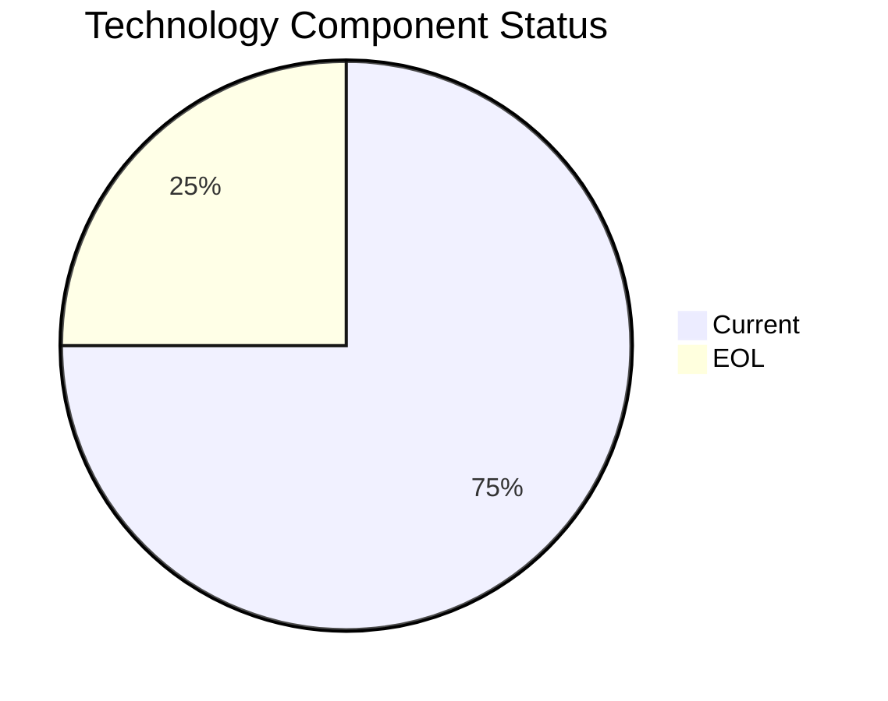

# ComplianceApp-022 (app022)

> Analysis timestamp: 2025-07-15T00:00:00Z

## Application Overview

| Attribute | Value |
|-----------|-------|
| **Name** | ComplianceApp-022 |
| **Status** | Production |
| **Criticality** | Critical |
| **Users** | 310 |
| **Solution Type** | Custom made |
| **Architecture** | 3-Tier |
| **Containerized** | Yes |
| **CI/CD** | Yes |
| **Environments** | 3 |
| **Servers** | sv32, sv33 |
| **External Interfaces** | 12 |

## Technology Stack

| Component | Value | Status |
|-----------|-------|--------|
| **Os** | RHEL 7 | ❌ EOL |
| **Language** | Scala 2.13 | ✅ CURRENT_VERSION |
| **Database** | PostgreSQL 14 | ✅ CURRENT_VERSION |
| **App Server** | Payara 6.0 | ✅ CURRENT_VERSION |

## Technology Health

## Complexity Assessment

**Score: 6/10 — MEDIUM**

1 EOL component(s) significantly raise technical debt; 12 external interfaces drive integration complexity; 2 server(s) across 3 environment(s); Business criticality is Critical.

| Factor | Value |
|--------|-------|
| Servers | 2 |
| Environments | 3 |
| External Interfaces | 12 |
| EOL Technologies | 1 |
| Outdated Technologies | 0 |
| CI/CD Present | Yes |
| Containerized | Yes |

## Modernization Scenarios

| Scenario | Status | Reason |
|----------|--------|--------|
| OS Security Patch | 🔧 APPLICABLE | Operating system RHEL 7 is EOL and requires security patching/upgrade. |
| Switch to Linux | ✅ FULFILLED | Application already runs on standard Linux (RHEL 7). |
| ARM CPU | 🔧 APPLICABLE | Application is containerized on Linux; ARM CPU migration is feasible. |
| App Server Replace | ✅ FULFILLED | Application server Payara 6.0 is current. |
| Cloud Deploy | 🔧 APPLICABLE | Application can be migrated to cloud infrastructure. |
| Containerization | ✅ FULFILLED | Application is already containerized. |
| Refactor/Decouple | ✅ FULFILLED | 3-Tier architecture already provides modular separation. |
| DB Upgrade | ✅ FULFILLED | Database PostgreSQL 14 is current and actively supported. |
| Open Source DB | ✅ FULFILLED | Database PostgreSQL 14 is already open source. |
| Update Components | 🔧 APPLICABLE | Application has EOL or outdated components that require updating. |

## Financial Summary

| Metric | Value |
|--------|-------|
| Total Implementation Cost | $12,721.83 |
| Total Annual Savings | $4,200.00 |
| Payback Period | 3.03 years |
| 5-Year Net Benefit | $8,278.17 |

### Applicable Scenario Costs

| Scenario | Impl. Cost | Annual Savings | Payback |
|----------|-----------|----------------|---------|
| OS Security Patch | $1,156.53 | $500.00 | 2.31 yrs |
| ARM CPU | $5,782.65 | $1,000.00 | 5.78 yrs |
| Cloud Deploy | $5,782.65 | $2,700.00 | 2.14 yrs |
