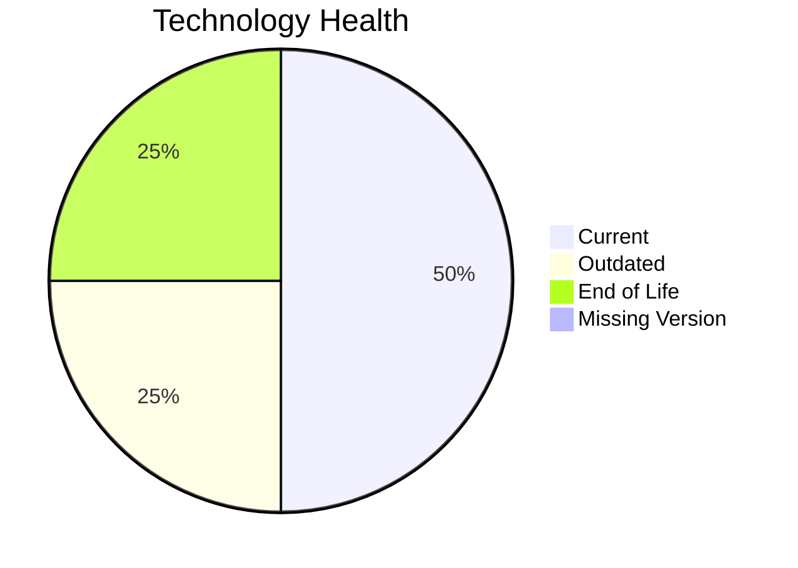

# Application Report: ComplianceApp-022

**ID:** app022  
**Generated:** 2026-05-17

## Overview

| Attribute | Value |
|-----------|-------|
| Owner | N/A |
| Environment | AWS, On-premise |
| Business Criticality | Critical |
| Users | 310 |
| Servers | 2 |

## Technology Stack

| Component | Technology | Version | Status |
|-----------|-----------|---------|--------|
| Operating System | RHEL | 7 | 🔴 EOL |
| Database | PostgreSQL | 14 | 🟡 OUTDATED |
| Language | Scala | 2.13 | 🟢 CURRENT_VERSION |
| Framework | N/A | N/A | ⚪ NO_KNOWLEDGE |
| App Server | Payara | 6.0 | 🟢 CURRENT_VERSION |

## Complexity Assessment

**Score:** 7/10 — **HIGH**  
**Confidence:** 8

| Factor | Score | Notes |
|--------|-------|-------|
| Technology Age | 8/10 | At least one component is EOL. |
| Integration | 8/10 | High integration surface with 12 external interfaces and 16 APIs. |
| Infrastructure | 5/10 | Moderate infrastructure footprint with 2 servers and 3 environments. |
| Business Criticality | 10/10 | Business criticality is Critical. |
| Architecture | 3/10 | already containerized, CI/CD exists, traditional multi-tier architecture. |
| Data | 6/10 | 1 database engine(s), 500 GB storage, aging database platform. |

## Modernization Scenarios

### Applicable Scenarios

#### ✅ Operating System Update

- **Priority:** High
- **Effort:** Low
- **Effects:** security
- **Cost:** €1330 (one-time)
- **Savings:** €500/year
- **Reasoning:** RHEL 7 is assessed as EOL, which triggers an OS update scenario.

#### ✅ Application Migration to Cloud Infrastructure (Lift & Shift)

- **Priority:** High
- **Effort:** Low
- **Effects:** security, agility
- **Cost:** €6650 (one-time)
- **Savings:** €2400/year
- **Reasoning:** Application still runs on-premises or in a hybrid footprint, so lift-and-shift to public cloud remains applicable.

#### ✅ Application Refactoring and De-coupling

- **Priority:** High
- **Effort:** High
- **Effects:** agility, cost, sustainability
- **Cost:** €332502 (one-time)
- **Savings:** €120000/year
- **Reasoning:** Architecture and integration signals point to a tightly coupled design that would benefit from refactoring.

#### ✅ Upgrade Legacy Databases

- **Priority:** High
- **Effort:** Medium
- **Effects:** security, agility
- **Cost:** €13300 (one-time)
- **Savings:** €10000/year
- **Reasoning:** PostgreSQL 14 is assessed as OUTDATED and is a candidate for upgrade.

### Not Applicable / Other

| Scenario | Status | Reason |
|----------|--------|--------|
| Switch to standard Linux Operating System | FULFILLED | RHEL 7 already belongs to a standard Linux family. |
| Switch to ARM-based CPU | LACK_OF_DATA | CPU architecture is not documented in the workbook, so ARM suitability cannot be assessed confidently. |
| Applications Server replacement | FULFILLED | Payara 6.0 is already on a currently supported release. |
| Application Containerization | FULFILLED | Application is already containerized. |
| Switch DB Engine to open-source database solution | FULFILLED | PostgreSQL 14 already uses an open-source-compatible engine family. |
| Update outdated components | FULFILLED | Assessed language, framework, and application server components are on supported versions. |

## Financial Summary

| Metric | Value |
|--------|-------|
| Total One-Time Cost | €353782 |
| Total Yearly Savings | €132900 |
| Break-Even | 2.7 years |
