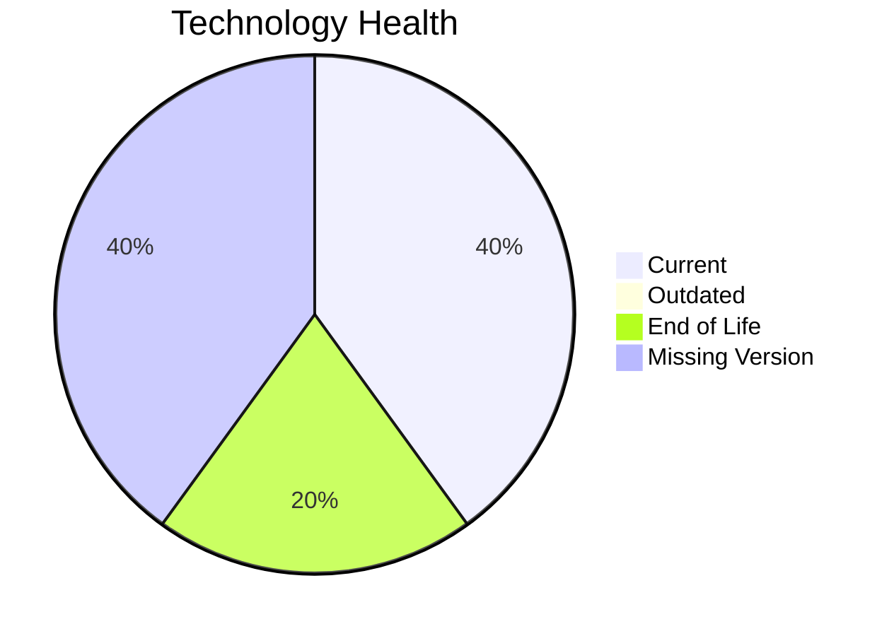

# Application Report: ComplianceApp-022

**ID:** app022  
**Generated:** 2026-05-17

## Overview

| Attribute | Value |
|-----------|-------|
| Owner | unknown |
| Environment | AWS, On-premise |
| Business Criticality | Critical |
| Users | 310 |
| Servers | sv32, sv33 |

## Technology Stack

| Component | Technology | Version | Status |
|-----------|-----------|---------|--------|
| Operating System | RHEL 7 | 7 | 🔴 EOL |
| Database | PostgreSQL 14 | 14 | 🟢 CURRENT_VERSION |
| Language | Scala 2.13 | 2.13 | ⚪ NO_KNOWLEDGE |
| Framework | Unknown Framework | N/A | ⚪ NO_KNOWLEDGE |
| App Server | Payara 6.0 | 6.0 | 🟢 CURRENT_VERSION |

## Complexity Assessment

**Score:** 6/10 — **MEDIUM**  
**Confidence:** 8

Tech age 7/10 (EOL=1, outdated=0, unknown=2); integration 8/10 (12 interfaces); infrastructure 5/10 (2 servers, 3 envs); criticality 5/10 (Critical); architecture 3/10 (arch=3-Tier, containerized=Yes, ci/cd=Yes); data 5/10 (1 DB(s), storage≈500GB).

## Modernization Scenarios

### Applicable Scenarios

#### ✅ Operating System Update
- **Priority:** High
- **Effort:** Low
- **Effects:** security
- **Cost:** €1157 (one-time)
- **Savings:** €500/year
- **Reasoning:** Operating system is outdated/EOL in technology assessment.

#### ✅ Switch to ARM-based CPU
- **Priority:** Medium
- **Effort:** Medium
- **Effects:** cost, sustainability
- **Cost:** €5783 (one-time)
- **Savings:** €1000/year
- **Reasoning:** No explicit blockers; likely x86/x64 default estate with modernization potential.

#### ✅ Application Refactoring and De-coupling
- **Priority:** High
- **Effort:** High
- **Effects:** agility, cost, sustainability
- **Cost:** €289133 (one-time)
- **Savings:** €135000/year
- **Reasoning:** High coupling/complexity indicates refactoring and decoupling potential.

#### ✅ Update outdated components
- **Priority:** High
- **Effort:** High
- **Effects:** security, agility, cost
- **Cost:** €N/A (one-time)
- **Savings:** €N/A/year
- **Reasoning:** Technology assessment found outdated/EOL components.

### Not Applicable / Other

| Scenario | Status | Reason |
|----------|--------|--------|
| Switch to standard Linux Operating System | FULFILLED | Application already runs on standard Linux distribution. |
| Applications Server replacement | PARTIALLY_FULFILLED | Server is supported but may still benefit from modernization. |
| Application Migration to Cloud Infrastructure (Lift & Shift) | PARTIALLY_FULFILLED | Hybrid deployment exists; further lift-and-shift opportunities remain. |
| Application Containerization | FULFILLED | Application is already containerized. |
| Upgrade Legacy Databases | PARTIALLY_FULFILLED | Database is supported; periodic modernization still relevant. |
| Switch DB Engine to open-source database solution | NOT_APPLICABLE | Database engine already open-source or open-source based. |

## Financial Summary

| Metric | Value |
|--------|-------|
| Total One-Time Cost | €296073 |
| Total Yearly Savings | €136500 |
| Break-Even | 2.2 years |
