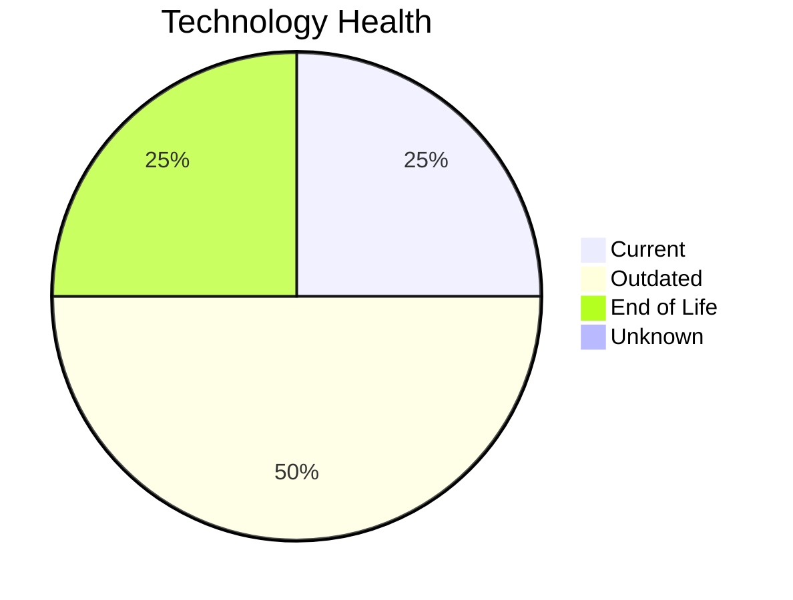

# Application Report: ComplianceApp-022

**ID:** app022  
**Generated:** 2026-05-15

## Overview

| Attribute | Value |
|-----------|-------|
| Business Unit | Compliance |
| Deployment | AWS, On-premise |
| Business Criticality | Critical |
| Users | 310 |
| Solution Type | Custom made |
| Architecture | 3-Tier |
| Containerized | Yes |
| CI/CD | Yes |
| External Interfaces | 12 |

## Technology Stack

| Component | Technology | Status |
|-----------|-----------|--------|
| Operating System | RHEL 7 | 🔴 EOL |
| Database | PostgreSQL 14 | 🟡 Outdated |
| Language | Scala 2.13 | 🟡 Outdated |
| App Server | Payara 6.0 | 🟢 Current |

## Complexity Assessment

**Score:** 6/10 — **MEDIUM**  
**Confidence:** 8

| Factor | Score | Notes |
|--------|-------|-------|
| Technology Age | 7/10 | 1 EOL and 2 outdated components — significant aging |
| Integration | 8/10 | 12 external interfaces, 0 dependencies — highly integrated |
| Infrastructure | 5/10 | 2 server instances, 3 environments |
| Business Criticality | 10/10 | Business criticality: critical, 310 users |
| Architecture | 2/10 | 3-tier architecture; containerized; CI/CD present |
| Data | 3/10 | Standard data complexity |

## Modernization Scenarios

### Applicable Scenarios

#### ✅ Operating System Update

- **Priority:** High
- **Effort:** Low
- **Effects:** security
- **One-time Cost:** €1,157
- **Yearly Savings:** €500/year
- **Reasoning:** OS 'RHEL 7' has reached EOL — critical security risk. Immediate OS update required.

#### ✅ Switch to ARM-based CPU

- **Priority:** Medium
- **Effort:** Medium
- **Effects:** cost, sustainability
- **One-time Cost:** €5,783
- **Yearly Savings:** €1,000/year
- **Reasoning:** Application is cloud-deployed and containerized. ARM-based instances (e.g., AWS Graviton) can reduce costs.

#### ✅ Upgrade Legacy Databases

- **Priority:** High
- **Effort:** Medium
- **Effects:** security, agility
- **One-time Cost:** €11,565
- **Yearly Savings:** €10,000/year
- **Reasoning:** Database 'PostgreSQL 14' is outdated. Upgrading to a current version is recommended.

#### ✅ Update outdated components

- **Priority:** High
- **Effort:** High
- **Effects:** security, agility, cost
- **One-time Cost:** N/A
- **Yearly Savings:** N/A
- **Reasoning:** Multiple EOL/outdated components detected (1 EOL, 2 outdated). Systematic update program needed.

### Other Scenarios

| Scenario | Status | Reason |
|----------|--------|--------|
| Switch to standard Linux Operating System | ✔️ Fulfilled | OS 'RHEL 7' is already a standard Linux distribution. |
| Applications Server replacement | ✔️ Fulfilled | Application server 'Payara 6.0' is on a current, supported version. |
| Application Migration to Cloud Infrastructure (Lift & Shift) | 🔶 Partial | Application has hybrid deployment (on-premise and cloud). Full cloud migration w... |
| Application Containerization | ✔️ Fulfilled | Application is already containerized. |
| Application Refactoring and De-coupling | 🔶 Partial | Application has a 3-Tier architecture. Some decoupling already done but may bene... |
| Switch DB Engine to open-source database solution | ✔️ Fulfilled | Database 'PostgreSQL 14' is already an open-source engine. |

## Business Case Summary

| Metric | Value |
|--------|-------|
| Total One-time Cost | €18,505 |
| Total Yearly Savings | €11,500 |
| ROI Break-even | 1.6 years |
