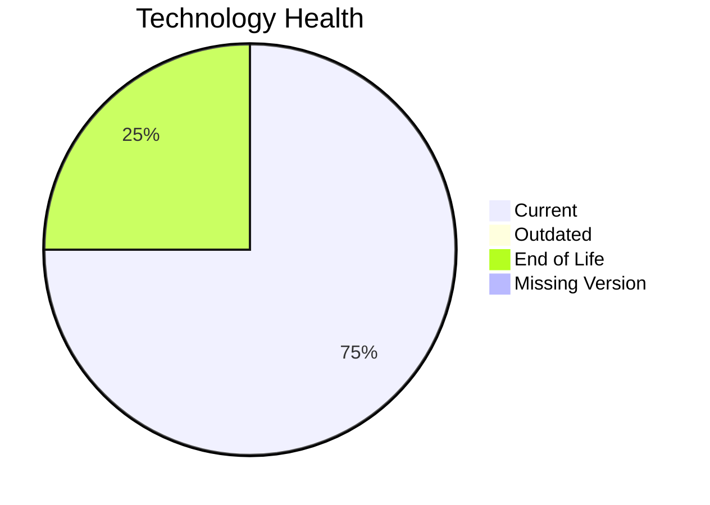

# Application Report: ComplianceApp-022

**ID:** app022
**Generated:** 2026-05-19

## Overview

| Attribute | Value |
|-----------|-------|
| Owner | unknown |
| Environment | AWS, On-premise |
| Business Criticality | Critical |
| Users | 310 |
| Servers | 2 |

## Technology Stack

| Component | Technology | Version | Status |
|-----------|-----------|---------|--------|
| Operating System | RHEL 7 | 7 | 🔴 EOL |
| Database | PostgreSQL 14 | 14 | 🟢 CURRENT_VERSION |
| Language | Scala 2.13 | 2.13 | 🟢 CURRENT_VERSION |
| Framework | N/A | N/A | ⚪ N/A |
| App Server | Payara 6.0 | 6.0 | 🟢 CURRENT_VERSION |

## Complexity Assessment

**Score:** 7/10 — **HIGH**
**Confidence:** 9

| Factor | Score | Notes |
|--------|-------|-------|
| Technology Age | n/a | Critical-critical app with complexity driven by technology age, integrations, and architecture characteristics. |
| Integration | n/a | Interfaces: 12 |
| Infrastructure | n/a | Environments: 3 |
| Business Criticality | n/a | Critical |
| Architecture | n/a | Containerized: Yes; CI/CD: Yes |
| Data | n/a | Databases: 1 |

## Scenario Applicability

### Applicable Scenarios

#### ✅ Operating System Update

- **Priority:** High
- **Effort:** Low
- **Effects:** security
- **Cost:** €1,330 (one-time)
- **Savings:** €500/year
- **Reasoning:** RHEL 7 is classified as EOL, which triggers an operating system update scenario.

#### ✅ Application Refactoring and De-coupling

- **Priority:** High
- **Effort:** High
- **Effects:** agility, cost, sustainability
- **Cost:** €332,502 (one-time)
- **Savings:** €120,000/year
- **Reasoning:** Legacy architecture signals or coupling indicators suggest refactoring and de-coupling would add value.

#### ✅ Update outdated components

- **Priority:** High
- **Effort:** High
- **Effects:** security, agility, cost
- **Cost:** N/A (one-time)
- **Savings:** N/A/year
- **Reasoning:** The technology assessment found outdated or EOL components that justify a component refresh.

### Not Applicable / Other

| Scenario | Status | Reason |
|----------|--------|--------|
| Switch to standard Linux Operating System | ✔️ FULFILLED | RHEL 7 is already a standard Linux distribution. |
| Switch to ARM-based CPU | ❓ LACK_OF_DATA | CPU architecture is not captured in the inventory, so ARM applicability cannot be confirmed. |
| Applications Server replacement | ✔️ FULFILLED | Payara 6.0 is already on a supported release line. |
| Application Migration to Cloud Infrastructure (Lift & Shift) | 🟨 PARTIALLY_FULFILLED | Application already has an AWS footprint but still retains on-premise hosting. |
| Application Containerization | ✔️ FULFILLED | Application is already marked as containerized. |
| Upgrade Legacy Databases | ✔️ FULFILLED | PostgreSQL 14 is currently supported. |
| Switch DB Engine to open-source database solution | ✔️ FULFILLED | PostgreSQL 14 already aligns with an open-source database family. |

## Financial Summary

| Metric | Value |
|--------|-------|
| Total One-Time Cost | €333,832 |
| Total Yearly Savings | €120,500 |
| Break-Even | 2.8 years |
