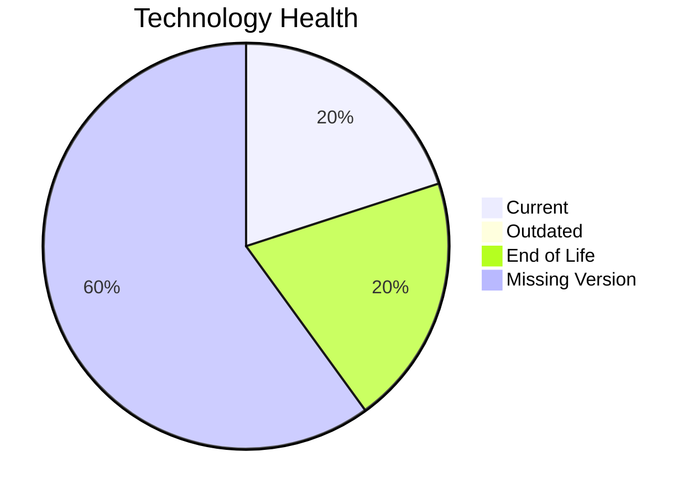

# Application Report: ComplianceApp-022

**ID:** app022  
**Generated:** 2026-05-14

## Overview

| Attribute | Value |
|-----------|-------|
| Owner | unknown |
| Environment | AWS, On-premise |
| Business Criticality | Critical |
| Users | 310 |
| Servers | sv32, sv33 |

## Technology Stack

| Component | Technology | Version | Status |
|-----------|-----------|---------|--------|
| os | RHEL 7 | 7 | 🔴 EOL |
| database | PostgreSQL 14 | 14 | 🟢 CURRENT_VERSION |
| language | Scala 2.13 | 2.13 | ⚪ NO_KNOWLEDGE |
| framework | Framework | unknown | ⚪ NO_KNOWLEDGE |
| app_server | Payara 6.0 | 6.0 | ⚪ NO_KNOWLEDGE |

## Complexity Assessment

**Score:** 6/10 — **MEDIUM**  
**Confidence:** 8

**Reasoning:** Tech age 7/10 (1 EOL, 0 outdated components), integrations 12 interfaces and 0 dependencies, infrastructure 2 servers/3 environments, criticality Critical, architecture score 3/10, data score 5/10.

## Modernization Scenarios

### Applicable Scenarios

#### ✅ Operating System Update
- **Cost:** €1157 (one-time)
- **Savings:** €500/year
- **Reasoning:** RHEL 7 requires upgrade/security patching.
#### ✅ Switch to ARM-based CPU
- **Cost:** €5783 (one-time)
- **Savings:** €1000/year
- **Reasoning:** Cloud-hosted workload can be evaluated for ARM-based instances.

### Not Applicable / Other

| Scenario | Status | Reason |
|----------|--------|--------|
| Switch to standard Linux Operating System | FULFILLED | Application already runs on a standard Linux platform. |
| Applications Server replacement | LACK_OF_DATA | Insufficient application server data. |
| Application Migration to Cloud Infrastructure (Lift & Shift) | PARTIALLY_FULFILLED | Hybrid deployment detected; further cloud migration possible. |
| Application Containerization | FULFILLED | Application is already containerized. |
| Application Refactoring and De-coupling | PARTIALLY_FULFILLED | Architecture shows partial decoupling already. |
| Upgrade Legacy Databases | FULFILLED | Database engine appears current. |
| Switch DB Engine to open-source database solution | FULFILLED | Application already uses open-source database engine. |
| Update outdated components | APPLICABLE | Outdated or EOL components identified in technology assessment. |

## Financial Summary

| Metric | Value |
|--------|-------|
| Total One-Time Cost | €6940 |
| Total Yearly Savings | €1500 |
| Break-Even | 4.6 years |
