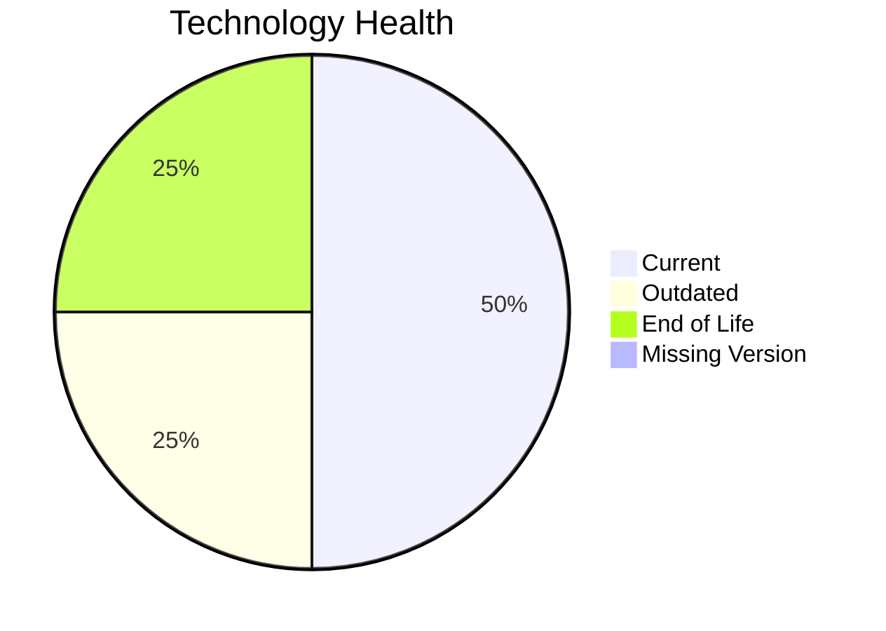

# Application Report: ComplianceApp-022

Modernization assessment for ComplianceApp-022 based solely on the Excel portfolio row and derived workflow outputs.

**ID:** app022  
**Generated:** 2026-05-07

## Overview

| Attribute | Value |
|-----------|-------|
| Owner | Compliance |
| Environment | AWS, On-premise |
| Business Criticality | Critical |
| Users | 310 |
| Servers | sv32, sv33 |

## Technology Stack

| Component | Technology | Version | Status |
|-----------|-----------|---------|--------|
| Operating System | RHEL | 7 | 🔴 |
| Database | PostgreSQL | 14 | 🟡 |
| Language | Scala | 2.13 | 🟢 |
| Framework | N/A | N/A | ⚪ |
| App Server | Payara | 6.0 | 🟢 |

## Complexity Assessment

**Score:** 7/10 — **HIGH**  
**Confidence:** 8

| Factor | Score | Notes |
|--------|-------|-------|
| Technology Age | 7/10 | 1 EOL, 1 outdated, 0 unknown lifecycle components. |
| Integration | 8/10 | 12 external interfaces and 16 API endpoints indicate the integration footprint. |
| Infrastructure | 5/10 | 2 listed server instances and 3 environments drive infrastructure coordination. |
| Business Criticality | 10/10 | Business criticality is Critical with approximately 310 users. |
| Architecture | 4/10 | 3-tier architecture is more modular than 1-tier or 2-tier |
| Data | 5/10 | database storage is 500 GB; moderate database footprint |

## Modernization Scenarios

### Applicable Scenarios

#### ✅ Operating System Update

- **Priority:** High
- **Effort:** Low
- **Effects:** security
- **Cost:** €1330 (one-time)
- **Savings:** €500/year
- **Reasoning:** Operating system RHEL 7 is eol and matches the OS update trigger.

#### ✅ Upgrade Legacy Databases

- **Priority:** High
- **Effort:** Medium
- **Effects:** security, agility
- **Cost:** €13300 (one-time)
- **Savings:** €10000/year
- **Reasoning:** Database platform PostgreSQL 14 is outdated.

### Not Applicable / Other

| Scenario | Status | Reason |
|----------|--------|--------|
| Switch to standard Linux Operating System | PARTIALLY_FULFILLED | The application already runs on Linux, but the distribution/version is not current and still needs standardization or upgrade. |
| Switch to ARM-based CPU | LACK_OF_DATA | CPU architecture is not present in the Excel input, so the primary ARM migration trigger cannot be confirmed. |
| Applications Server replacement | FULFILLED | Application server Payara 6.0 is already current. |
| Application Migration to Cloud Infrastructure (Lift & Shift) | PARTIALLY_FULFILLED | The application already has an AWS footprint but still retains on-premise deployment. |
| Application Containerization | FULFILLED | The application is already containerized. |
| Application Refactoring and De-coupling | PARTIALLY_FULFILLED | The application already shows some modular traits, but the source does not prove a fully decoupled architecture. |
| Switch DB Engine to open-source database solution | FULFILLED | Database engine PostgreSQL 14 is already open-source aligned. |
| Update outdated components | FULFILLED | Application runtime components are already current. |

## Financial Summary

| Metric | Value |
|--------|-------|
| Total One-Time Cost | €14630 |
| Total Yearly Savings | €10500 |
| Break-Even | 1.4 years |
