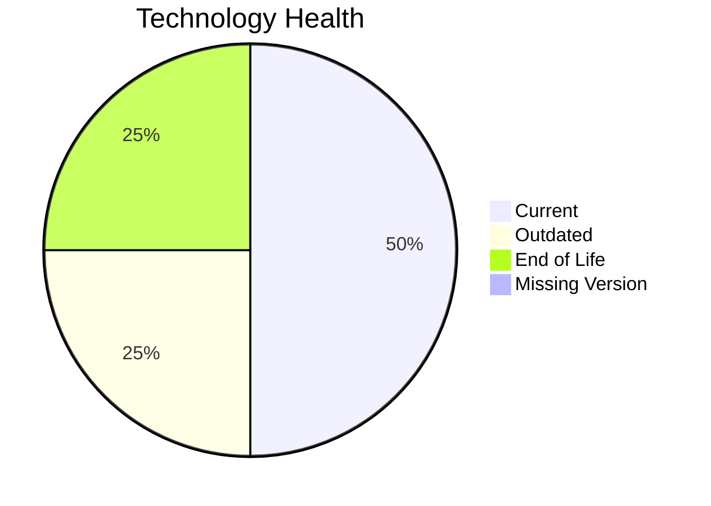

# Application Report: ComplianceApp-022

**ID:** app022
**Generated:** 2026-05-07

## Overview

| Attribute | Value |
|-----------|-------|
| Owner | N/A |
| Environment | AWS, On-premise |
| Business Criticality | Critical |
| Users | 310 |
| Servers | 2 |

## Technology Stack

| Component | Technology | Version | Status |
|-----------|-----------|---------|--------|
| Operating System | RHEL | 7 | 🔴 EOL |
| Database | PostgreSQL | 14 | 🟡 OUTDATED |
| Language | Scala | 2.13 | 🟢 CURRENT_VERSION |
| Framework | N/A | N/A | ⚪ NO_KNOWLEDGE |
| App Server | Payara | 6.0 | 🟢 CURRENT_VERSION |

## Complexity Assessment

**Score:** 6/10 — **MEDIUM**
**Confidence:** 8

| Factor | Score | Notes |
|--------|-------|-------|
| Technology Age | 8/10 | At least one EOL component was found in the application stack. |
| Integration | 8/10 | The application exposes 12 interfaces, indicating heavy integration. |
| Infrastructure | 5/10 | 2 servers and 3 environments indicate moderate infrastructure complexity. |
| Business Criticality | 9/10 | Criticality is 'Critical' with 310 users. |
| Architecture | 1/10 | A 3-tier architecture is more separable than 1-tier or 2-tier designs. Containerization lowers modernization friction. CI/CD lowers delivery risk. |
| Data | 5/10 | Database footprint (500 GB) indicates moderate data migration effort. |

## Modernization Scenarios

### Applicable Scenarios

#### ✅ Operating System Update

- **Priority:** High
- **Effort:** Low
- **Effects:** security
- **Cost:** €1,157 (one-time)
- **Savings:** €500/year
- **Reasoning:** RHEL 7 reached end of maintenance support in June 2024.

#### ✅ Upgrade Legacy Databases

- **Priority:** High
- **Effort:** Medium
- **Effects:** security, agility
- **Cost:** €11,565 (one-time)
- **Savings:** €10,000/year
- **Reasoning:** PostgreSQL 14 is still supported in 2026 but nearing end of life and behind the latest major releases.

### Not Applicable / Other

| Scenario | Status | Reason |
|----------|--------|--------|
| Switch to standard Linux Operating System | PARTIALLY_FULFILLED | Application runs on Linux already, but the current RHEL 7 release is EOL. |
| Switch to ARM-based CPU | LACK_OF_DATA | CPU architecture is not present in the workbook, so ARM suitability cannot be validated. |
| Applications Server replacement | FULFILLED | Payara 6 is the current major stream. |
| Application Migration to Cloud Infrastructure (Lift & Shift) | PARTIALLY_FULFILLED | Application spans AWS and on-premise environments, so cloud migration is only partially fulfilled. |
| Application Containerization | FULFILLED | The workbook explicitly marks the application as containerized. |
| Application Refactoring and De-coupling | PARTIALLY_FULFILLED | The application already shows some modular characteristics, but there is no evidence it is fully decoupled or microservice-based. |
| Switch DB Engine to open-source database solution | FULFILLED | The application already uses an open-source or open-source-compatible database engine. |
| Update outdated components | FULFILLED | All assessed application components are on current supported versions. |

## Financial Summary

| Metric | Value |
|--------|-------|
| Total One-Time Cost | €12,722 |
| Total Yearly Savings | €10,500 |
| Break-Even | 1.2 years |
