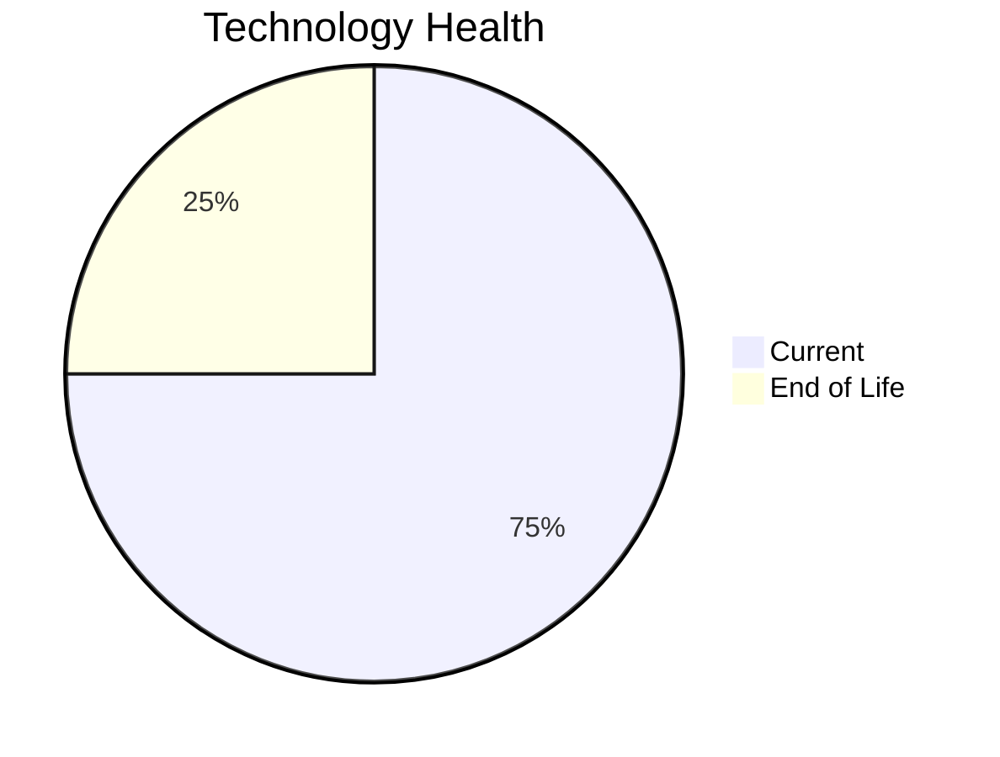

# Application Report: ComplianceApp-022

**ID:** app022
**Generated:** 2026-05-14

## Overview

| Attribute | Value |
|-----------|-------|
| Business Unit | Compliance |
| Business Criticality | Critical |
| Solution Type | Custom made |
| Deployment Type | AWS, On-premise |
| Users | 310 |
| Servers | 2 |
| External Interfaces | 12 |
| Containerized | Yes |
| CI/CD Present | Yes |
| Architecture | 3-Tier |

## Technology Stack

| Component | Technology | Version | Status |
|-----------|-----------|---------|--------|
| Os | RHEL | 7 | 🔴 EOL |
| Language | Scala | 2.13 | 🟢 CURRENT_VERSION |
| Database | PostgreSQL | 14 | 🟢 CURRENT_VERSION |
| App Server | Payara | 6.0 | 🟢 CURRENT_VERSION |

## Complexity Assessment

**Score:** 6/10 — **MEDIUM**
**Confidence:** 7

Score 6/10 (MEDIUM): EOL components=1, Outdated=0, Interfaces=12, Servers=2, Criticality=Critical, Architecture=3-Tier.

| Factor | Value |
|--------|-------|
| Servers | 2 |
| Environments | 3 |
| Interfaces | 12 |
| EOL Technologies | 1 |
| Outdated Technologies | 0 |
| Business Criticality | Critical |

## Modernization Scenarios

### Applicable Scenarios

#### ✅ Operating System Update

- **Priority:** High
- **Effort:** Low
- **Effects:** security
- **One-Time Cost:** $1,157
- **Annual Savings:** $500/year
- **Reasoning:** Operating system RHEL 7 is EOL. Update to a current supported OS version is recommended.

#### ✅ Switch to ARM-based CPU

- **Priority:** Medium
- **Effort:** Medium
- **Effects:** cost, sustainability
- **One-Time Cost:** $5,783
- **Annual Savings:** $1,000/year
- **Reasoning:** Application is containerized on standard Linux. ARM migration is feasible if x86-specific binaries are absent. CPU architecture not explicitly documented.

#### ✅ Update outdated components

- **Priority:** High
- **Effort:** High
- **Effects:** security, agility, cost
- **Reasoning:** Application has EOL or very legacy components. Update of outdated programming language and framework components is required.

### Other Scenarios

| Scenario | Status | Reason |
|----------|--------|--------|
| Switch to standard Linux Operating System | ✔️ FULFILLED | Application already runs on a standard Linux distribution: RHEL 7. |
| Applications Server replacement | ✔️ FULFILLED | Application server Payara 6.0 is on a current supported version. |
| Application Migration to Cloud Infrastructure (Lift & Shift) | ⚠️ PARTIALLY_FULFILLED | Application has hybrid deployment (On-Premise and Cloud: AWS, On-premise). Full cloud migration not ... |
| Application Containerization | ✔️ FULFILLED | Application is already containerized (is_containerized=Yes). |
| Application Refactoring and De-coupling | ❌ NOT_APPLICABLE | Application already uses 3-tier architecture. Primary triggers for monolith/tight coupling do not ap... |
| Upgrade Legacy Databases | ✔️ FULFILLED | Database PostgreSQL 14 is on a current, supported version. |
| Switch DB Engine to open-source database solution | ✔️ FULFILLED | Database PostgreSQL 14 is already an open-source/license-free solution. |