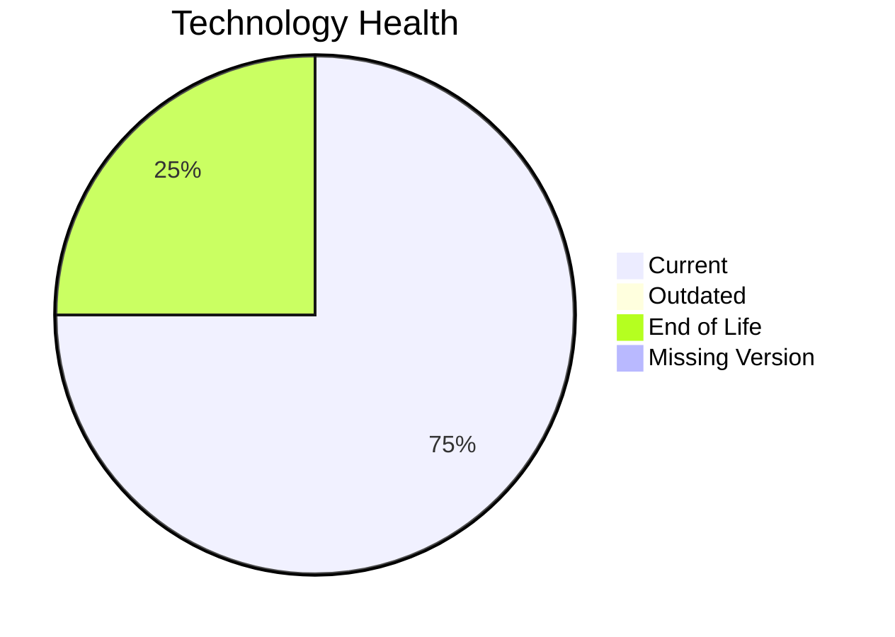

# Application Report: ComplianceApp-022

**ID:** app022  
**Generated:** 2026-05-13

## Overview
| Attribute | Value |
|---|---|
| Owner | Compliance |
| Environment | AWS, On-premise |
| Business Criticality | Critical |
| Users | 310 |
| Servers | 2 |

## Technology Stack
| Component | Technology | Status |
|---|---|---|
| Operating System | RHEL 7 | 🔴 EOL |
| Language | Scala 2.13 | 🟢 CURRENT_VERSION |
| Application Server | Payara 6.0 | 🟢 CURRENT_VERSION |
| Database | PostgreSQL 14 | 🟢 CURRENT_VERSION |

## Complexity Assessment
**Score:** 6/10 — **MEDIUM**  
**Confidence:** Medium

## Modernization Scenarios
| Applicable Scenario | Priority | Cost | Savings/Year |
|---|---|---:|---:|
| Operating System Update | High | €1157 | €500 |
| Update outdated components | High | €N/A | €N/A |

## Financial Summary
| Metric | Value |
|---|---:|
| Total One-Time Cost | €1157 |
| Total Yearly Savings | €500 |
| Break-Even | 2.3 years |
