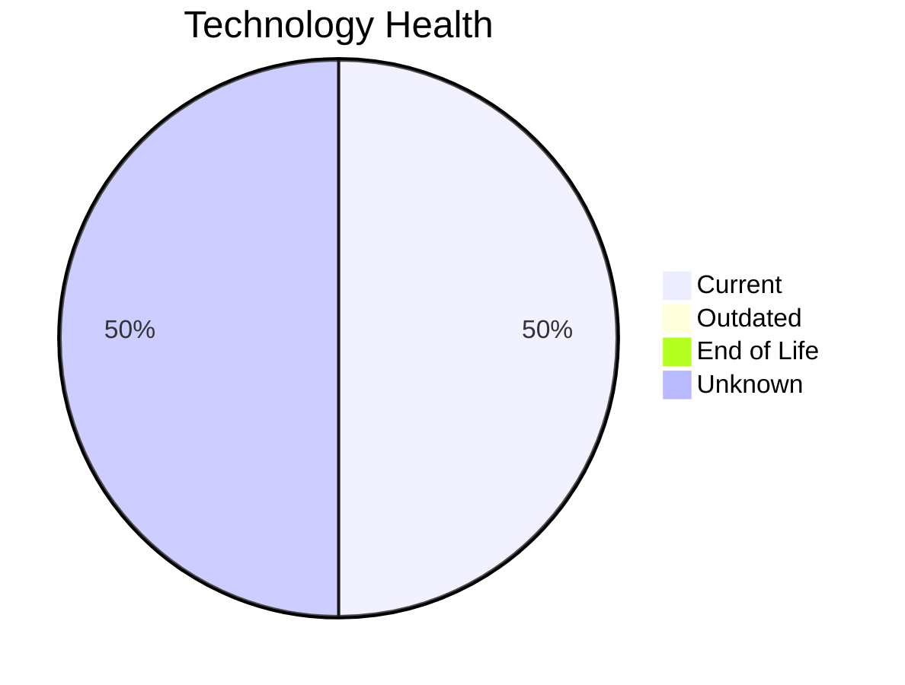

# Application Report: ChatbotApp-023

**ID:** app023
**Generated:** 2026-05-14

## Overview

| Attribute | Value |
|-----------|-------|
| Owner | Customer Service |
| Environment | AWS |
| Business Criticality | Medium |
| Users | 1100 |
| Servers | 1 |
| Solution Type | Open Source |
| Architecture | 3-Tier |
| Containerized | Yes |
| CI/CD | Yes |

## Technology Stack

| Component | Technology | Version | Status |
|-----------|-----------|---------|--------|
| Os | RHEL 8 | 8 | 🟢 CURRENT_VERSION |
| Database | MongoDB |  | ⚪ NO_KNOWLEDGE |
| Programming Language | Node.js 18 | 18 | 🟢 CURRENT_VERSION |
| Application Server | Apache Tomcat. 7.4 | Tomcat. 7.4 | ⚪ NO_KNOWLEDGE |

## Complexity Assessment

**Score:** 4/10 — **MEDIUM**
**Confidence:** 8/10

| Factor | Score | Notes |
|--------|-------|-------|
| Technology Age | 2/10 | 0 EOL, 0 outdated components |
| Integration | 7/10 | 8 external interfaces |
| Infrastructure | 4/10 | 1 server(s), 2 environment(s) |
| Business Criticality | 4/10 | Medium criticality |
| Architecture | 2/10 | Containerized: Yes, CI/CD: Yes |
| Data | 5/10 | DB: MongoDB |

## Modernization Scenarios

### Applicable Scenarios

#### ✅ Switch to ARM-based CPU

- **Priority:** Medium
- **Effort:** Medium
- **Effects:** cost, sustainability
- **Cost:** €4,373 (one-time)
- **Savings:** €1,000/year
- **Reasoning:** Application is containerized on Linux and custom-developed, making it a good candidate for ARM CPU migration for cost and sustainability benefits.

### Not Applicable / Other

| Scenario | Status | Reason |
|----------|--------|--------|
| Operating System Update | ✔️ FULFILLED | Operating system RHEL 8 is on a current, supported version. |
| Switch to standard Linux Operating System | ✔️ FULFILLED | Application already runs on standard Linux (RHEL 8). No migration needed. |
| Applications Server replacement | ❓ LACK_OF_DATA | Cannot assess application server lifecycle for Apache Tomcat. 7.4. |
| Application Migration to Cloud Infrastructure (Lift & Shift) | ✔️ FULFILLED | Application is already deployed on cloud infrastructure (AWS). No migration needed. |
| Application Containerization | ✔️ FULFILLED | Application is already containerized. Scenario already achieved. |
| Application Refactoring and De-coupling | ❌ NOT_APPLICABLE | Application has 3-Tier architecture and is containerized, suggesting modern modular design. Refactor... |
| Upgrade Legacy Databases | ❓ LACK_OF_DATA | Cannot assess database lifecycle status for MongoDB without version information. |
| Switch DB Engine to open-source database solution | ✔️ FULFILLED | Database MongoDB is already an open-source or managed solution. No commercial license migration need... |
| Update outdated components | ❓ LACK_OF_DATA | Some component version data is missing or inconclusive. |

## Financial Summary

| Metric | Value |
|--------|-------|
| Total One-Time Cost | €4,373 |
| Total Yearly Savings | €1,000 |
| Break-Even | 4.4 years |
