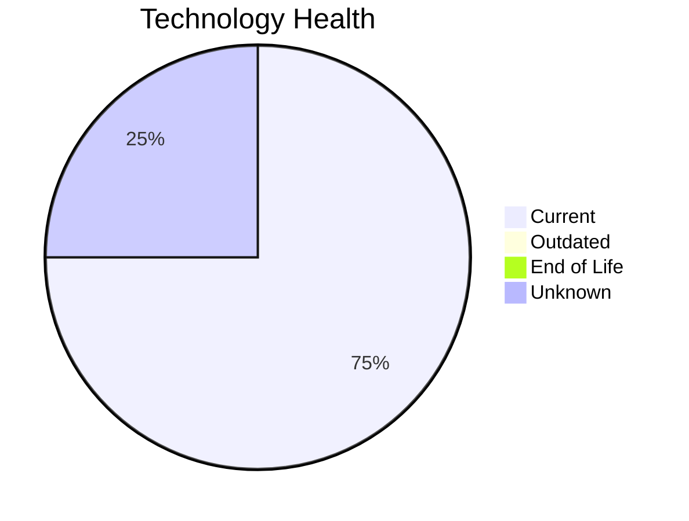

# Application Report: ChatbotApp-023

**ID:** app023  
**Generated:** 2026-05-06

## Overview

| Attribute | Value |
|-----------|-------|
| Business Unit | Customer Service |
| Deployment | AWS |
| Business Criticality | Medium |
| Users | 1100 |
| Servers | sv34 |
| Architecture | 3-Tier |
| Containerized | Yes |
| CI/CD | Yes |

## Technology Stack

| Component | Technology | Status |
|-----------|-----------|--------|
| Operating System | RHEL 8 | 🟢 CURRENT_VERSION |
| Database | MongoDB | 🟢 CURRENT_VERSION |
| Language | Node.js 18 | 🟢 CURRENT_VERSION |
| App Server | Apache Tomcat. 7.4 | ⚪ NO_KNOWLEDGE |

## Complexity Assessment

**Score:** 5/10 — **MEDIUM**  
**Confidence:** 8/10

> Complexity score 5/10 (MEDIUM). 8 external interfaces.

| Factor | Score |
|--------|-------|
| Technology Age & EOL | 2/10 |
| Integration Complexity | 7/10 |
| Infrastructure Scale | 4/10 |
| Business Criticality | 9/10 |
| Code & Architecture | 2/10 |
| Data Complexity | 4/10 |

## Modernization Scenarios

### Applicable Scenarios

_No applicable scenarios found._

### Other Scenarios

| Scenario | Status | Reason |
|----------|--------|--------|
| Operating System Update | FULFILLED | Operating system is on a current, supported version. |
| Switch to standard Linux Operating System | FULFILLED | Application runs on standard Linux (RHEL 8). |
| Switch to ARM-based CPU | LACK_OF_DATA | CPU architecture not documented in application data. |
| Applications Server replacement | LACK_OF_DATA | Application server lifecycle status unknown. |
| Application Migration to Cloud Infrastructure (Lift & Shift) | FULFILLED | Application is already deployed on cloud (AWS). |
| Application Containerization | FULFILLED | Application is already containerized. |
| Application Refactoring and De-coupling | PARTIALLY_FULFILLED | 3-tier architecture has some separation; further decoupling into microservices i... |
| Upgrade Legacy Databases | FULFILLED | Database (MongoDB) is on a current, supported version. |
| Switch DB Engine to open-source database solution | FULFILLED | Database (MongoDB) is already open-source or compatible. |
| Update outdated components | NOT_APPLICABLE | No outdated components found. |
