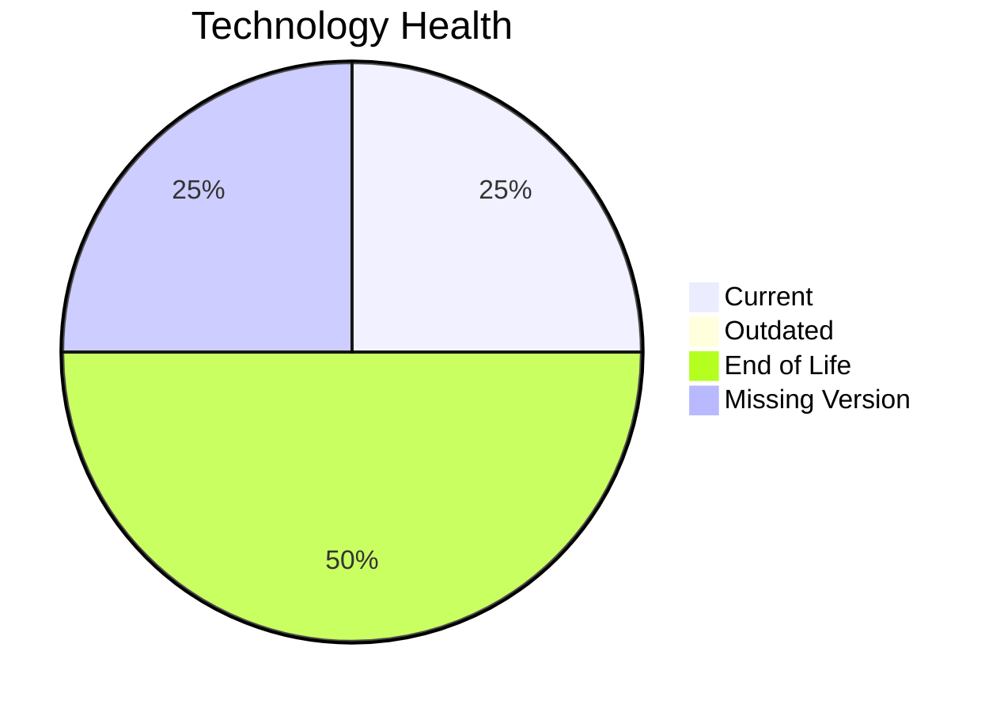

# Application Report: ChatbotApp-023

**ID:** app023
**Generated:** 2026-05-11

## Overview

| Attribute | Value |
|-----------|-------|
| Owner | Customer Service |
| Environment | AWS |
| Business Criticality | Medium |
| Users | 1100 |
| Servers | 1 |

## Technology Stack

| Component | Technology | Version | Status |
|-----------|-----------|---------|--------|
| Operating System | RHEL | RHEL 8 | 🟢 CURRENT_VERSION |
| Database | MongoDB | MongoDB | ⚪ NO_KNOWLEDGE |
| Language | Node.js | Node.js 18 | 🔴 EOL |
| Framework | N/A | N/A | ⚪ |
| App Server | Apache Tomcat | Apache Tomcat. 7.4 | 🔴 EOL |

## Complexity Assessment

**Score:** 6/10 — **MEDIUM**
**Confidence:** 7

Technology age score 9/10 (EOL=2, outdated=0, unknown=1); integration score 8/10 (interfaces=8, api_endpoints=22); infrastructure score 2/10 (servers=1, environments=2); business criticality score 6/10 (Medium, users=1100); architecture score 3/10 (architecture=3-Tier, CI/CD=Yes, containerized=Yes); data score 3/10 (db_count=1, db_storage_gb=200).

## Modernization Scenarios

### Applicable Scenarios

#### ✅ Applications Server replacement

- **Priority:** Medium
- **Effort:** Medium
- **Effects:** agility, cost
- **Cost:** €11565 (one-time)
- **Savings:** €10800/year
- **Reasoning:** Application server version is legacy or unsupported.

#### ✅ Application Refactoring and De-coupling

- **Priority:** High
- **Effort:** High
- **Effects:** agility, cost, sustainability
- **Cost:** €289133 (one-time)
- **Savings:** €135000/year
- **Reasoning:** Architecture and integration profile indicate decoupling/refactoring opportunity.

#### ✅ Update outdated components

- **Priority:** High
- **Effort:** High
- **Effects:** security, agility, cost
- **Cost:** N/A
- **Savings:** N/A
- **Reasoning:** Language/framework/server components are outdated or end-of-life.

### Not Applicable / Other

| Scenario | Status | Reason |
|----------|--------|--------|
| Operating System Update | FULFILLED | Operating system is on a supported current version. |
| Switch to standard Linux Operating System | FULFILLED | Application already runs on a standard Linux distribution. |
| Switch to ARM-based CPU | LACK_OF_DATA | CPU architecture (x86/x64/ARM) is not provided in source data. |
| Application Migration to Cloud Infrastructure (Lift & Shift) | FULFILLED | Application is already hosted on public cloud infrastructure. |
| Application Containerization | FULFILLED | Application is already containerized. |
| Upgrade Legacy Databases | LACK_OF_DATA | Database version/support information is incomplete. |
| Switch DB Engine to open-source database solution | LACK_OF_DATA | Database engine details are insufficient for open-source migration assessment. |

## Financial Summary

| Metric | Value |
|--------|-------|
| Total One-Time Cost | €300698 |
| Total Yearly Savings | €145800 |
| Break-Even | 2.1 years |
