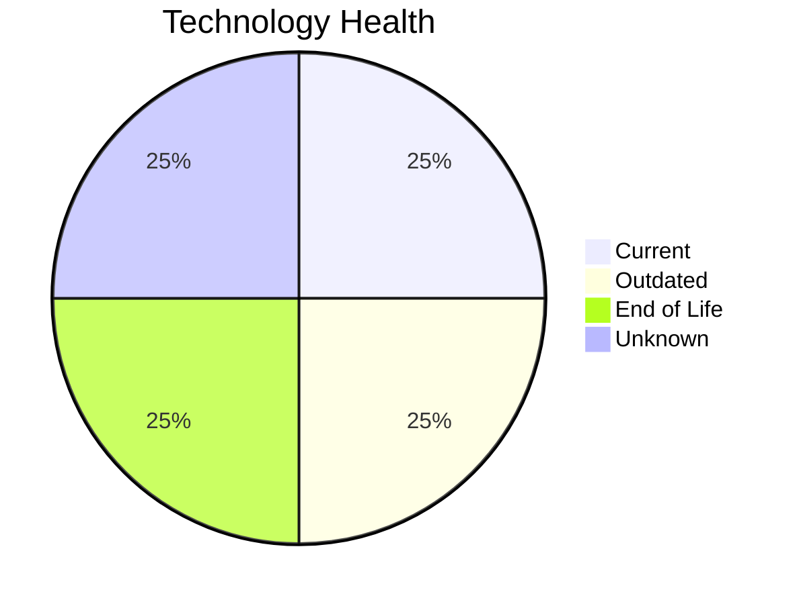

# Application Report: ChatbotApp-023

**ID:** app023  
**Generated:** 2026-05-15

## Overview

| Attribute | Value |
|-----------|-------|
| Business Unit | Customer Service |
| Deployment | AWS |
| Business Criticality | Medium |
| Users | 1100 |
| Solution Type | Open Source |
| Architecture | 3-Tier |
| Containerized | Yes |
| CI/CD | Yes |
| External Interfaces | 8 |

## Technology Stack

| Component | Technology | Status |
|-----------|-----------|--------|
| Operating System | RHEL 8 | 🟢 Current |
| Database | MongoDB | ⚪ Unknown |
| Language | Node.js 18 | 🟡 Outdated |
| App Server | Apache Tomcat. 7.4 | 🔴 EOL |

## Complexity Assessment

**Score:** 5/10 — **MEDIUM**  
**Confidence:** 8

| Factor | Score | Notes |
|--------|-------|-------|
| Technology Age | 7/10 | 1 EOL and 1 outdated components — significant aging |
| Integration | 8/10 | 8 external interfaces, 0 dependencies — highly integrated |
| Infrastructure | 3/10 | 1 server instance(s), 2 environment(s) |
| Business Criticality | 6/10 | Business criticality: medium, 1100 users |
| Architecture | 2/10 | 3-tier architecture; containerized; CI/CD present |
| Data | 3/10 | Standard data complexity |

## Modernization Scenarios

### Applicable Scenarios

#### ✅ Switch to ARM-based CPU

- **Priority:** Medium
- **Effort:** Medium
- **Effects:** cost, sustainability
- **One-time Cost:** €5,028
- **Yearly Savings:** €1,000/year
- **Reasoning:** Application is cloud-deployed and containerized. ARM-based instances (e.g., AWS Graviton) can reduce costs.

#### ✅ Applications Server replacement

- **Priority:** Medium
- **Effort:** Medium
- **Effects:** agility, cost
- **One-time Cost:** €10,057
- **Yearly Savings:** €10,800/year
- **Reasoning:** Application server 'Apache Tomcat. 7.4' has reached EOL. Replacement is needed to maintain security and support.

#### ✅ Update outdated components

- **Priority:** High
- **Effort:** High
- **Effects:** security, agility, cost
- **One-time Cost:** N/A
- **Yearly Savings:** N/A
- **Reasoning:** Multiple EOL/outdated components detected (1 EOL, 1 outdated). Systematic update program needed.

### Other Scenarios

| Scenario | Status | Reason |
|----------|--------|--------|
| Operating System Update | ✔️ Fulfilled | OS 'RHEL 8' is on a current, supported version with no end-of-life or outdated s... |
| Switch to standard Linux Operating System | ✔️ Fulfilled | OS 'RHEL 8' is already a standard Linux distribution. |
| Application Migration to Cloud Infrastructure (Lift & Shift) | ✔️ Fulfilled | Application is already deployed in the cloud. |
| Application Containerization | ✔️ Fulfilled | Application is already containerized. |
| Application Refactoring and De-coupling | 🔶 Partial | Application has a 3-Tier architecture. Some decoupling already done but may bene... |
| Upgrade Legacy Databases | ❓ No Data | Database 'MongoDB' version/lifecycle data insufficient for assessment. |
| Switch DB Engine to open-source database solution | ✔️ Fulfilled | Database 'MongoDB' is already an open-source engine. |

## Business Case Summary

| Metric | Value |
|--------|-------|
| Total One-time Cost | €15,085 |
| Total Yearly Savings | €11,800 |
| ROI Break-even | 1.3 years |
