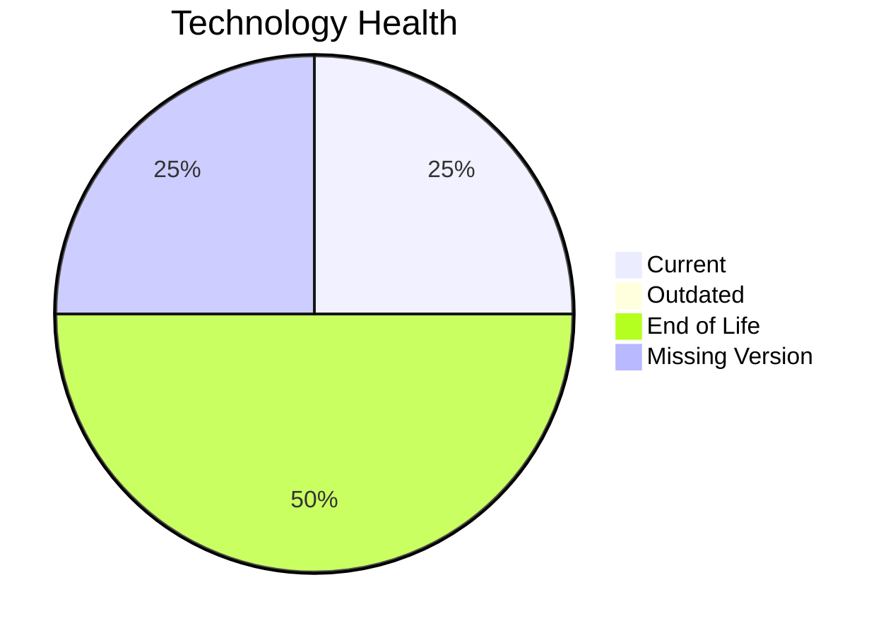

# Application Report: ChatbotApp-023

**ID:** app023
**Generated:** 2026-05-07

## Overview

| Attribute | Value |
|-----------|-------|
| Owner | N/A |
| Environment | AWS |
| Business Criticality | Medium |
| Users | 1100 |
| Servers | 1 |

## Technology Stack

| Component | Technology | Version | Status |
|-----------|-----------|---------|--------|
| Operating System | RHEL | 8 | 🟢 CURRENT_VERSION |
| Database | MongoDB | unknown | ⚪ NO_KNOWLEDGE |
| Language | Node.js | 18 | 🔴 EOL |
| Framework | N/A | N/A | ⚪ NO_KNOWLEDGE |
| App Server | Tomcat | 7.4 | 🔴 EOL |

## Complexity Assessment

**Score:** 6/10 — **MEDIUM**
**Confidence:** 6

| Factor | Score | Notes |
|--------|-------|-------|
| Technology Age | 9/10 | 2 EOL components were found in the application stack. |
| Integration | 8/10 | The application exposes 8 interfaces, indicating heavy integration. |
| Infrastructure | 5/10 | 1 servers and 2 environments indicate moderate infrastructure complexity. |
| Business Criticality | 6/10 | Criticality is 'Medium' with 1100 users. |
| Architecture | 1/10 | A 3-tier architecture is more separable than 1-tier or 2-tier designs. Containerization lowers modernization friction. CI/CD lowers delivery risk. |
| Data | 5/10 | Database footprint (200 GB) indicates moderate data migration effort. |

## Modernization Scenarios

### Applicable Scenarios

#### ✅ Applications Server replacement

- **Priority:** Medium
- **Effort:** Medium
- **Effects:** agility, cost
- **Cost:** €11,565 (one-time)
- **Savings:** €10,800/year
- **Reasoning:** Tomcat 7 is out of support.

#### ✅ Update outdated components

- **Priority:** High
- **Effort:** High
- **Effects:** security, agility, cost
- **Cost:** €N/A (one-time)
- **Savings:** €N/A/year
- **Reasoning:** At least one language, framework, or application server component is outdated or EOL.

### Not Applicable / Other

| Scenario | Status | Reason |
|----------|--------|--------|
| Operating System Update | FULFILLED | RHEL 8 remains vendor-supported through May 2029. |
| Switch to standard Linux Operating System | FULFILLED | Application already runs on a standard Linux distribution. |
| Switch to ARM-based CPU | LACK_OF_DATA | CPU architecture is not present in the workbook, so ARM suitability cannot be validated. |
| Application Migration to Cloud Infrastructure (Lift & Shift) | FULFILLED | Application is already hosted on AWS, which satisfies the public cloud hosting indicator. |
| Application Containerization | FULFILLED | The workbook explicitly marks the application as containerized. |
| Application Refactoring and De-coupling | PARTIALLY_FULFILLED | The application already shows some modular characteristics, but there is no evidence it is fully decoupled or microservice-based. |
| Upgrade Legacy Databases | LACK_OF_DATA | MongoDB version is not provided, so lifecycle status cannot be assessed reliably. |
| Switch DB Engine to open-source database solution | FULFILLED | The application already uses an open-source or open-source-compatible database engine. |

## Financial Summary

| Metric | Value |
|--------|-------|
| Total One-Time Cost | €11,565 |
| Total Yearly Savings | €10,800 |
| Break-Even | 1.1 years |
