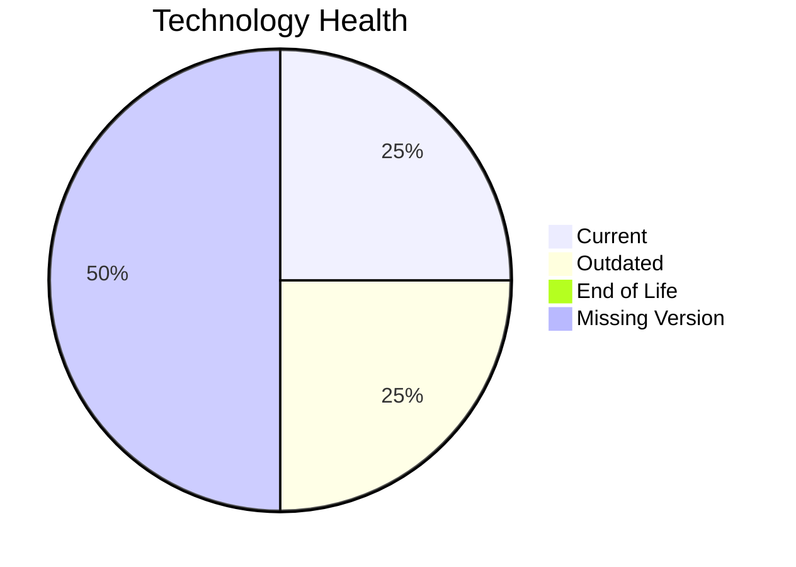

# Application Report: ChatbotApp-023

**ID:** app023  
**Generated:** 2026-05-13

## Overview
| Attribute | Value |
|---|---|
| Owner | Customer Service |
| Environment | AWS |
| Business Criticality | Medium |
| Users | 1100 |
| Servers | 1 |

## Technology Stack
| Component | Technology | Status |
|---|---|---|
| Operating System | RHEL 8 | 🟢 CURRENT_VERSION |
| Language | Node.js 18 | 🟡 OUTDATED |
| Application Server | Apache Tomcat. 7.4 | ⚪ NO_KNOWLEDGE |
| Database | MongoDB | ⚪ NO_KNOWLEDGE |

## Complexity Assessment
**Score:** 5/10 — **MEDIUM**  
**Confidence:** Medium

## Modernization Scenarios
| Applicable Scenario | Priority | Cost | Savings/Year |
|---|---|---:|---:|
| Update outdated components | High | €N/A | €N/A |

## Financial Summary
| Metric | Value |
|---|---:|
| Total One-Time Cost | €0 |
| Total Yearly Savings | €0 |
| Break-Even | N/A years |
