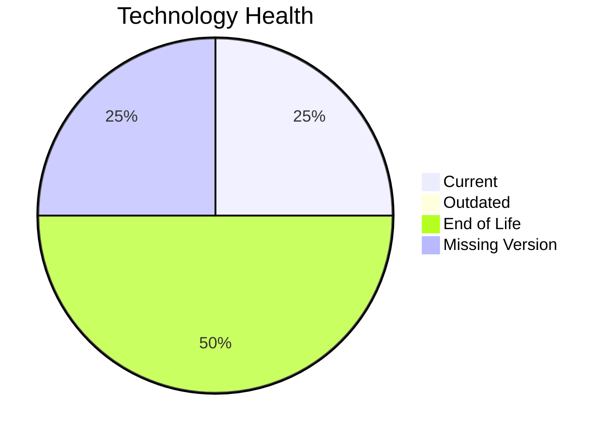

# Application Report: ChatbotApp-023

**ID:** app023
**Generated:** 2026-05-18T00:00:00Z

## Overview

| Attribute | Value |
|-----------|-------|
| Owner | Customer Service |
| Environment | AWS |
| Business Criticality | Medium |
| Users | 1100 |
| Servers | 1 |

## Technology Stack

| Component | Technology | Version | Status |
|-----------|-----------|---------|--------|
| Operating System | RHEL | 8 | 🟢 CURRENT_VERSION |
| Database | MongoDB | unknown | ⚪ NO_KNOWLEDGE |
| Language | Node.js | 18 | 🔴 EOL |
| Framework | N/A | N/A | ⚪ N/A |
| App Server | Apache Tomcat | 7.x | 🔴 EOL |

## Complexity Assessment

**Score:** 6/10 — **MEDIUM**
**Confidence:** 8

| Factor | Score | Notes |
|--------|-------|-------|
| Technology Age | 8/10 | 2 component(s) are EOL. |
| Integration | 8/10 | 8 external interfaces and 22 API endpoints. |
| Infrastructure | 4/10 | 1 server instance(s) across 2 environment(s). |
| Business Criticality | 6/10 | Criticality is Medium with 1100 users. |
| Architecture | 2/10 | Architecture is 3-Tier; containerized=Yes; CI/CD=Yes. |
| Data | 4/10 | Database storage is 200 GB on MongoDB.  |

## Modernization Scenarios

### Applicable Scenarios

#### ✅ Applications Server replacement

- **Priority:** Medium
- **Effort:** Medium
- **Effects:** agility, cost
- **Cost:** €11,565 (one-time)
- **Savings:** €10,800/year
- **Reasoning:** Apache Tomcat. 7.4 is assessed as EOL, which directly triggers server replacement.

#### ✅ Update outdated components

- **Priority:** High
- **Effort:** High
- **Effects:** security, agility, cost
- **Cost:** €N/A (one-time)
- **Savings:** €N/A/year
- **Reasoning:** At least one application runtime component is outdated or end of life.

### Not Applicable / Other

| Scenario | Status | Reason |
|----------|--------|--------|
| Operating System Update | FULFILLED | RHEL 8 is on a supported current-enough release. |
| Switch to standard Linux Operating System | FULFILLED | The application already runs on a supported standard Linux distribution. |
| Switch to ARM-based CPU | LACK_OF_DATA | CPU architecture is not documented in the workbook, so ARM suitability cannot be confirmed. |
| Application Migration to Cloud Infrastructure (Lift & Shift) | FULFILLED | The deployment target is already a public cloud platform (AWS). |
| Application Containerization | FULFILLED | The workbook already marks the application as containerized. |
| Application Refactoring and De-coupling | PARTIALLY_FULFILLED | The application already shows some modular characteristics, but there is not enough evidence of true microservice decoupling. |
| Upgrade Legacy Databases | LACK_OF_DATA | MongoDB is assessed as NO_KNOWLEDGE. |
| Switch DB Engine to open-source database solution | FULFILLED | MongoDB is already an open-source or open-source-compatible database option. |

## Financial Summary

| Metric | Value |
|--------|-------|
| Total One-Time Cost | €11,565 |
| Total Yearly Savings | €10,800 |
| Break-Even | 1.1 years |
