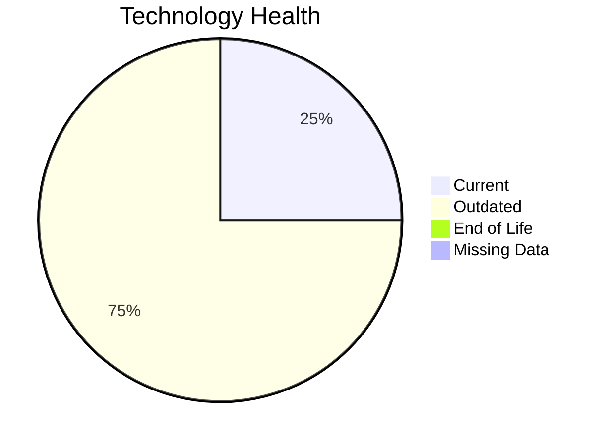

# Application Report: ChatbotApp-023

**ID:** app023  
**Generated:** 2026-05-07

## Overview

| Attribute | Value |
|-----------|-------|
| Business Unit | Customer Service |
| Deployment Type | AWS |
| Business Criticality | Medium |
| Users | 1100 |
| Servers | N/A |
| Solution Type | Open Source |

**Description:** AI-powered chatbot system for handling customer inquiries and providing automated support

## Technology Stack

| Component | Technology | Status |
|-----------|-----------|--------|
| Os | RHEL 8 | 🟢 CURRENT_VERSION |
| Database | MongoDB None | 🟡 OUTDATED |
| Language | js 18 | 🟡 OUTDATED |
| App_Server | Apache Tomcat None | 🟡 OUTDATED |

## Complexity Assessment

**Score:** 5/10 — **MEDIUM**  
**Confidence:** 9/10

**Reasoning:** Technology age: 6/10 (0 EOL, 3 outdated components) | Integration: 8/10 (8 external interfaces) | Infrastructure: 4/10 (1 servers, 2 environments) | Criticality: 5/10 (medium) | Architecture: 2/10 (containerized: yes, CI/CD: yes) | Data: 4/10 (200 GB storage)

### Contributing Factors

| Factor | Value |
|--------|-------|
| Servers | 1 |
| Databases | 1 |
| Environments | 2 |
| Interfaces | 8 |
| EOL Technologies | 0 |
| Outdated Technologies | 3 |
| Containerized | Yes |
| CI/CD Present | Yes |

## Modernization Scenarios

### Applicable Scenarios

#### ✅ Application Refactoring and De-coupling

- **Priority:** High
- **Effort:** High
- **Effects:** agility, cost, sustainability
- **Cost:** $251,419.65 (one-time)
- **Savings:** $135,000.00/year
- **Reasoning:** Triggered by: Architecture is Tightly Coupled

#### ✅ Upgrade Legacy Databases

- **Priority:** High
- **Effort:** Medium
- **Effects:** security, agility
- **Cost:** $10,056.79 (one-time)
- **Savings:** $10,000.00/year
- **Reasoning:** Triggered by: Database Support is End of Life / Outdated

#### ✅ Update outdated components

- **Priority:** High
- **Effort:** High
- **Effects:** security, agility, cost
- **Cost:** $0.00 (one-time)
- **Savings:** $0.00/year
- **Reasoning:** Triggered by: Used Programming language is legacy or outdated (e.g. Java 6 or older, .NET Framework 3.5 or older, PHP 5.x or older, Python 2.x), Used programming language is no longer supported by vendor or community

### Other Scenarios

| Scenario | Status | Reason |
|----------|--------|--------|
| Operating System Update | ✔️ FULFILLED | Fulfilled: Operating system is on a current, supported version with no end-of-li... |
| Switch to standard Linux Operating System | ✔️ FULFILLED | Fulfilled: Application already runs on a standard, widely supported Linux distri... |
| Switch to ARM-based CPU | ❌ NOT_APPLICABLE | No primary triggers matched for this application. |
| Applications Server replacement | ✔️ FULFILLED | Fulfilled: Application server is already containerized and optimized |
| Application Migration to Cloud Infrastructure (Lift & Shift) | ✔️ FULFILLED | Fulfilled: Application is already hosted on a Public Cloud provider |
| Application Containerization | ✔️ FULFILLED | Fulfilled: Application is already containerized |
| Switch DB Engine to open-source database solution | ✔️ FULFILLED | Fulfilled: Database engine is already an open-source alternative with no commerc... |

## Financial Summary

| Metric | Value |
|--------|-------|
| Total One-Time Cost | $261,476.43 |
| Total Yearly Savings | $145,000.00 |
| Break-Even | 1.8 years |

---

*This report was automatically generated from application portfolio analysis.*
