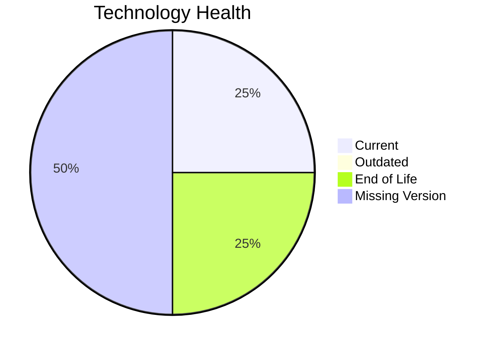

# Application Report: ChatbotApp-023

**ID:** app023  
**Generated:** 2026-05-17

## Overview

| Attribute | Value |
|-----------|-------|
| Owner | N/A |
| Environment | AWS |
| Business Criticality | Medium |
| Users | 1100 |
| Servers | 1 |

## Technology Stack

| Component | Technology | Version | Status |
|-----------|-----------|---------|--------|
| Operating System | RHEL | 8 | 🟢 CURRENT_VERSION |
| Database | MongoDB | N/A | ⚪ NO_KNOWLEDGE |
| Language | Node.js | 18 | 🔴 EOL |
| Framework | N/A | N/A | ⚪ NO_KNOWLEDGE |
| App Server | Apache | 7.4 | ⚪ NO_KNOWLEDGE |

## Complexity Assessment

**Score:** 6/10 — **MEDIUM**  
**Confidence:** 6

| Factor | Score | Notes |
|--------|-------|-------|
| Technology Age | 8/10 | At least one component is EOL. |
| Integration | 8/10 | High integration surface with 8 external interfaces and 22 APIs. |
| Infrastructure | 5/10 | Moderate infrastructure footprint with 1 servers and 2 environments. |
| Business Criticality | 5/10 | Business criticality is Medium. |
| Architecture | 3/10 | already containerized, CI/CD exists, traditional multi-tier architecture. |
| Data | 5/10 | 1 database engine(s), 200 GB storage, database version not fully known. |

## Modernization Scenarios

### Applicable Scenarios

#### ✅ Applications Server replacement

- **Priority:** Medium
- **Effort:** Medium
- **Effects:** agility, cost
- **Cost:** €11565 (one-time)
- **Savings:** €10800/year
- **Reasoning:** Apache Tomcat. 7.4 is assessed as NO_KNOWLEDGE and should be modernized or replaced.

#### ✅ Update outdated components

- **Priority:** High
- **Effort:** High
- **Effects:** security, agility, cost
- **Cost:** €0 (one-time)
- **Savings:** €0/year
- **Reasoning:** One or more application components are outdated or end-of-life.

### Not Applicable / Other

| Scenario | Status | Reason |
|----------|--------|--------|
| Operating System Update | FULFILLED | RHEL 8 is within supported lifecycle. |
| Switch to standard Linux Operating System | FULFILLED | RHEL 8 already belongs to a standard Linux family. |
| Switch to ARM-based CPU | LACK_OF_DATA | CPU architecture is not documented in the workbook, so ARM suitability cannot be assessed confidently. |
| Application Migration to Cloud Infrastructure (Lift & Shift) | FULFILLED | Deployment target already points to AWS/public cloud only. |
| Application Containerization | FULFILLED | Application is already containerized. |
| Application Refactoring and De-coupling | NOT_APPLICABLE | No clear evidence of customer-controlled monolithic architecture was found. |
| Upgrade Legacy Databases | LACK_OF_DATA | Database engine/version details are insufficient to determine upgrade need. |
| Switch DB Engine to open-source database solution | FULFILLED | MongoDB already uses an open-source-compatible engine family. |

## Financial Summary

| Metric | Value |
|--------|-------|
| Total One-Time Cost | €11565 |
| Total Yearly Savings | €10800 |
| Break-Even | 1.1 years |
