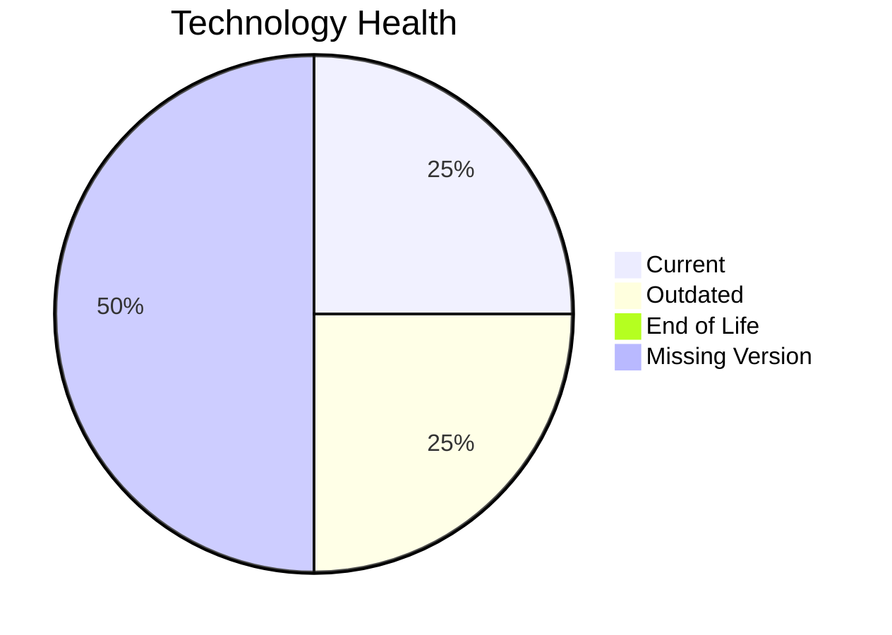

# Application Report: ChatbotApp-023

**ID:** app023
**Generated:** 2026-04-24

## Overview

| Attribute | Value |
|-----------|-------|
| Owner | Customer Service |
| Business Unit | Customer Service |
| Deployment Type | AWS |
| Business Criticality | Medium |
| Users | 1100 |
| Servers | N/A |
| Architecture | 3-Tier |
| Solution Type | Open Source |
| CI/CD | Yes |
| Containerized | Yes |

## Technology Stack

| Component | Technology | Version | Status |
|-----------|-----------|---------|--------|
| Operating System | RHEL 8 | RHEL 8 | 🟢 CURRENT_VERSION |
| Language | Node.js 18 | Node.js 18 | 🟡 OUTDATED |
| Database | MongoDB | MongoDB | ⚪ NO_KNOWLEDGE |
| App Server | Apache Tomcat. 7.4 | Apache Tomcat. 7.4 | ⚪ NO_KNOWLEDGE |

## Complexity Assessment

**Score:** 4/10 — **MEDIUM**
**Confidence:** 7

**Reasoning:** Tech age score 5/10 (0 EOL, 1 outdated components). Integration score 7/10 (8 external interfaces). Infrastructure score 3/10 (1 servers, 2 environments). Business criticality score 5/10 (criticality: Medium). Architecture score 1/10 (architecture: 3-Tier, containerized: Yes, CI/CD: Yes). Data score 4/10 (200GB storage).

### Contributing Factors

| Factor | Value |
|--------|-------|
| Servers | 1 |
| Environments | 2 |
| External Interfaces | 8 |
| EOL Technologies | 0 |
| Outdated Technologies | 1 |
| CI/CD | Yes |
| Containerized | Yes |

## Modernization Scenarios

### Applicable Scenarios

#### ✅ Update outdated components

- **Priority:** High
- **Effort:** High
- **Effects:** security, agility, cost
- **Cost:** N/A (one-time)
- **Savings:** N/A
- **Reasoning:** Programming language 'Node.js 18' is OUTDATED. Component updates are needed.

### Not Applicable / Other

| Scenario | Status | Reason |
|----------|--------|--------|
| Operating System Update | FULFILLED | Operating system 'RHEL 8' is currently supported and up to date.... |
| Switch to standard Linux Operating System | FULFILLED | Application already runs on a standard Linux distribution: 'RHEL 8'.... |
| Switch to ARM-based CPU | LACK_OF_DATA | CPU architecture not explicitly documented; cannot assess ARM suitability.... |
| Applications Server replacement | LACK_OF_DATA | Lifecycle data for application server 'Apache Tomcat. 7.4' is not available.... |
| Application Migration to Cloud Infrastructure (Lift & Shift) | FULFILLED | Application is already deployed on cloud: 'AWS'.... |
| Application Containerization | FULFILLED | Application is already containerized.... |
| Application Refactoring and De-coupling | LACK_OF_DATA | Insufficient architecture data to determine refactoring need.... |
| Upgrade Legacy Databases | LACK_OF_DATA | Cannot determine lifecycle status of database 'MongoDB'.... |
| Switch DB Engine to open-source database solution | FULFILLED | Database 'MongoDB' is already an open-source solution.... |

## Financial Summary

| Metric | Value |
|--------|-------|
| Total One-Time Cost | €0 |
| Total Yearly Savings | €0 |
| Break-Even | N/A |
