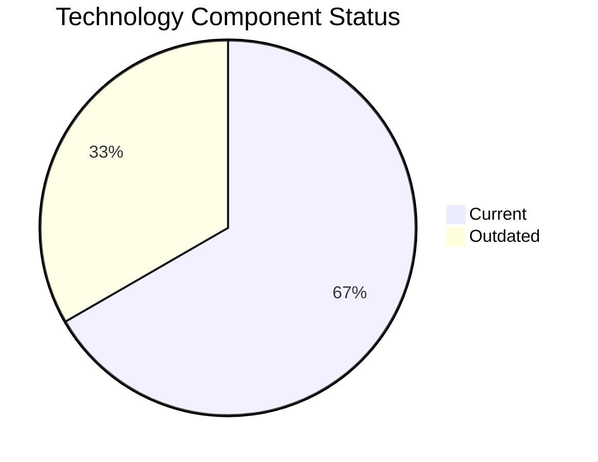

# ChatbotApp-023 (app023)

> Analysis timestamp: 2025-07-15T00:00:00Z

## Application Overview

| Attribute | Value |
|-----------|-------|
| **Name** | ChatbotApp-023 |
| **Status** | Production |
| **Criticality** | Medium |
| **Users** | 1,100 |
| **Solution Type** | Open Source |
| **Architecture** | 3-Tier |
| **Containerized** | Yes |
| **CI/CD** | Yes |
| **Environments** | 2 |
| **Servers** | s, v, 3, 4 |
| **External Interfaces** | 8 |

## Technology Stack

| Component | Value | Status |
|-----------|-------|--------|
| **Os** | RHEL 8 | ✅ CURRENT_VERSION |
| **Language** | Node.js 18 | ✅ CURRENT_VERSION |
| **Database** | MongoDB | ⚠️ OUTDATED |

## Technology Health

## Complexity Assessment

**Score: 5/10 — MEDIUM**

1 outdated component(s) require attention; 8 external interfaces drive integration complexity; 4 server(s) across 2 environment(s); Business criticality is Medium.

| Factor | Value |
|--------|-------|
| Servers | 4 |
| Environments | 2 |
| External Interfaces | 8 |
| EOL Technologies | 0 |
| Outdated Technologies | 1 |
| CI/CD Present | Yes |
| Containerized | Yes |

## Modernization Scenarios

| Scenario | Status | Reason |
|----------|--------|--------|
| OS Security Patch | ✅ FULFILLED | Operating system RHEL 8 is current and maintained. |
| Switch to Linux | ✅ FULFILLED | Application already runs on standard Linux (RHEL 8). |
| ARM CPU | 🔧 APPLICABLE | Application is containerized on Linux; ARM CPU migration is feasible. |
| App Server Replace | ✅ FULFILLED | Application server Apache Tomcat. 7.4 is current. |
| Cloud Deploy | 🔧 APPLICABLE | Application can be migrated to cloud infrastructure. |
| Containerization | ✅ FULFILLED | Application is already containerized. |
| Refactor/Decouple | ✅ FULFILLED | 3-Tier architecture already provides modular separation. |
| DB Upgrade | 🔧 APPLICABLE | Database MongoDB is OUTDATED and should be upgraded. |
| Open Source DB | ✅ FULFILLED | Database MongoDB is already open source. |
| Update Components | 🔧 APPLICABLE | Application has EOL or outdated components that require updating. |

## Financial Summary

| Metric | Value |
|--------|-------|
| Total Implementation Cost | $20,113.57 |
| Total Annual Savings | $13,700.00 |
| Payback Period | 1.47 years |
| 5-Year Net Benefit | $48,386.43 |

### Applicable Scenario Costs

| Scenario | Impl. Cost | Annual Savings | Payback |
|----------|-----------|----------------|---------|
| ARM CPU | $5,028.39 | $1,000.00 | 5.03 yrs |
| Cloud Deploy | $5,028.39 | $2,700.00 | 1.86 yrs |
| DB Upgrade | $10,056.79 | $10,000.00 | 1.01 yrs |
