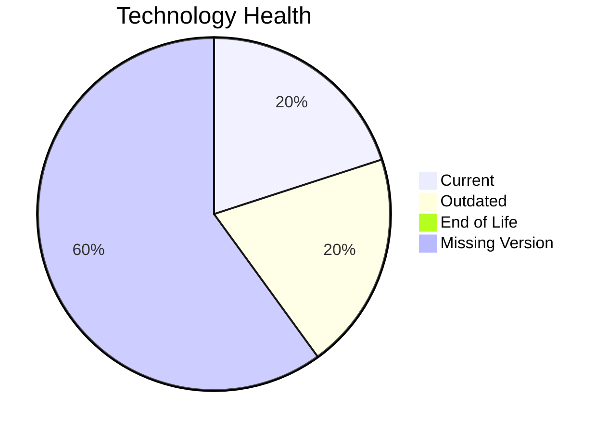

# Application Report: ChatbotApp-023

**ID:** app023  
**Generated:** 2026-05-14

## Overview

| Attribute | Value |
|-----------|-------|
| Owner | unknown |
| Environment | AWS |
| Business Criticality | Medium |
| Users | 1100 |
| Servers | sv34 |

## Technology Stack

| Component | Technology | Version | Status |
|-----------|-----------|---------|--------|
| os | RHEL 8 | 8 | 🟢 CURRENT_VERSION |
| database | MongoDB | unknown | ⚪ NO_KNOWLEDGE |
| language | Node.js 18 | 18 | 🟡 OUTDATED |
| framework | Framework | unknown | ⚪ NO_KNOWLEDGE |
| app_server | Apache Tomcat. 7.4 | 7.4 | ⚪ NO_KNOWLEDGE |

## Complexity Assessment

**Score:** 4/10 — **MEDIUM**  
**Confidence:** 8

**Reasoning:** Tech age 3/10 (0 EOL, 1 outdated components), integrations 8 interfaces and 0 dependencies, infrastructure 1 servers/2 environments, criticality Medium, architecture score 3/10, data score 3/10.

## Modernization Scenarios

### Applicable Scenarios

#### ✅ Switch to ARM-based CPU
- **Cost:** €4373 (one-time)
- **Savings:** €1000/year
- **Reasoning:** Cloud-hosted workload can be evaluated for ARM-based instances.

### Not Applicable / Other

| Scenario | Status | Reason |
|----------|--------|--------|
| Operating System Update | FULFILLED | RHEL 8 appears current. |
| Switch to standard Linux Operating System | FULFILLED | Application already runs on a standard Linux platform. |
| Applications Server replacement | LACK_OF_DATA | Insufficient application server data. |
| Application Migration to Cloud Infrastructure (Lift & Shift) | FULFILLED | Application is already deployed in cloud. |
| Application Containerization | FULFILLED | Application is already containerized. |
| Application Refactoring and De-coupling | PARTIALLY_FULFILLED | Architecture shows partial decoupling already. |
| Upgrade Legacy Databases | LACK_OF_DATA | Database lifecycle could not be determined. |
| Switch DB Engine to open-source database solution | LACK_OF_DATA | Database engine not clear enough for assessment. |
| Update outdated components | APPLICABLE | Outdated or EOL components identified in technology assessment. |

## Financial Summary

| Metric | Value |
|--------|-------|
| Total One-Time Cost | €4373 |
| Total Yearly Savings | €1000 |
| Break-Even | 4.4 years |
