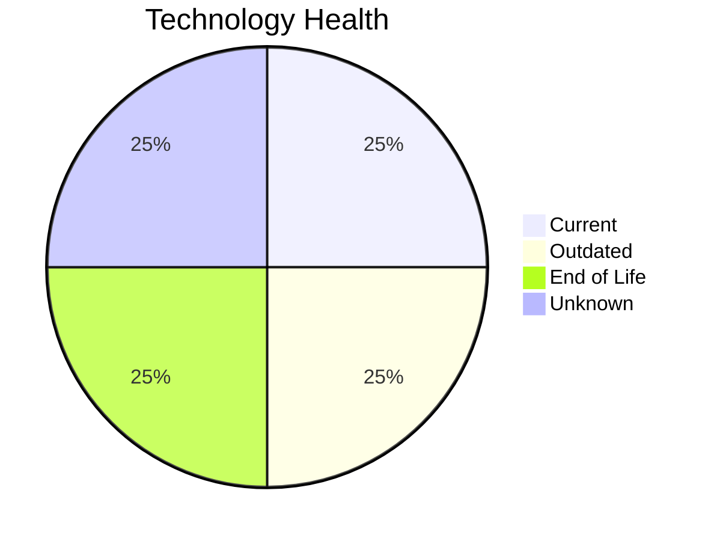

# Application Report: ChatbotApp-023

**ID:** app023
**Generated:** 2026-05-14

## Overview

| Attribute | Value |
|-----------|-------|
| Business Unit | Customer Service |
| Business Criticality | Medium |
| Solution Type | Open Source |
| Deployment Type | AWS |
| Users | 1100 |
| Servers | 1 |
| External Interfaces | 8 |
| Containerized | Yes |
| CI/CD Present | Yes |
| Architecture | 3-Tier |

## Technology Stack

| Component | Technology | Version | Status |
|-----------|-----------|---------|--------|
| Os | RHEL | 8 | 🟢 CURRENT_VERSION |
| Language | Node.js | 18 | 🟡 OUTDATED |
| Database | MongoDB | unknown | ⚪ NO_KNOWLEDGE |
| App Server | Apache Tomcat | 7.x | 🔴 EOL |

## Complexity Assessment

**Score:** 5/10 — **MEDIUM**
**Confidence:** 7

Score 5/10 (MEDIUM): EOL components=1, Outdated=1, Interfaces=8, Servers=1, Criticality=Medium, Architecture=3-Tier.

| Factor | Value |
|--------|-------|
| Servers | 1 |
| Environments | 2 |
| Interfaces | 8 |
| EOL Technologies | 1 |
| Outdated Technologies | 1 |
| Business Criticality | Medium |

## Modernization Scenarios

### Applicable Scenarios

#### ✅ Switch to ARM-based CPU

- **Priority:** Medium
- **Effort:** Medium
- **Effects:** cost, sustainability
- **One-Time Cost:** $5,028
- **Annual Savings:** $1,000/year
- **Reasoning:** Application is containerized on standard Linux. ARM migration is feasible if x86-specific binaries are absent. CPU architecture not explicitly documented.

#### ✅ Applications Server replacement

- **Priority:** Medium
- **Effort:** Medium
- **Effects:** agility, cost
- **One-Time Cost:** $10,057
- **Annual Savings:** $10,800/year
- **Reasoning:** Application server Apache Tomcat. 7.4 is EOL. Replacement with a modern server is recommended.

#### ✅ Update outdated components

- **Priority:** High
- **Effort:** High
- **Effects:** security, agility, cost
- **Reasoning:** Application has EOL or very legacy components. Update of outdated programming language and framework components is required.

### Other Scenarios

| Scenario | Status | Reason |
|----------|--------|--------|
| Operating System Update | ✔️ FULFILLED | Operating system RHEL 8 is on a current, supported version within its vendor support lifecycle. |
| Switch to standard Linux Operating System | ✔️ FULFILLED | Application already runs on a standard Linux distribution: RHEL 8. |
| Application Migration to Cloud Infrastructure (Lift & Shift) | ✔️ FULFILLED | Application is already deployed on cloud infrastructure (AWS). |
| Application Containerization | ✔️ FULFILLED | Application is already containerized (is_containerized=Yes). |
| Application Refactoring and De-coupling | ❌ NOT_APPLICABLE | Application already uses 3-tier architecture. Primary triggers for monolith/tight coupling do not ap... |
| Upgrade Legacy Databases | ❓ LACK_OF_DATA | Database MongoDB version is unknown. Cannot assess lifecycle. |
| Switch DB Engine to open-source database solution | ✔️ FULFILLED | Database MongoDB is already an open-source/license-free solution. |