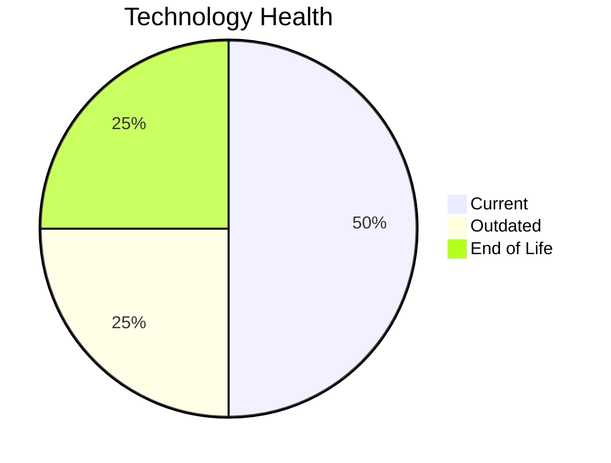

# Application Report: AuditApp-024

**ID:** app024  
**Generated:** 2026-05-05

## Overview

| Attribute | Value |
|-----------|-------|
| Business Unit | Finance |
| Deployment Type | On-Premise |
| Business Criticality | High |
| Users | 95 |
| Servers | sv35 |
| Environments | 2 |
| Architecture | 2-Tier |
| Containerized | No |
| CI/CD | No |
| Solution Type | Custom made |
| Data Classification | Confidential |

> Legacy audit management system for tracking financial audits and compliance activities

## Technology Stack

| Component | Technology | Version | Status |
|-----------|-----------|---------|--------|
| Os | Windows Server | 2019 | 🟢 CURRENT_VERSION |
| Database | SQL Server | 2014 | 🔴 EOL |
| Language | VB.NET | unspecified | 🟡 OUTDATED |
| Application Server | Microsoft IIS | 10.0 | 🟢 CURRENT_VERSION |

## Complexity Assessment

**Score:** 6/10 — **MEDIUM**  
**Confidence:** 7

> Score 6/10 (MEDIUM). EOL components: 1, Outdated: 1. External interfaces: 3. Servers: 1. Criticality: High. Architecture: 2-Tier. DB storage: 300.0GB.

| Factor | Value |
|--------|-------|
| Servers | 1 |
| Environments | 2 |
| External Interfaces | 3 |
| Business Criticality | High |
| EOL Technologies | 1 |
| Outdated Technologies | 1 |
| CI/CD | No |
| Containerized | No |

## Modernization Scenarios

### ✅ Applicable Scenarios

#### ✅ Application Migration to Cloud (Lift & Shift)

- **Priority:** High
- **Effort:** Low
- **One-Time Cost:** €5,783
- **Yearly Savings:** €2,700
- **Reasoning:** Application is hosted on-premise. Migration to cloud (Lift & Shift) is recommended to reduce infrastructure costs.

#### ✅ Application Refactoring and De-coupling

- **Priority:** High
- **Effort:** High
- **One-Time Cost:** €289,133
- **Yearly Savings:** €135,000
- **Reasoning:** Application has a 2-tier architecture with limited modularity. Refactoring and decoupling would improve maintainability and cloud-readiness.

#### ✅ Upgrade Legacy Databases

- **Priority:** High
- **Effort:** Medium
- **One-Time Cost:** €11,565
- **Yearly Savings:** €10,000
- **Reasoning:** Database SQL Server 2014 is EOL. SQL Server 2014 reached End of Extended Support on July 9, 2024. Immediate upgrade is required.

#### ✅ Switch DB Engine to Open-Source

- **Priority:** High
- **Effort:** Medium
- **Reasoning:** Application uses SQL Server (SQL Server 2014), a proprietary Microsoft database. Migration to PostgreSQL would reduce licensing costs.

#### ✅ Update Outdated Components

- **Priority:** High
- **Effort:** High
- **Reasoning:** Outdated/EOL application components detected: VB.NET unspecified (OUTDATED). These should be updated to current supported versions.

### Other Scenarios

| Scenario | Status | Reason |
|----------|--------|--------|
| Operating System Update | ✔️ FULFILLED | Operating system Windows Server 2019 is current and supported. |
| Switch to Standard Linux OS | ❌ NOT_APPLICABLE | Application runs on Windows OS. Scenario is excluded for Windows-based systems. |
| Switch to ARM-based CPU | ❌ NOT_APPLICABLE | Application runs on Windows OS, which is excluded from ARM migration per scenario criteria. |
| Application Server Replacement | ✔️ FULFILLED | Application server Microsoft IIS 10.0 is current. |
| Application Containerization | ❌ NOT_APPLICABLE | Windows-based application without confirmed .NET 6+ compatibility. Pre-.NET 6 Windows apps are excluded. |

## Financial Summary

| Metric | Value |
|--------|-------|
| Total One-Time Cost | €306,481 |
| Total Yearly Savings | €147,700 |
| Break-Even | 2.1 years |
