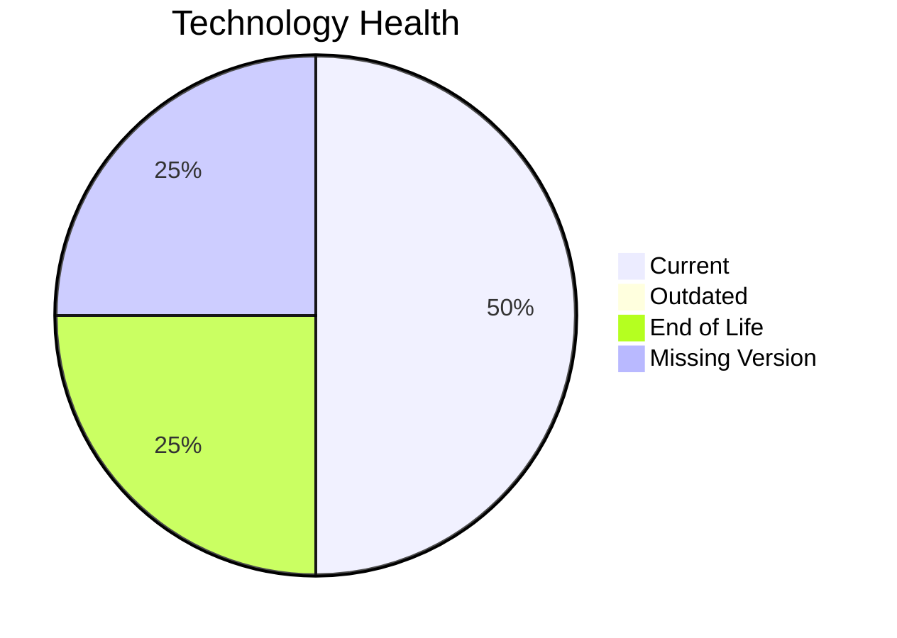

# Application Report: AuditApp-024

Modernization assessment for AuditApp-024 based solely on the Excel portfolio row and derived workflow outputs.

**ID:** app024  
**Generated:** 2026-05-07

## Overview

| Attribute | Value |
|-----------|-------|
| Owner | Finance |
| Environment | On-Premise |
| Business Criticality | High |
| Users | 95 |
| Servers | sv35 |

## Technology Stack

| Component | Technology | Version | Status |
|-----------|-----------|---------|--------|
| Operating System | Windows Server | 2019 | 🟢 |
| Database | SQL Server | 2014 | 🔴 |
| Language | VB.NET | unknown | ⚪ |
| Framework | N/A | N/A | ⚪ |
| App Server | Microsoft IIS | 10.0 | 🟢 |

## Complexity Assessment

**Score:** 6/10 — **MEDIUM**  
**Confidence:** 7

| Factor | Score | Notes |
|--------|-------|-------|
| Technology Age | 7/10 | 1 EOL, 0 outdated, 1 unknown lifecycle components. |
| Integration | 5/10 | 3 external interfaces and 2 API endpoints indicate the integration footprint. |
| Infrastructure | 2/10 | 1 listed server instances and 2 environments drive infrastructure coordination. |
| Business Criticality | 8/10 | Business criticality is High with approximately 95 users. |
| Architecture | 8/10 | 2-tier architecture still carries coupling risk; application is not containerized; CI/CD is not present |
| Data | 7/10 | database storage is 300 GB; proprietary or enterprise database migration complexity; database platform is EOL |

## Modernization Scenarios

### Applicable Scenarios

#### ✅ Application Migration to Cloud Infrastructure (Lift & Shift)

- **Priority:** High
- **Effort:** Low
- **Effects:** security, agility
- **Cost:** €5783 (one-time)
- **Savings:** €2700/year
- **Reasoning:** The application is still on-premise and matches the lift-and-shift trigger.

#### ✅ Application Containerization

- **Priority:** High
- **Effort:** High
- **Effects:** agility, cost, sustainability
- **Cost:** €115653 (one-time)
- **Savings:** €90000/year
- **Reasoning:** The application is not containerized and no hard blocker is visible in the input.

#### ✅ Application Refactoring and De-coupling

- **Priority:** High
- **Effort:** High
- **Effects:** agility, cost, sustainability
- **Cost:** €289133 (one-time)
- **Savings:** €135000/year
- **Reasoning:** Architecture and complexity indicators suggest a refactoring/de-coupling opportunity.

#### ✅ Upgrade Legacy Databases

- **Priority:** High
- **Effort:** Medium
- **Effects:** security, agility
- **Cost:** €11565 (one-time)
- **Savings:** €10000/year
- **Reasoning:** Database platform SQL Server 2014 is eol.

#### ✅ Switch DB Engine to open-source database solution

- **Priority:** High
- **Effort:** Medium
- **Effects:** cost
- **Cost:** N/A (one-time)
- **Savings:** N/A/year
- **Reasoning:** Database engine SQL Server 2014 is proprietary and matches the open-source migration trigger.

### Not Applicable / Other

| Scenario | Status | Reason |
|----------|--------|--------|
| Operating System Update | FULFILLED | Operating system Windows Server 2019 is already on a supported version. |
| Switch to standard Linux Operating System | NOT_APPLICABLE | The application already runs on Windows; this Linux standardization scenario is not a natural fit. |
| Switch to ARM-based CPU | LACK_OF_DATA | CPU architecture is not present in the Excel input, so the primary ARM migration trigger cannot be confirmed. |
| Applications Server replacement | FULFILLED | Application server Microsoft IIS 10.0 is already current. |
| Update outdated components | LACK_OF_DATA | Application runtime component versions are incomplete or unknown. |

## Financial Summary

| Metric | Value |
|--------|-------|
| Total One-Time Cost | €422134 |
| Total Yearly Savings | €237700 |
| Break-Even | 1.8 years |
