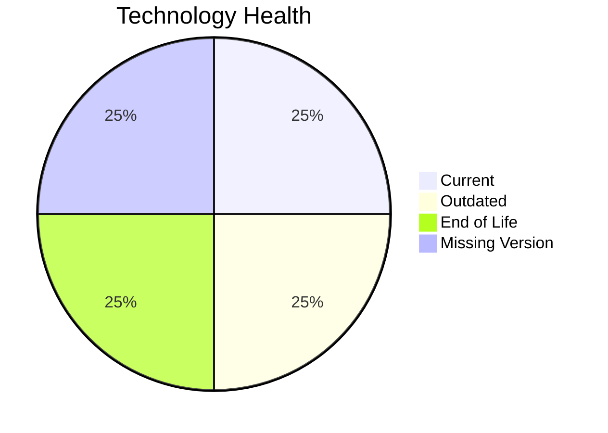

# Application Report: AuditApp-024

**ID:** app024  
**Generated:** 2026-05-13

## Overview
| Attribute | Value |
|---|---|
| Owner | Finance |
| Environment | On-Premise |
| Business Criticality | High |
| Users | 95 |
| Servers | 1 |

## Technology Stack
| Component | Technology | Status |
|---|---|---|
| Operating System | Windows Server 2019 | 🟡 OUTDATED |
| Language | VB.NET | ⚪ NO_KNOWLEDGE |
| Application Server | Microsoft IIS 10.0 | 🟢 CURRENT_VERSION |
| Database | SQL Server 2014 | 🔴 EOL |

## Complexity Assessment
**Score:** 6/10 — **MEDIUM**  
**Confidence:** Medium

## Modernization Scenarios
| Applicable Scenario | Priority | Cost | Savings/Year |
|---|---|---:|---:|
| Operating System Update | High | €1157 | €500 |
| Application Migration to Cloud Infrastructure (Lift & Shift) | High | €5783 | €2700 |
| Application Containerization | High | €115653 | €90000 |
| Application Refactoring and De-coupling | High | €289133 | €135000 |
| Upgrade Legacy Databases | High | €11565 | €10000 |
| Switch DB Engine to open-source database solution | High | €N/A | €N/A |
| Update outdated components | High | €N/A | €N/A |

## Financial Summary
| Metric | Value |
|---|---:|
| Total One-Time Cost | €423291 |
| Total Yearly Savings | €238200 |
| Break-Even | 1.8 years |
