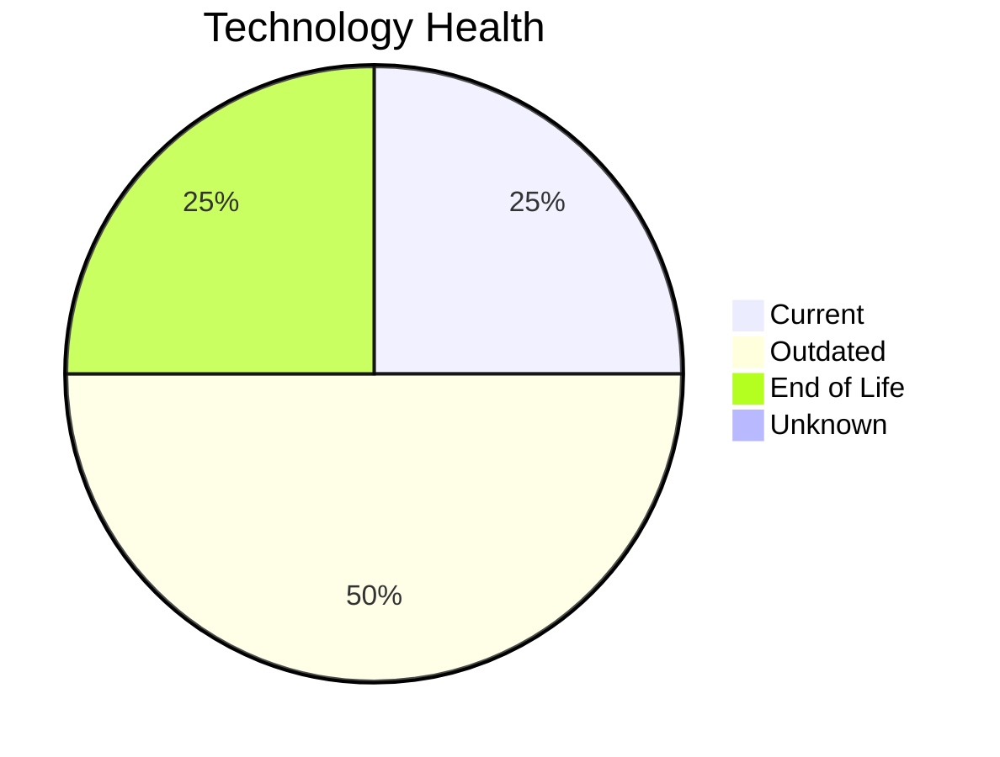

# Application Report: AuditApp-024

**ID:** app024
**Generated:** 2026-05-14

## Overview

| Attribute | Value |
|-----------|-------|
| Owner | Finance |
| Environment | On-Premise |
| Business Criticality | High |
| Users | 95 |
| Servers | 1 |
| Solution Type | Custom made |
| Architecture | 2-Tier |
| Containerized | No |
| CI/CD | No |

## Technology Stack

| Component | Technology | Version | Status |
|-----------|-----------|---------|--------|
| Os | Windows Server 2019 | Server 2019 | 🟡 OUTDATED |
| Database | SQL Server 2014 | Server 2014 | 🔴 EOL |
| Programming Language | VB.NET |  | 🟡 OUTDATED |
| Application Server | Microsoft IIS 10.0 | IIS 10.0 | 🟢 CURRENT_VERSION |

## Complexity Assessment

**Score:** 6/10 — **MEDIUM**
**Confidence:** 8/10

| Factor | Score | Notes |
|--------|-------|-------|
| Technology Age | 7/10 | 1 EOL, 2 outdated components |
| Integration | 5/10 | 3 external interfaces |
| Infrastructure | 4/10 | 1 server(s), 2 environment(s) |
| Business Criticality | 7/10 | High criticality |
| Architecture | 8/10 | Containerized: No, CI/CD: No |
| Data | 5/10 | DB: SQL Server 2014 |

## Modernization Scenarios

### Applicable Scenarios

#### ✅ Operating System Update

- **Priority:** High
- **Effort:** Low
- **Effects:** security
- **Cost:** €1,157 (one-time)
- **Savings:** €500/year
- **Reasoning:** Operating system Windows Server 2019 is outdated (past mainstream support) and requires update.

#### ✅ Application Migration to Cloud Infrastructure (Lift & Shift)

- **Priority:** High
- **Effort:** Low
- **Effects:** security, agility
- **Cost:** €5,783 (one-time)
- **Savings:** €2,700/year
- **Reasoning:** Application is on-premise. Cloud migration (Lift & Shift) offers improved scalability, security, and compliance benefits.

#### ✅ Application Refactoring and De-coupling

- **Priority:** High
- **Effort:** High
- **Effects:** agility, cost, sustainability
- **Cost:** €289,133 (one-time)
- **Savings:** €135,000/year
- **Reasoning:** Application has 2-Tier architecture which may have coupling between layers. Refactoring to modular/microservices architecture would improve agility.

#### ✅ Upgrade Legacy Databases

- **Priority:** High
- **Effort:** Medium
- **Effects:** security, agility
- **Cost:** €11,565 (one-time)
- **Savings:** €10,000/year
- **Reasoning:** Database SQL Server 2014 is End of Life and no longer receives security patches. Upgrade or migration is urgently needed.

#### ✅ Switch DB Engine to open-source database solution

- **Priority:** High
- **Effort:** Medium
- **Effects:** cost
- **Cost:** €28,913 (one-time)
- **Savings:** €15,000/year
- **Reasoning:** Application uses proprietary database SQL Server 2014. Migration to an open-source alternative would reduce costs.

#### ✅ Update outdated components

- **Priority:** High
- **Effort:** High
- **Effects:** security, agility, cost
- **Cost:** N/A (one-time)
- **Savings:** N/A/year
- **Reasoning:** Application has outdated components: programming language VB.NET is outdated. Update recommended.

### Not Applicable / Other

| Scenario | Status | Reason |
|----------|--------|--------|
| Switch to standard Linux Operating System | ❌ NOT_APPLICABLE | Application runs on Windows OS. Switching to Linux would require significant re-platforming; not app... |
| Switch to ARM-based CPU | 🚫 BLOCKED | Application runs on Windows Server which has legacy dependencies incompatible with ARM CPU migration... |
| Applications Server replacement | ✔️ FULFILLED | Application server Microsoft IIS 10.0 is on a current, supported version. No replacement needed. |
| Application Containerization | ⚠️ PARTIALLY_FULFILLED | Application runs on Windows Server with potentially pre-.NET 6 stack. Containerization may be limite... |

## Financial Summary

| Metric | Value |
|--------|-------|
| Total One-Time Cost | €336,551 |
| Total Yearly Savings | €163,200 |
| Break-Even | 2.1 years |
