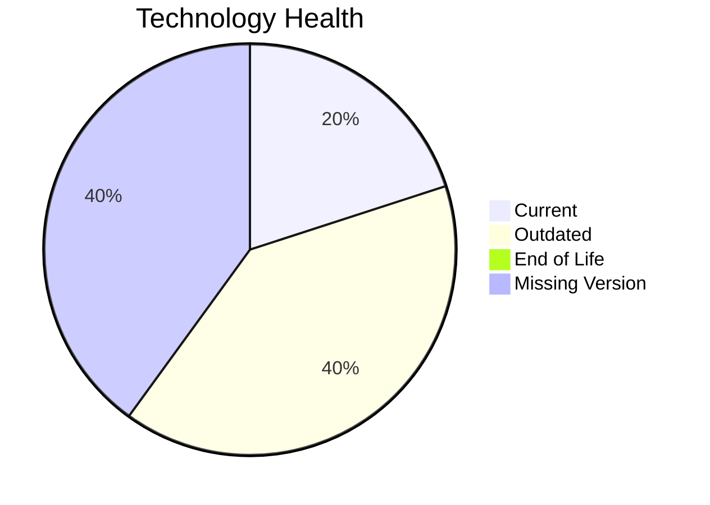

# Application Report: AuditApp-024

**ID:** app024  
**Generated:** 2026-05-14

## Overview

| Attribute | Value |
|-----------|-------|
| Owner | unknown |
| Environment | On-Premise |
| Business Criticality | High |
| Users | 95 |
| Servers | sv35 |

## Technology Stack

| Component | Technology | Version | Status |
|-----------|-----------|---------|--------|
| os | Windows Server 2019 | 2019 | 🟢 CURRENT_VERSION |
| database | SQL Server 2014 | 2014 | 🟡 OUTDATED |
| language | VB.NET | unknown | ⚪ NO_KNOWLEDGE |
| framework | Framework | unknown | ⚪ NO_KNOWLEDGE |
| app_server | Microsoft IIS 10.0 | 10.0 | 🟡 OUTDATED |

## Complexity Assessment

**Score:** 5/10 — **MEDIUM**  
**Confidence:** 8

**Reasoning:** Tech age 4/10 (0 EOL, 2 outdated components), integrations 3 interfaces and 0 dependencies, infrastructure 1 servers/2 environments, criticality High, architecture score 6/10, data score 5/10.

## Modernization Scenarios

### Applicable Scenarios

#### ✅ Switch to standard Linux Operating System
- **Cost:** €302 (one-time)
- **Savings:** €400/year
- **Reasoning:** Current OS (Windows Server 2019) is non-standard for Linux consolidation.
#### ✅ Applications Server replacement
- **Cost:** €10057 (one-time)
- **Savings:** €10800/year
- **Reasoning:** Application server Microsoft IIS 10.0 is outdated/EOL.
#### ✅ Application Migration to Cloud Infrastructure (Lift & Shift)
- **Cost:** €5028 (one-time)
- **Savings:** €2700/year
- **Reasoning:** Application appears on-premise and is a cloud migration candidate.
#### ✅ Application Containerization
- **Cost:** €100568 (one-time)
- **Savings:** €90000/year
- **Reasoning:** Containerization could improve portability and operations.
#### ✅ Application Refactoring and De-coupling
- **Cost:** €251420 (one-time)
- **Savings:** €135000/year
- **Reasoning:** Application modernization can include decoupling improvements.
#### ✅ Upgrade Legacy Databases
- **Cost:** €10057 (one-time)
- **Savings:** €10000/year
- **Reasoning:** Database SQL Server 2014 is legacy/outdated.

### Not Applicable / Other

| Scenario | Status | Reason |
|----------|--------|--------|
| Operating System Update | FULFILLED | Windows Server 2019 appears current. |
| Switch to ARM-based CPU | NOT_APPLICABLE | On-premise hosting makes ARM migration less direct. |
| Switch DB Engine to open-source database solution | APPLICABLE | Proprietary database engine indicates open-source migration opportunity. |
| Update outdated components | APPLICABLE | Outdated or EOL components identified in technology assessment. |

## Financial Summary

| Metric | Value |
|--------|-------|
| Total One-Time Cost | €377432 |
| Total Yearly Savings | €248900 |
| Break-Even | 1.5 years |
