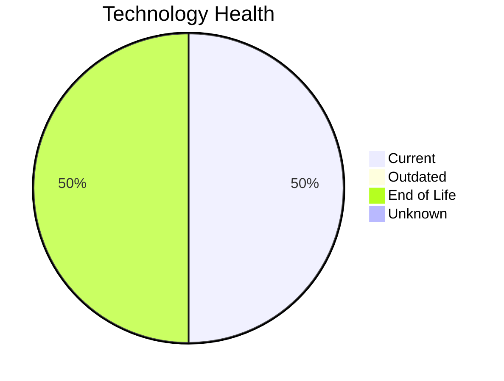

# Application Report: AuditApp-024

**ID:** app024  
**Generated:** 2026-05-15

## Overview

| Attribute | Value |
|-----------|-------|
| Business Unit | Finance |
| Deployment | On-Premise |
| Business Criticality | High |
| Users | 95 |
| Solution Type | Custom made |
| Architecture | 2-Tier |
| Containerized | No |
| CI/CD | No |
| External Interfaces | 3 |

## Technology Stack

| Component | Technology | Status |
|-----------|-----------|--------|
| Operating System | Windows Server 2019 | 🟢 Current |
| Database | SQL Server 2014 | 🔴 EOL |
| Language | VB.NET | 🔴 EOL |
| App Server | Microsoft IIS 10.0 | 🟢 Current |

## Complexity Assessment

**Score:** 6/10 — **MEDIUM**  
**Confidence:** 8

| Factor | Score | Notes |
|--------|-------|-------|
| Technology Age | 6/10 | 2 EOL component(s) detected |
| Integration | 4/10 | 3 external interfaces — some integrations |
| Infrastructure | 3/10 | 1 server instance(s), 2 environment(s) |
| Business Criticality | 8/10 | Business criticality: high, 95 users |
| Architecture | 10/10 | 2-tier architecture; not containerized; no CI/CD; legacy language: vb.net |
| Data | 3/10 | Standard data complexity |

## Modernization Scenarios

### Applicable Scenarios

#### ✅ Application Migration to Cloud Infrastructure (Lift & Shift)

- **Priority:** High
- **Effort:** Low
- **Effects:** security, agility
- **One-time Cost:** €5,783
- **Yearly Savings:** €2,700/year
- **Reasoning:** Application is fully on-premise. Migration to cloud (Lift & Shift) can reduce infrastructure costs and improve agility.

#### ✅ Application Refactoring and De-coupling

- **Priority:** High
- **Effort:** High
- **Effects:** agility, cost, sustainability
- **One-time Cost:** €289,133
- **Yearly Savings:** €135,000/year
- **Reasoning:** Legacy language (VB.NET) in a non-decomposed architecture. Refactoring/rewrite needed.

#### ✅ Upgrade Legacy Databases

- **Priority:** High
- **Effort:** Medium
- **Effects:** security, agility
- **One-time Cost:** €11,565
- **Yearly Savings:** €10,000/year
- **Reasoning:** Database 'SQL Server 2014' has reached EOL. Urgent upgrade required to maintain support and security.

#### ✅ Switch DB Engine to open-source database solution

- **Priority:** High
- **Effort:** Medium
- **Effects:** cost
- **One-time Cost:** N/A
- **Yearly Savings:** N/A
- **Reasoning:** Microsoft SQL Server has licensing costs. Migrating to PostgreSQL or MySQL is a cost-saving option.

#### ✅ Update outdated components

- **Priority:** High
- **Effort:** High
- **Effects:** security, agility, cost
- **One-time Cost:** N/A
- **Yearly Savings:** N/A
- **Reasoning:** Multiple EOL/outdated components detected (2 EOL, 0 outdated). Systematic update program needed.

### Other Scenarios

| Scenario | Status | Reason |
|----------|--------|--------|
| Operating System Update | ✔️ Fulfilled | OS 'Windows Server 2019' is on a current, supported version with no end-of-life ... |
| Switch to standard Linux Operating System | ➖ N/A | Application runs on Windows (Windows Server 2019). Scenario excludes Windows-bas... |
| Switch to ARM-based CPU | ❓ No Data | On-premise application. CPU architecture not specified in available data. |
| Applications Server replacement | ✔️ Fulfilled | Application server 'Microsoft IIS 10.0' is on a current, supported version. |
| Application Containerization | 🚫 Blocked | Legacy language (VB.NET) makes containerization technically very challenging wit... |

## Business Case Summary

| Metric | Value |
|--------|-------|
| Total One-time Cost | €306,481 |
| Total Yearly Savings | €147,700 |
| ROI Break-even | 2.1 years |
