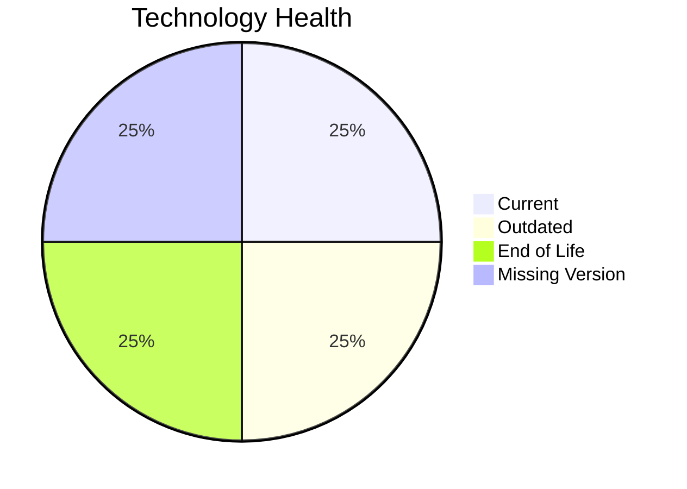

# Application Report: AuditApp-024

**ID:** app024
**Generated:** 2026-04-24

## Overview

| Attribute | Value |
|-----------|-------|
| Owner | Finance |
| Business Unit | Finance |
| Deployment Type | On-Premise |
| Business Criticality | High |
| Users | 95 |
| Servers | N/A |
| Architecture | 2-Tier |
| Solution Type | Custom made |
| CI/CD | No |
| Containerized | No |

## Technology Stack

| Component | Technology | Version | Status |
|-----------|-----------|---------|--------|
| Operating System | Windows Server 2019 | Windows Server 2019 | 🟢 CURRENT_VERSION |
| Language | VB.NET | VB.NET | 🟡 OUTDATED |
| Database | SQL Server 2014 | SQL Server 2014 | 🔴 EOL |
| App Server | Microsoft IIS 10.0 | Microsoft IIS 10.0 | ⚪ NO_KNOWLEDGE |

## Complexity Assessment

**Score:** 6/10 — **MEDIUM**
**Confidence:** 7

**Reasoning:** Tech age score 7/10 (1 EOL, 1 outdated components). Integration score 5/10 (3 external interfaces). Infrastructure score 3/10 (1 servers, 2 environments). Business criticality score 8/10 (criticality: High). Architecture score 6/10 (architecture: 2-Tier, containerized: No, CI/CD: No). Data score 4/10 (300GB storage).

### Contributing Factors

| Factor | Value |
|--------|-------|
| Servers | 1 |
| Environments | 2 |
| External Interfaces | 3 |
| EOL Technologies | 1 |
| Outdated Technologies | 1 |
| CI/CD | No |
| Containerized | No |

## Modernization Scenarios

### Applicable Scenarios

#### ✅ Application Migration to Cloud Infrastructure (Lift & Shift)

- **Priority:** High
- **Effort:** Low
- **Effects:** security, agility
- **Cost:** €5,783 (one-time)
- **Savings:** €2,700/year
- **Reasoning:** Application is deployed On-Premise. Cloud migration (Lift & Shift) is applicable.

#### ✅ Application Containerization

- **Priority:** High
- **Effort:** High
- **Effects:** agility, cost, sustainability
- **Cost:** €115,653 (one-time)
- **Savings:** €90,000/year
- **Reasoning:** Custom/open-source application not yet containerized is a strong candidate for containerization.

#### ✅ Application Refactoring and De-coupling

- **Priority:** High
- **Effort:** High
- **Effects:** agility, cost, sustainability
- **Cost:** €289,133 (one-time)
- **Savings:** €135,000/year
- **Reasoning:** Custom application with '2-tier' architecture may benefit from refactoring for better agility.

#### ✅ Upgrade Legacy Databases

- **Priority:** High
- **Effort:** Medium
- **Effects:** security, agility
- **Cost:** €11,565 (one-time)
- **Savings:** €10,000/year
- **Reasoning:** Database 'SQL Server 2014' is EOL. Upgrade to a supported version is recommended.

#### ✅ Switch DB Engine to open-source database solution

- **Priority:** High
- **Effort:** Medium
- **Effects:** cost
- **Cost:** N/A (one-time)
- **Savings:** N/A
- **Reasoning:** Database 'SQL Server 2014' is a proprietary/commercial database. Switching to open-source (e.g., PostgreSQL) would reduce licensing costs.

#### ✅ Update outdated components

- **Priority:** High
- **Effort:** High
- **Effects:** security, agility, cost
- **Cost:** N/A (one-time)
- **Savings:** N/A
- **Reasoning:** Programming language 'VB.NET' is OUTDATED. Component updates are needed.

### Not Applicable / Other

| Scenario | Status | Reason |
|----------|--------|--------|
| Operating System Update | FULFILLED | Operating system 'Windows Server 2019' is currently supported and up to date.... |
| Switch to standard Linux Operating System | NOT_APPLICABLE | Exclusion criterion: Application runs on Windows-based OS.... |
| Switch to ARM-based CPU | BLOCKED | Legacy Windows OS is not ARM-compatible for server workloads.... |
| Applications Server replacement | LACK_OF_DATA | Lifecycle data for application server 'Microsoft IIS 10.0' is not available.... |

## Financial Summary

| Metric | Value |
|--------|-------|
| Total One-Time Cost | €422,134 |
| Total Yearly Savings | €237,700 |
| Break-Even | 1.8 years |
