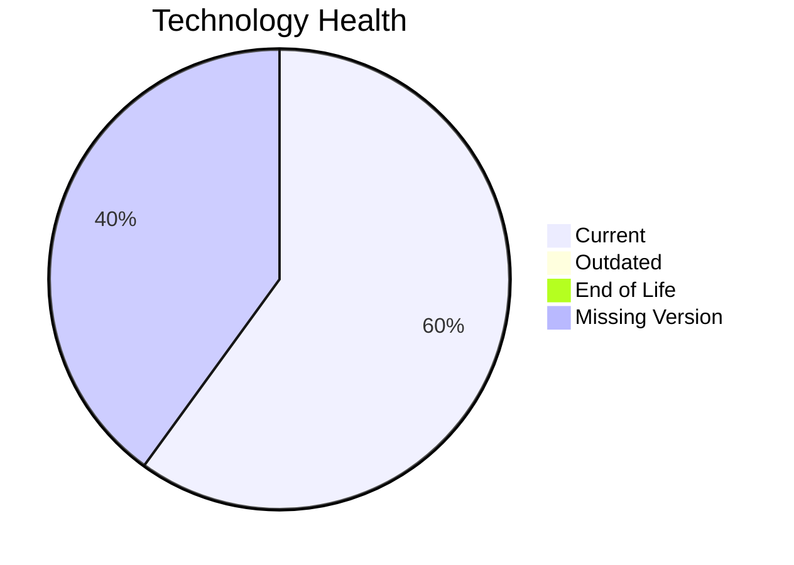

# Application Report: PortalApp-025

Modernization assessment for PortalApp-025 based solely on the Excel portfolio row and derived workflow outputs.

**ID:** app025  
**Generated:** 2026-05-07

## Overview

| Attribute | Value |
|-----------|-------|
| Owner | Operations |
| Environment | AWS |
| Business Criticality | Medium |
| Users | 2200 |
| Servers | sv36, sv37 |

## Technology Stack

| Component | Technology | Version | Status |
|-----------|-----------|---------|--------|
| Operating System | Windows Server | 2019 | 🟢 |
| Database | PostgreSQL | 15 | 🟢 |
| Language | ASP.NET Core | unknown | ⚪ |
| Framework | ASP.NET Core | unknown | ⚪ |
| App Server | Microsoft IIS | 10.0 | 🟢 |

## Complexity Assessment

**Score:** 6/10 — **MEDIUM**  
**Confidence:** 7

| Factor | Score | Notes |
|--------|-------|-------|
| Technology Age | 5/10 | 0 EOL, 0 outdated, 2 unknown lifecycle components. |
| Integration | 8/10 | 15 external interfaces and 35 API endpoints indicate the integration footprint. |
| Infrastructure | 5/10 | 2 listed server instances and 3 environments drive infrastructure coordination. |
| Business Criticality | 7/10 | Business criticality is Medium with approximately 2200 users. |
| Architecture | 6/10 | 2-tier architecture still carries coupling risk |
| Data | 7/10 | database storage is 800 GB; large database footprint |

## Modernization Scenarios

### Applicable Scenarios

#### ✅ Application Refactoring and De-coupling

- **Priority:** High
- **Effort:** High
- **Effects:** agility, cost, sustainability
- **Cost:** €289133 (one-time)
- **Savings:** €135000/year
- **Reasoning:** Architecture and complexity indicators suggest a refactoring/de-coupling opportunity.

### Not Applicable / Other

| Scenario | Status | Reason |
|----------|--------|--------|
| Operating System Update | FULFILLED | Operating system Windows Server 2019 is already on a supported version. |
| Switch to standard Linux Operating System | NOT_APPLICABLE | The application already runs on Windows; this Linux standardization scenario is not a natural fit. |
| Switch to ARM-based CPU | LACK_OF_DATA | CPU architecture is not present in the Excel input, so the primary ARM migration trigger cannot be confirmed. |
| Applications Server replacement | FULFILLED | Application server Microsoft IIS 10.0 is already current. |
| Application Migration to Cloud Infrastructure (Lift & Shift) | FULFILLED | The application is already hosted on AWS, which fulfills the lift-and-shift cloud target. |
| Application Containerization | FULFILLED | The application is already containerized. |
| Upgrade Legacy Databases | FULFILLED | Database platform PostgreSQL 15 is already current. |
| Switch DB Engine to open-source database solution | FULFILLED | Database engine PostgreSQL 15 is already open-source aligned. |
| Update outdated components | LACK_OF_DATA | Application runtime component versions are incomplete or unknown. |

## Financial Summary

| Metric | Value |
|--------|-------|
| Total One-Time Cost | €289133 |
| Total Yearly Savings | €135000 |
| Break-Even | 2.1 years |
