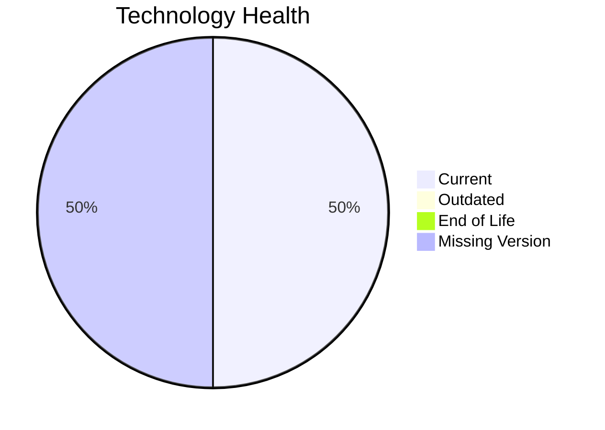

# Application Report: PortalApp-025

**ID:** app025
**Generated:** 2026-04-24

## Overview

| Attribute | Value |
|-----------|-------|
| Owner | Operations |
| Business Unit | Operations |
| Deployment Type | AWS |
| Business Criticality | Medium |
| Users | 2200 |
| Servers | 2 |
| Architecture | 2-Tier |
| Solution Type | Custom made |
| CI/CD | Yes |
| Containerized | Yes |

## Technology Stack

| Component | Technology | Version | Status |
|-----------|-----------|---------|--------|
| Operating System | Windows Server 2019 | Windows Server 2019 | 🟢 CURRENT_VERSION |
| Language | ASP.NET Core | ASP.NET Core | ⚪ NO_KNOWLEDGE |
| Database | PostgreSQL 15 | PostgreSQL 15 | 🟢 CURRENT_VERSION |
| App Server | Microsoft IIS 10.0 | Microsoft IIS 10.0 | ⚪ NO_KNOWLEDGE |

## Complexity Assessment

**Score:** 5/10 — **MEDIUM**
**Confidence:** 7

**Reasoning:** Tech age score 5/10 (0 EOL, 0 outdated components). Integration score 9/10 (15 external interfaces). Infrastructure score 5/10 (2 servers, 3 environments). Business criticality score 5/10 (criticality: Medium). Architecture score 3/10 (architecture: 2-Tier, containerized: Yes, CI/CD: Yes). Data score 4/10 (800GB storage).

### Contributing Factors

| Factor | Value |
|--------|-------|
| Servers | 2 |
| Environments | 3 |
| External Interfaces | 15 |
| EOL Technologies | 0 |
| Outdated Technologies | 0 |
| CI/CD | Yes |
| Containerized | Yes |

## Modernization Scenarios

### Applicable Scenarios

#### ✅ Application Refactoring and De-coupling

- **Priority:** High
- **Effort:** High
- **Effects:** agility, cost, sustainability
- **Cost:** €251,420 (one-time)
- **Savings:** €135,000/year
- **Reasoning:** Custom application with '2-tier' architecture may benefit from refactoring for better agility.

### Not Applicable / Other

| Scenario | Status | Reason |
|----------|--------|--------|
| Operating System Update | FULFILLED | Operating system 'Windows Server 2019' is currently supported and up to date.... |
| Switch to standard Linux Operating System | NOT_APPLICABLE | Exclusion criterion: Application runs on Windows-based OS.... |
| Switch to ARM-based CPU | BLOCKED | Legacy Windows OS is not ARM-compatible for server workloads.... |
| Applications Server replacement | LACK_OF_DATA | Lifecycle data for application server 'Microsoft IIS 10.0' is not available.... |
| Application Migration to Cloud Infrastructure (Lift & Shift) | FULFILLED | Application is already deployed on cloud: 'AWS'.... |
| Application Containerization | FULFILLED | Application is already containerized.... |
| Upgrade Legacy Databases | FULFILLED | Database 'PostgreSQL 15' is on a currently supported version.... |
| Switch DB Engine to open-source database solution | FULFILLED | Database 'PostgreSQL 15' is already an open-source solution.... |
| Update outdated components | LACK_OF_DATA | Lifecycle status of 'ASP.NET Core' is unknown.... |

## Financial Summary

| Metric | Value |
|--------|-------|
| Total One-Time Cost | €251,420 |
| Total Yearly Savings | €135,000 |
| Break-Even | 1.9 years |
