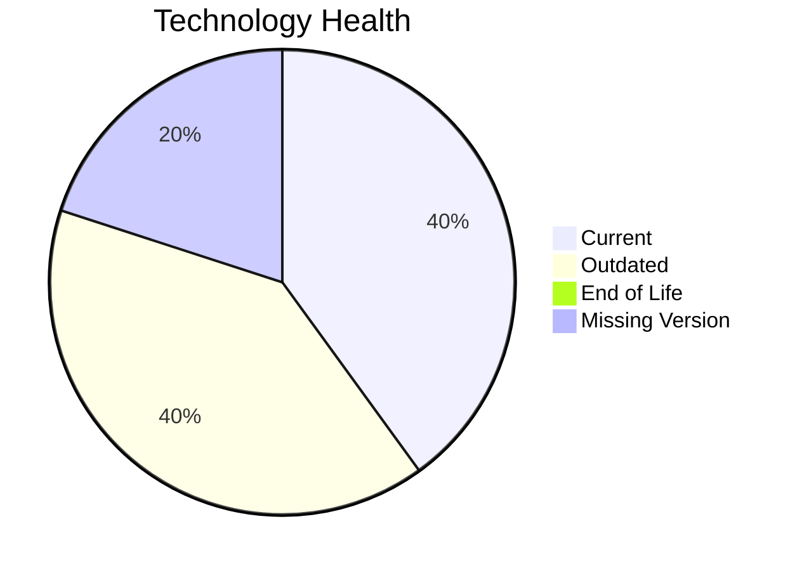

# Application Report: PortalApp-025

**ID:** app025  
**Generated:** 2026-05-14

## Overview

| Attribute | Value |
|-----------|-------|
| Owner | unknown |
| Environment | AWS |
| Business Criticality | Medium |
| Users | 2200 |
| Servers | sv36, sv37 |

## Technology Stack

| Component | Technology | Version | Status |
|-----------|-----------|---------|--------|
| os | Windows Server 2019 | 2019 | 🟢 CURRENT_VERSION |
| database | PostgreSQL 15 | 15 | 🟢 CURRENT_VERSION |
| language | ASP.NET Core | unknown | 🟡 OUTDATED |
| framework | Framework | unknown | ⚪ NO_KNOWLEDGE |
| app_server | Microsoft IIS 10.0 | 10.0 | 🟡 OUTDATED |

## Complexity Assessment

**Score:** 5/10 — **MEDIUM**  
**Confidence:** 8

**Reasoning:** Tech age 4/10 (0 EOL, 2 outdated components), integrations 15 interfaces and 0 dependencies, infrastructure 2 servers/3 environments, criticality Medium, architecture score 4/10, data score 7/10.

## Modernization Scenarios

### Applicable Scenarios

#### ✅ Switch to standard Linux Operating System
- **Cost:** €302 (one-time)
- **Savings:** €400/year
- **Reasoning:** Current OS (Windows Server 2019) is non-standard for Linux consolidation.
#### ✅ Switch to ARM-based CPU
- **Cost:** €5028 (one-time)
- **Savings:** €1000/year
- **Reasoning:** Cloud-hosted workload can be evaluated for ARM-based instances.
#### ✅ Applications Server replacement
- **Cost:** €10057 (one-time)
- **Savings:** €10800/year
- **Reasoning:** Application server Microsoft IIS 10.0 is outdated/EOL.
#### ✅ Application Refactoring and De-coupling
- **Cost:** €251420 (one-time)
- **Savings:** €135000/year
- **Reasoning:** Monolithic/tightly integrated footprint suggests refactoring benefits.

### Not Applicable / Other

| Scenario | Status | Reason |
|----------|--------|--------|
| Operating System Update | FULFILLED | Windows Server 2019 appears current. |
| Application Migration to Cloud Infrastructure (Lift & Shift) | FULFILLED | Application is already deployed in cloud. |
| Application Containerization | FULFILLED | Application is already containerized. |
| Upgrade Legacy Databases | FULFILLED | Database engine appears current. |
| Switch DB Engine to open-source database solution | FULFILLED | Application already uses open-source database engine. |
| Update outdated components | APPLICABLE | Outdated or EOL components identified in technology assessment. |

## Financial Summary

| Metric | Value |
|--------|-------|
| Total One-Time Cost | €266807 |
| Total Yearly Savings | €147200 |
| Break-Even | 1.8 years |
