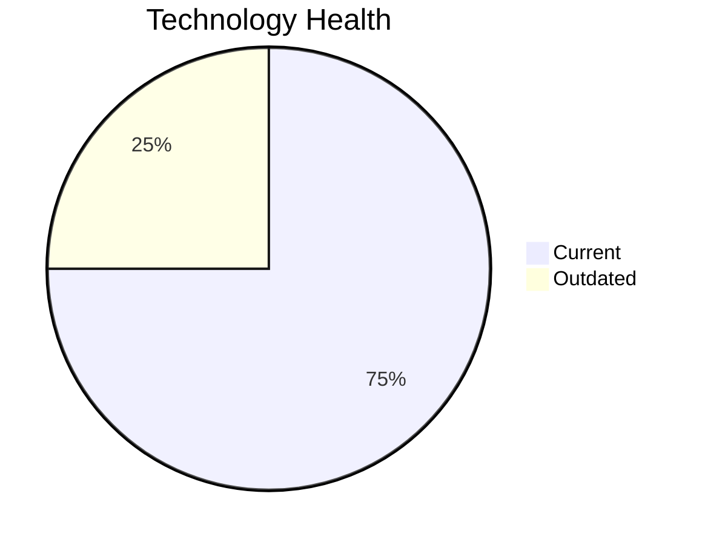

# Application Report: PortalApp-025

**ID:** app025
**Generated:** 2026-05-14

## Overview

| Attribute | Value |
|-----------|-------|
| Business Unit | Operations |
| Business Criticality | Medium |
| Solution Type | Custom made |
| Deployment Type | AWS |
| Users | 2200 |
| Servers | 2 |
| External Interfaces | 15 |
| Containerized | Yes |
| CI/CD Present | Yes |
| Architecture | 2-Tier |

## Technology Stack

| Component | Technology | Version | Status |
|-----------|-----------|---------|--------|
| Os | Windows Server | 2019 | 🟢 CURRENT_VERSION |
| Language | .NET Core | unknown | 🟡 OUTDATED |
| Database | PostgreSQL | 15 | 🟢 CURRENT_VERSION |
| App Server | Microsoft IIS | 10.0 | 🟢 CURRENT_VERSION |

## Complexity Assessment

**Score:** 5/10 — **MEDIUM**
**Confidence:** 7

Score 5/10 (MEDIUM): EOL components=0, Outdated=1, Interfaces=15, Servers=2, Criticality=Medium, Architecture=2-Tier.

| Factor | Value |
|--------|-------|
| Servers | 2 |
| Environments | 3 |
| Interfaces | 15 |
| EOL Technologies | 0 |
| Outdated Technologies | 1 |
| Business Criticality | Medium |

## Modernization Scenarios

### Applicable Scenarios

#### ✅ Application Refactoring and De-coupling

- **Priority:** High
- **Effort:** High
- **Effects:** agility, cost, sustainability
- **One-Time Cost:** $251,420
- **Annual Savings:** $135,000/year
- **Reasoning:** Application uses 2-tier architecture. Decoupling into separate frontend/backend services is applicable.

#### ✅ Update outdated components

- **Priority:** High
- **Effort:** High
- **Effects:** security, agility, cost
- **Reasoning:** Application has outdated components. Updating them will improve security and maintainability.

### Other Scenarios

| Scenario | Status | Reason |
|----------|--------|--------|
| Operating System Update | ✔️ FULFILLED | Operating system Windows Server 2019 is on a current, supported version within its vendor support li... |
| Switch to standard Linux Operating System | ❌ NOT_APPLICABLE | Application runs on Windows Server (Windows Server 2019). The scenario excludes Windows-based OS. |
| Switch to ARM-based CPU | ❓ LACK_OF_DATA | CPU architecture is not explicitly documented as x86/x64. Cannot confirm primary trigger for ARM mig... |
| Applications Server replacement | ✔️ FULFILLED | Application server Microsoft IIS 10.0 is on a current supported version. |
| Application Migration to Cloud Infrastructure (Lift & Shift) | ✔️ FULFILLED | Application is already deployed on cloud infrastructure (AWS). |
| Application Containerization | ✔️ FULFILLED | Application is already containerized (is_containerized=Yes). |
| Upgrade Legacy Databases | ✔️ FULFILLED | Database PostgreSQL 15 is on a current, supported version. |
| Switch DB Engine to open-source database solution | ✔️ FULFILLED | Database PostgreSQL 15 is already an open-source/license-free solution. |