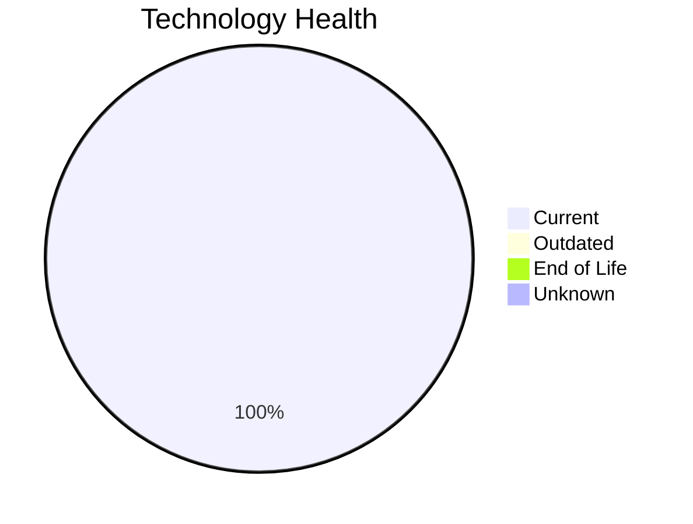

# Application Report: PortalApp-025

**ID:** app025  
**Generated:** 2026-05-15

## Overview

| Attribute | Value |
|-----------|-------|
| Business Unit | Operations |
| Deployment | AWS |
| Business Criticality | Medium |
| Users | 2200 |
| Solution Type | Custom made |
| Architecture | 2-Tier |
| Containerized | Yes |
| CI/CD | Yes |
| External Interfaces | 15 |

## Technology Stack

| Component | Technology | Status |
|-----------|-----------|--------|
| Operating System | Windows Server 2019 | 🟢 Current |
| Database | PostgreSQL 15 | 🟢 Current |
| Language | ASP.NET Core | 🟢 Current |
| App Server | Microsoft IIS 10.0 | 🟢 Current |

## Complexity Assessment

**Score:** 5/10 — **MEDIUM**  
**Confidence:** 8

| Factor | Score | Notes |
|--------|-------|-------|
| Technology Age | 2/10 | All components current or well-supported |
| Integration | 8/10 | 15 external interfaces, 0 dependencies — highly integrated |
| Infrastructure | 5/10 | 2 server instances, 3 environments |
| Business Criticality | 6/10 | Business criticality: medium, 2200 users |
| Architecture | 4/10 | 2-tier architecture; containerized; CI/CD present |
| Data | 4/10 | 800 GB data storage |

## Modernization Scenarios

### Applicable Scenarios

#### ✅ Switch to ARM-based CPU

- **Priority:** Medium
- **Effort:** Medium
- **Effects:** cost, sustainability
- **One-time Cost:** €5,028
- **Yearly Savings:** €1,000/year
- **Reasoning:** Application is cloud-deployed and containerized. ARM-based instances (e.g., AWS Graviton) can reduce costs.

### Other Scenarios

| Scenario | Status | Reason |
|----------|--------|--------|
| Operating System Update | ✔️ Fulfilled | OS 'Windows Server 2019' is on a current, supported version with no end-of-life ... |
| Switch to standard Linux Operating System | ➖ N/A | Application runs on Windows (Windows Server 2019). Scenario excludes Windows-bas... |
| Applications Server replacement | ✔️ Fulfilled | Application server 'Microsoft IIS 10.0' is on a current, supported version. |
| Application Migration to Cloud Infrastructure (Lift & Shift) | ✔️ Fulfilled | Application is already deployed in the cloud. |
| Application Containerization | ✔️ Fulfilled | Application is already containerized. |
| Application Refactoring and De-coupling | ➖ N/A | Application architecture does not indicate a need for major refactoring. |
| Upgrade Legacy Databases | ✔️ Fulfilled | Database 'PostgreSQL 15' is on a current, supported version. |
| Switch DB Engine to open-source database solution | ✔️ Fulfilled | Database 'PostgreSQL 15' is already an open-source engine. |
| Update outdated components | ✔️ Fulfilled | All assessed components are on current, supported versions. |

## Business Case Summary

| Metric | Value |
|--------|-------|
| Total One-time Cost | €5,028 |
| Total Yearly Savings | €1,000 |
| ROI Break-even | 5.0 years |
