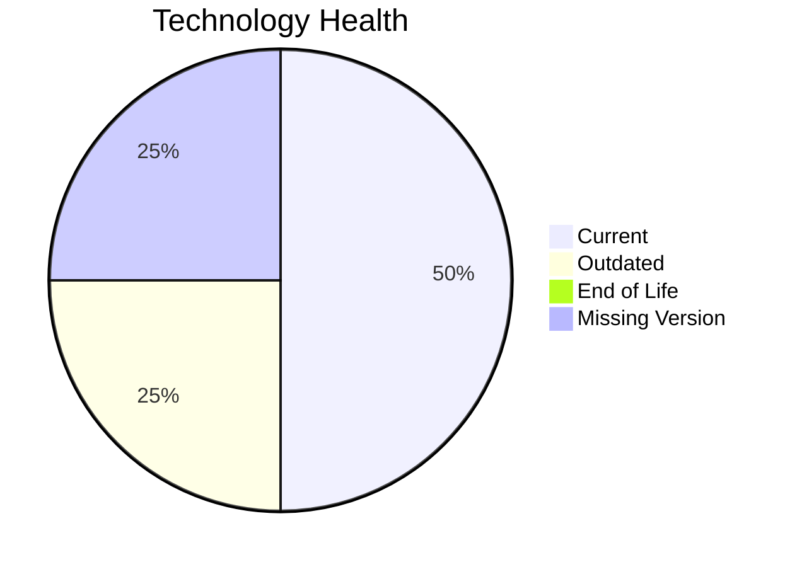

# Application Report: PortalApp-025

**ID:** app025
**Generated:** 2026-05-07

## Overview

| Attribute | Value |
|-----------|-------|
| Owner | N/A |
| Environment | AWS |
| Business Criticality | Medium |
| Users | 2200 |
| Servers | 2 |

## Technology Stack

| Component | Technology | Version | Status |
|-----------|-----------|---------|--------|
| Operating System | Windows Server | 2019 | 🟡 OUTDATED |
| Database | PostgreSQL | 15 | 🟢 CURRENT_VERSION |
| Language | N/A | N/A | ⚪ NO_KNOWLEDGE |
| Framework | ASP.NET Core | unknown | ⚪ NO_KNOWLEDGE |
| App Server | IIS | 10.0 | 🟢 CURRENT_VERSION |

## Complexity Assessment

**Score:** 5/10 — **MEDIUM**
**Confidence:** 6

| Factor | Score | Notes |
|--------|-------|-------|
| Technology Age | 5/10 | One outdated component was found. |
| Integration | 8/10 | The application exposes 15 interfaces, indicating heavy integration. |
| Infrastructure | 5/10 | 2 servers and 3 environments indicate moderate infrastructure complexity. |
| Business Criticality | 6/10 | Criticality is 'Medium' with 2200 users. |
| Architecture | 3/10 | A 2-tier architecture suggests some legacy coupling. Containerization lowers modernization friction. CI/CD lowers delivery risk. |
| Data | 5/10 | Database footprint (800 GB) indicates moderate data migration effort. |

## Modernization Scenarios

### Applicable Scenarios

#### ✅ Operating System Update

- **Priority:** High
- **Effort:** Low
- **Effects:** security
- **Cost:** €1,006 (one-time)
- **Savings:** €500/year
- **Reasoning:** Windows Server 2019 is still supported but is an older generation than Windows Server 2022.

#### ✅ Application Refactoring and De-coupling

- **Priority:** High
- **Effort:** High
- **Effects:** agility, cost, sustainability
- **Cost:** €251,420 (one-time)
- **Savings:** €135,000/year
- **Reasoning:** The architecture indicates coupling or legacy structure that would benefit from refactoring.

### Not Applicable / Other

| Scenario | Status | Reason |
|----------|--------|--------|
| Switch to standard Linux Operating System | NOT_APPLICABLE | The scenario excludes Windows-based operating systems. |
| Switch to ARM-based CPU | LACK_OF_DATA | CPU architecture is not present in the workbook, so ARM suitability cannot be validated. |
| Applications Server replacement | FULFILLED | IIS 10.0 remains supported on current Windows Server releases. |
| Application Migration to Cloud Infrastructure (Lift & Shift) | FULFILLED | Application is already hosted on AWS, which satisfies the public cloud hosting indicator. |
| Application Containerization | FULFILLED | The workbook explicitly marks the application as containerized. |
| Upgrade Legacy Databases | FULFILLED | PostgreSQL 15 remains within community support. |
| Switch DB Engine to open-source database solution | FULFILLED | The application already uses an open-source or open-source-compatible database engine. |
| Update outdated components | LACK_OF_DATA | Version evidence is incomplete for one or more application components. |

## Financial Summary

| Metric | Value |
|--------|-------|
| Total One-Time Cost | €252,426 |
| Total Yearly Savings | €135,500 |
| Break-Even | 1.9 years |
