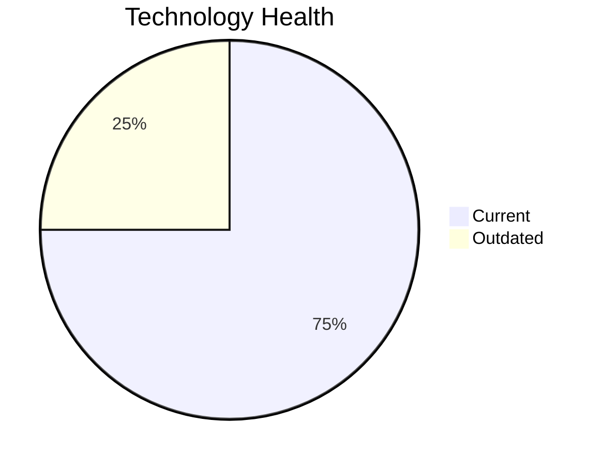

# Application Report: PortalApp-025

**ID:** app025  
**Generated:** 2026-05-05

## Overview

| Attribute | Value |
|-----------|-------|
| Business Unit | Operations |
| Deployment Type | AWS |
| Business Criticality | Medium |
| Users | 2200 |
| Servers | sv36, sv37 |
| Environments | 3 |
| Architecture | 2-Tier |
| Containerized | Yes |
| CI/CD | Yes |
| Solution Type | Custom made |
| Data Classification | Internal |

> Customer self-service portal for shipment tracking, billing, and service requests

## Technology Stack

| Component | Technology | Version | Status |
|-----------|-----------|---------|--------|
| Os | Windows Server | 2019 | 🟢 CURRENT_VERSION |
| Database | PostgreSQL | 15 | 🟢 CURRENT_VERSION |
| Language | .NET Core | unspecified | 🟡 OUTDATED |
| Application Server | Microsoft IIS | 10.0 | 🟢 CURRENT_VERSION |

## Complexity Assessment

**Score:** 5/10 — **MEDIUM**  
**Confidence:** 7

> Score 5/10 (MEDIUM). EOL components: 0, Outdated: 1. External interfaces: 15. Servers: 2. Criticality: Medium. Architecture: 2-Tier. DB storage: 800.0GB.

| Factor | Value |
|--------|-------|
| Servers | 2 |
| Environments | 3 |
| External Interfaces | 15 |
| Business Criticality | Medium |
| EOL Technologies | 0 |
| Outdated Technologies | 1 |
| CI/CD | Yes |
| Containerized | Yes |

## Modernization Scenarios

### ✅ Applicable Scenarios

#### ✅ Application Refactoring and De-coupling

- **Priority:** High
- **Effort:** High
- **One-Time Cost:** €251,420
- **Yearly Savings:** €135,000
- **Reasoning:** Application has a 2-tier architecture with limited modularity. Refactoring and decoupling would improve maintainability and cloud-readiness.

#### ✅ Update Outdated Components

- **Priority:** High
- **Effort:** High
- **Reasoning:** Outdated/EOL application components detected: .NET Core unspecified (OUTDATED). These should be updated to current supported versions.

### Other Scenarios

| Scenario | Status | Reason |
|----------|--------|--------|
| Operating System Update | ✔️ FULFILLED | Operating system Windows Server 2019 is current and supported. |
| Switch to Standard Linux OS | ❌ NOT_APPLICABLE | Application runs on Windows OS. Scenario is excluded for Windows-based systems. |
| Switch to ARM-based CPU | ❌ NOT_APPLICABLE | Application runs on Windows OS, which is excluded from ARM migration per scenario criteria. |
| Application Server Replacement | ✔️ FULFILLED | Application server Microsoft IIS 10.0 is current. |
| Application Migration to Cloud (Lift & Shift) | ✔️ FULFILLED | Application is already hosted on cloud (AWS). Lift & Shift is not needed. |
| Application Containerization | ✔️ FULFILLED | Application is already containerized. |
| Upgrade Legacy Databases | ✔️ FULFILLED | Database PostgreSQL 15 is on a current supported version. |
| Switch DB Engine to Open-Source | ✔️ FULFILLED | Application already uses an open-source database engine (PostgreSQL 15). |

## Financial Summary

| Metric | Value |
|--------|-------|
| Total One-Time Cost | €251,420 |
| Total Yearly Savings | €135,000 |
| Break-Even | 1.9 years |
