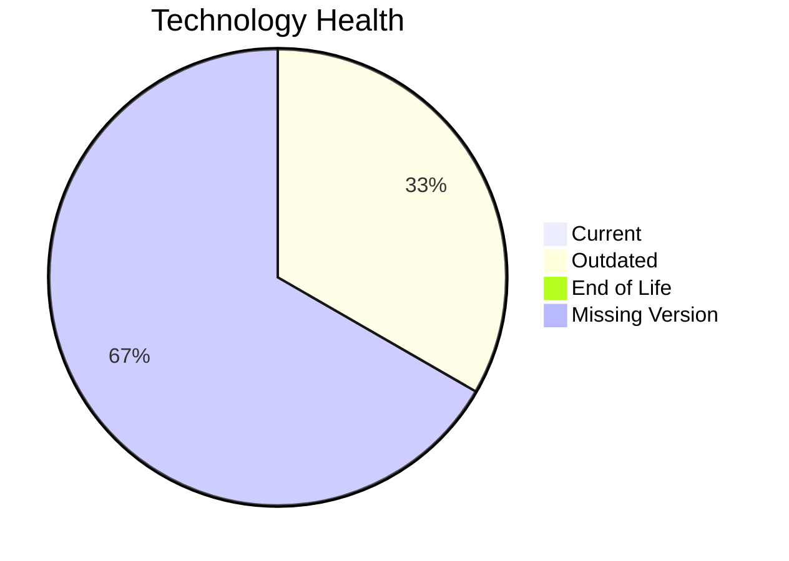

# Application Report: LegacyFinApp-026

Modernization assessment for LegacyFinApp-026 based solely on the Excel portfolio row and derived workflow outputs.

**ID:** app026  
**Generated:** 2026-05-07

## Overview

| Attribute | Value |
|-----------|-------|
| Owner | Finance |
| Environment | On-Premise |
| Business Criticality | Critical |
| Users | 150 |
| Servers | sv38 |

## Technology Stack

| Component | Technology | Version | Status |
|-----------|-----------|---------|--------|
| Operating System | AIX | 7.2 | 🟡 |
| Database | DB2 | unknown | ⚪ |
| Language | Fortran | 2018 | ⚪ |
| Framework | N/A | N/A | ⚪ |
| App Server | N/A | N/A | ⚪ |

## Complexity Assessment

**Score:** 6/10 — **MEDIUM**  
**Confidence:** 7

| Factor | Score | Notes |
|--------|-------|-------|
| Technology Age | 5/10 | 0 EOL, 1 outdated, 2 unknown lifecycle components. |
| Integration | 2/10 | 1 external interfaces and 0 API endpoints indicate the integration footprint. |
| Infrastructure | 2/10 | 1 listed server instances and 2 environments drive infrastructure coordination. |
| Business Criticality | 10/10 | Business criticality is Critical with approximately 150 users. |
| Architecture | 10/10 | 1-tier architecture suggests a tightly coupled legacy design; application is not containerized; CI/CD is not present |
| Data | 7/10 | database storage is 1500 GB; large database footprint; proprietary or enterprise database migration complexity |

## Modernization Scenarios

### Applicable Scenarios

#### ✅ Operating System Update

- **Priority:** High
- **Effort:** Low
- **Effects:** security
- **Cost:** €1157 (one-time)
- **Savings:** €500/year
- **Reasoning:** Operating system AIX 7.2 is outdated and matches the OS update trigger.

#### ✅ Switch to standard Linux Operating System

- **Priority:** Medium
- **Effort:** Medium
- **Effects:** agility, security, cost
- **Cost:** €347 (one-time)
- **Savings:** €400/year
- **Reasoning:** The application runs on proprietary Unix, which is a direct trigger for standard Linux migration.

#### ✅ Application Migration to Cloud Infrastructure (Lift & Shift)

- **Priority:** High
- **Effort:** Low
- **Effects:** security, agility
- **Cost:** €5783 (one-time)
- **Savings:** €2700/year
- **Reasoning:** The application is still on-premise and matches the lift-and-shift trigger.

#### ✅ Application Refactoring and De-coupling

- **Priority:** High
- **Effort:** High
- **Effects:** agility, cost, sustainability
- **Cost:** €289133 (one-time)
- **Savings:** €135000/year
- **Reasoning:** Architecture and complexity indicators suggest a refactoring/de-coupling opportunity.

#### ✅ Switch DB Engine to open-source database solution

- **Priority:** High
- **Effort:** Medium
- **Effects:** cost
- **Cost:** N/A (one-time)
- **Savings:** N/A/year
- **Reasoning:** Database engine DB2 is proprietary and matches the open-source migration trigger.

### Not Applicable / Other

| Scenario | Status | Reason |
|----------|--------|--------|
| Switch to ARM-based CPU | LACK_OF_DATA | CPU architecture is not present in the Excel input, so the primary ARM migration trigger cannot be confirmed. |
| Applications Server replacement | NOT_APPLICABLE | No application server is listed for this application. |
| Application Containerization | BLOCKED | The application runs on legacy AIX, which is a poor fit for straightforward containerization. |
| Upgrade Legacy Databases | LACK_OF_DATA | Database technology is known but its version support status is not. |
| Update outdated components | LACK_OF_DATA | Application runtime component versions are incomplete or unknown. |

## Financial Summary

| Metric | Value |
|--------|-------|
| Total One-Time Cost | €296420 |
| Total Yearly Savings | €138600 |
| Break-Even | 2.1 years |
