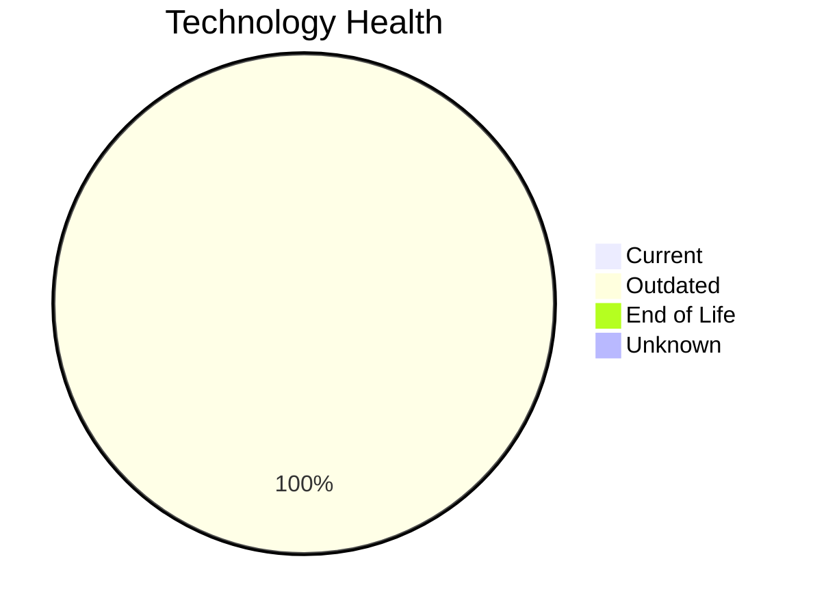

# Application Report: LegacyFinApp-026

**ID:** app026  
**Generated:** 2026-05-15

## Overview

| Attribute | Value |
|-----------|-------|
| Business Unit | Finance |
| Deployment | On-Premise |
| Business Criticality | Critical |
| Users | 150 |
| Solution Type | Custom made |
| Architecture | 1-Tier |
| Containerized | No |
| CI/CD | No |
| External Interfaces | 1 |

## Technology Stack

| Component | Technology | Status |
|-----------|-----------|--------|
| Operating System | AIX 7.2 | 🟡 Outdated |
| Database | DB2 | 🟡 Outdated |
| Language | FORTRAN 2018 | 🟡 Outdated |
| App Server | None | — |

## Complexity Assessment

**Score:** 6/10 — **MEDIUM**  
**Confidence:** 8

| Factor | Score | Notes |
|--------|-------|-------|
| Technology Age | 5/10 | 3 outdated components — some modernization needed |
| Integration | 4/10 | 1 external interfaces — some integrations |
| Infrastructure | 3/10 | 1 server instance(s), 2 environment(s) |
| Business Criticality | 10/10 | Business criticality: critical, 150 users |
| Architecture | 10/10 | monolithic 1-tier architecture; not containerized; no CI/CD; legacy language: fortran 2018 |
| Data | 6/10 | IBM DB2 — complex legacy database; 1500 GB data storage |

## Modernization Scenarios

### Applicable Scenarios

#### ✅ Operating System Update

- **Priority:** High
- **Effort:** Low
- **Effects:** security
- **One-time Cost:** €1,157
- **Yearly Savings:** €500/year
- **Reasoning:** OS 'AIX 7.2' is outdated and aging. Update to a currently supported version is recommended.

#### ✅ Switch to standard Linux Operating System

- **Priority:** Medium
- **Effort:** Medium
- **Effects:** agility, security, cost
- **One-time Cost:** €347
- **Yearly Savings:** €400/year
- **Reasoning:** OS 'AIX 7.2' is a proprietary non-standard OS (AIX/HP-UX). Standardization on Linux reduces licensing costs and improves maintainability.

#### ✅ Application Migration to Cloud Infrastructure (Lift & Shift)

- **Priority:** High
- **Effort:** Low
- **Effects:** security, agility
- **One-time Cost:** €5,783
- **Yearly Savings:** €2,700/year
- **Reasoning:** Application is fully on-premise. Migration to cloud (Lift & Shift) can reduce infrastructure costs and improve agility.

#### ✅ Application Refactoring and De-coupling

- **Priority:** High
- **Effort:** High
- **Effects:** agility, cost, sustainability
- **One-time Cost:** €289,133
- **Yearly Savings:** €135,000/year
- **Reasoning:** Monolithic architecture with no modern decomposition. Refactoring into services would improve maintainability and scalability.

#### ✅ Upgrade Legacy Databases

- **Priority:** High
- **Effort:** Medium
- **Effects:** security, agility
- **One-time Cost:** €11,565
- **Yearly Savings:** €10,000/year
- **Reasoning:** Database 'DB2' is outdated. Upgrading to a current version is recommended.

#### ✅ Switch DB Engine to open-source database solution

- **Priority:** High
- **Effort:** Medium
- **Effects:** cost
- **One-time Cost:** N/A
- **Yearly Savings:** N/A
- **Reasoning:** IBM DB2 has high licensing costs. Migrating to an open-source database (PostgreSQL) would reduce costs.

#### ✅ Update outdated components

- **Priority:** High
- **Effort:** High
- **Effects:** security, agility, cost
- **One-time Cost:** N/A
- **Yearly Savings:** N/A
- **Reasoning:** Component(s) detected as outdated. Targeted component updates recommended.

### Other Scenarios

| Scenario | Status | Reason |
|----------|--------|--------|
| Switch to ARM-based CPU | ❓ No Data | On-premise application. CPU architecture not specified in available data. |
| Applications Server replacement | ➖ N/A | No application server identified for this application. |
| Application Containerization | 🚫 Blocked | Legacy language (FORTRAN 2018) makes containerization technically very challengi... |

## Business Case Summary

| Metric | Value |
|--------|-------|
| Total One-time Cost | €307,985 |
| Total Yearly Savings | €148,600 |
| ROI Break-even | 2.1 years |
