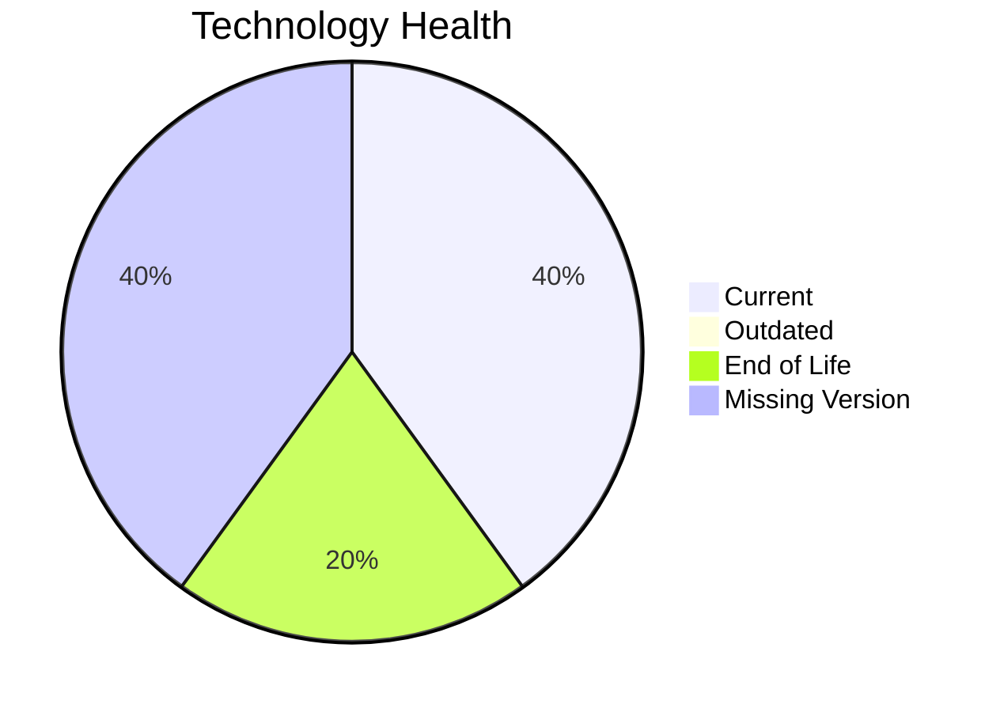

# Application Report: LegacyFinApp-026

**ID:** app026
**Generated:** 2026-05-14

## Overview

| Attribute | Value |
|-----------|-------|
| Owner | Finance |
| Environment | On-Premise |
| Business Criticality | Critical |
| Users | 150 |
| Servers | sv38 |

## Technology Stack

| Component | Technology | Status |
|-----------|-----------|--------|
| Operating System | AIX 7.2 | 🔴 |
| Database | DB2 | 🟢 |
| Language | FORTRAN 2018 | 🟢 |

## Complexity Assessment

**Score:** 6/10 — **MEDIUM**

## Modernization Scenarios

### ✅ Os Update Security Patch
- **Reasoning:** EOL operating system/server components require security remediation.

### ✅ Switch To Standard Linux Os
- **Reasoning:** Current OS footprint includes non-standard enterprise OS variants.

### ✅ App Deployment To Cloud
- **Reasoning:** On-premise deployment model is a direct cloud-migration opportunity.

### ✅ App Containerization
- **Reasoning:** Application is not containerized and can benefit from platform standardization.

### ✅ App Refactor Decoupling
- **Reasoning:** High coupling and/or monolithic architecture indicates refactor opportunity.

## Financial Summary

| Metric | Value |
|--------|-------|
| Total One-Time Cost | €446769 |
| Total Yearly Savings | €253560 |
| Break-Even | 1.8 years |
