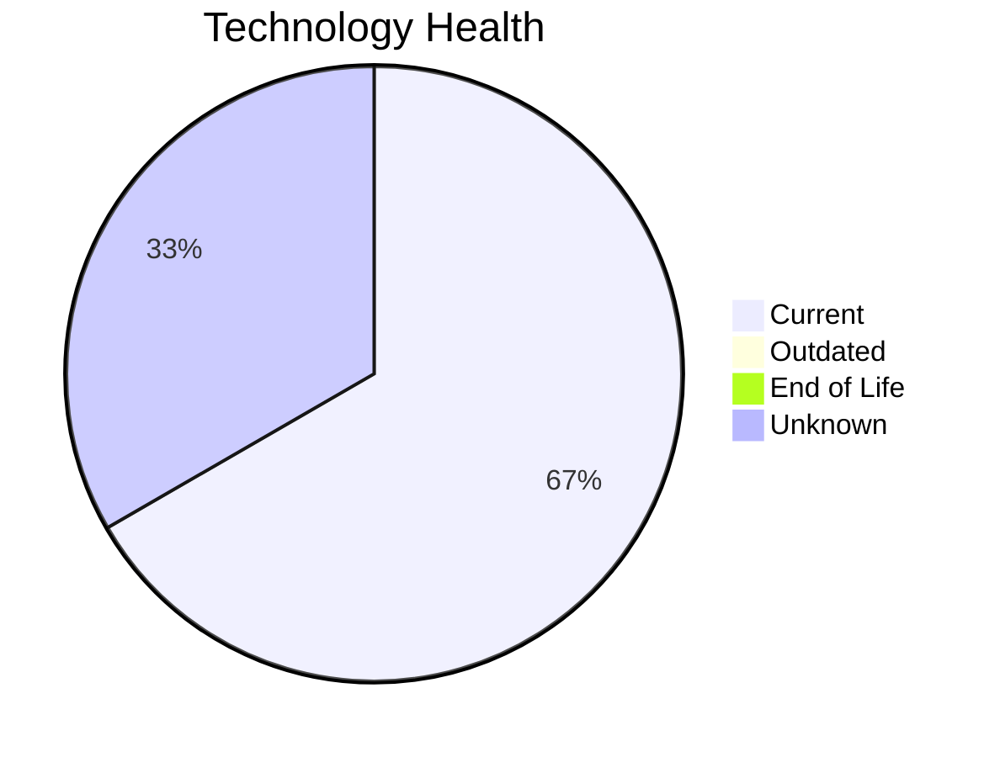

# Application Report: LegacyFinApp-026

**ID:** app026
**Generated:** 2026-05-14

## Overview

| Attribute | Value |
|-----------|-------|
| Owner | Finance |
| Environment | On-Premise |
| Business Criticality | Critical |
| Users | 150 |
| Servers | 1 |
| Solution Type | Custom made |
| Architecture | 1-Tier |
| Containerized | No |
| CI/CD | No |

## Technology Stack

| Component | Technology | Version | Status |
|-----------|-----------|---------|--------|
| Os | AIX 7.2 | 7.2 | 🟢 CURRENT_VERSION |
| Database | DB2 |  | ⚪ NO_KNOWLEDGE |
| Programming Language | FORTRAN 2018 | 2018 | 🟢 CURRENT_VERSION |

## Complexity Assessment

**Score:** 5/10 — **MEDIUM**
**Confidence:** 8/10

| Factor | Score | Notes |
|--------|-------|-------|
| Technology Age | 2/10 | 0 EOL, 0 outdated components |
| Integration | 3/10 | 1 external interfaces |
| Infrastructure | 4/10 | 1 server(s), 2 environment(s) |
| Business Criticality | 9/10 | Critical criticality |
| Architecture | 5/10 | Containerized: No, CI/CD: No |
| Data | 5/10 | DB: DB2 |

## Modernization Scenarios

### Applicable Scenarios

#### ✅ Switch to standard Linux Operating System

- **Priority:** Medium
- **Effort:** Medium
- **Effects:** agility, security, cost
- **Cost:** €302 (one-time)
- **Savings:** €400/year
- **Reasoning:** Application runs on proprietary Unix (AIX 7.2) which lacks container support and is not supported by cloud providers. Migrating to standard Linux would reduce costs and improve cloud readiness.

#### ✅ Application Migration to Cloud Infrastructure (Lift & Shift)

- **Priority:** High
- **Effort:** Low
- **Effects:** security, agility
- **Cost:** €5,028 (one-time)
- **Savings:** €2,700/year
- **Reasoning:** Application is on-premise. Cloud migration (Lift & Shift) offers improved scalability, security, and compliance benefits.

#### ✅ Application Refactoring and De-coupling

- **Priority:** High
- **Effort:** High
- **Effects:** agility, cost, sustainability
- **Cost:** €251,420 (one-time)
- **Savings:** €135,000/year
- **Reasoning:** Application has monolithic 1-Tier architecture with high coupling. Decoupling into modular services would significantly improve agility and maintainability.

#### ✅ Switch DB Engine to open-source database solution

- **Priority:** High
- **Effort:** Medium
- **Effects:** cost
- **Cost:** €25,142 (one-time)
- **Savings:** €15,000/year
- **Reasoning:** Application uses proprietary database DB2. Migration to an open-source alternative would reduce costs.

### Not Applicable / Other

| Scenario | Status | Reason |
|----------|--------|--------|
| Operating System Update | ✔️ FULFILLED | Operating system AIX 7.2 is on a current, supported version. |
| Switch to ARM-based CPU | 🚫 BLOCKED | Application runs on proprietary Unix (AIX 7.2), which is incompatible with ARM migration. |
| Applications Server replacement | ❌ NOT_APPLICABLE | Application has no dedicated application server. Scenario not applicable. |
| Application Containerization | 🚫 BLOCKED | Application runs on proprietary Unix OS (AIX 7.2), which does not support containerization. |
| Upgrade Legacy Databases | ❓ LACK_OF_DATA | Cannot assess database lifecycle status for DB2 without version information. |
| Update outdated components | ✔️ FULFILLED | All assessed application components are on current, supported versions. |

## Financial Summary

| Metric | Value |
|--------|-------|
| Total One-Time Cost | €281,892 |
| Total Yearly Savings | €153,100 |
| Break-Even | 1.8 years |
