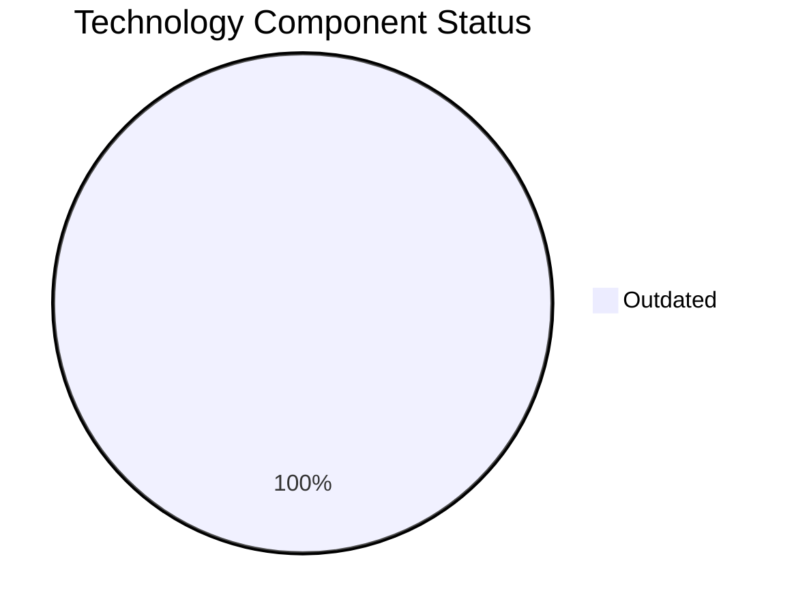

# LegacyFinApp-026 (app026)

> Analysis timestamp: 2025-07-15T00:00:00Z

## Application Overview

| Attribute | Value |
|-----------|-------|
| **Name** | LegacyFinApp-026 |
| **Status** | Production |
| **Criticality** | Critical |
| **Users** | 150 |
| **Solution Type** | Custom made |
| **Architecture** | 1-Tier |
| **Containerized** | No |
| **CI/CD** | No |
| **Environments** | 2 |
| **Servers** | s, v, 3, 8 |
| **External Interfaces** | 1 |

## Technology Stack

| Component | Value | Status |
|-----------|-------|--------|
| **Os** | AIX 7.2 | ⚠️ OUTDATED |
| **Language** | FORTRAN 2018 | ⚠️ OUTDATED |
| **Database** | DB2 | ⚠️ OUTDATED |

## Technology Health

## Complexity Assessment

**Score: 6/10 — MEDIUM**

3 outdated component(s) require attention; 1 external interfaces drive integration complexity; 4 server(s) across 2 environment(s); Business criticality is Critical.

| Factor | Value |
|--------|-------|
| Servers | 4 |
| Environments | 2 |
| External Interfaces | 1 |
| EOL Technologies | 0 |
| Outdated Technologies | 3 |
| CI/CD Present | No |
| Containerized | No |

## Modernization Scenarios

| Scenario | Status | Reason |
|----------|--------|--------|
| OS Security Patch | 🔧 APPLICABLE | Operating system AIX 7.2 is OUTDATED and requires security patching/upgrade. |
| Switch to Linux | 🔧 APPLICABLE | Application runs on AIX 7.2; migration to standard Linux would improve portabili... |
| ARM CPU | 🚫 BLOCKED | Application uses FORTRAN 2018 which is tightly coupled to x86/mainframe architec... |
| App Server Replace | ➖ NOT_APPLICABLE | Application does not use an application server. |
| Cloud Deploy | 🚫 BLOCKED | Application runs on AIX 7.2 which is tightly coupled to proprietary hardware. |
| Containerization | 🚫 BLOCKED | FORTRAN application is not suitable for containerization. |
| Refactor/Decouple | 🔧 APPLICABLE | 1-Tier monolithic architecture is a high-priority candidate for refactoring and ... |
| DB Upgrade | 🔧 APPLICABLE | Database DB2 is OUTDATED and should be upgraded. |
| Open Source DB | 🔧 APPLICABLE | Database DB2 is proprietary; switching to open source would reduce licensing cos... |
| Update Components | 🔧 APPLICABLE | Application has EOL or outdated components that require updating. |

## Financial Summary

| Metric | Value |
|--------|-------|
| Total Implementation Cost | $331,114.65 |
| Total Annual Savings | $160,900.00 |
| Payback Period | 2.06 years |
| 5-Year Net Benefit | $473,385.35 |

### Applicable Scenario Costs

| Scenario | Impl. Cost | Annual Savings | Payback |
|----------|-----------|----------------|---------|
| OS Security Patch | $1,156.53 | $500.00 | 2.31 yrs |
| Switch to Linux | $346.96 | $400.00 | 0.87 yrs |
| Refactor/Decouple | $289,132.60 | $135,000.00 | 2.14 yrs |
| DB Upgrade | $11,565.30 | $10,000.00 | 1.16 yrs |
| Open Source DB | $28,913.26 | $15,000.00 | 1.93 yrs |
