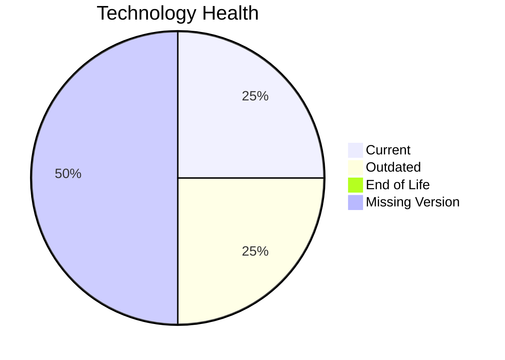

# Application Report: LegacyFinApp-026

**ID:** app026
**Generated:** 2026-05-18T00:00:00Z

## Overview

| Attribute | Value |
|-----------|-------|
| Owner | Finance |
| Environment | On-Premise |
| Business Criticality | Critical |
| Users | 150 |
| Servers | 1 |

## Technology Stack

| Component | Technology | Version | Status |
|-----------|-----------|---------|--------|
| Operating System | AIX | 7.2 | 🟡 OUTDATED |
| Database | DB2 | unknown | ⚪ NO_KNOWLEDGE |
| Language | FORTRAN | 2018 | ⚪ NO_KNOWLEDGE |
| Framework | N/A | N/A | ⚪ N/A |
| App Server | None | none | 🟢 CURRENT_VERSION |

## Complexity Assessment

**Score:** 6/10 — **MEDIUM**
**Confidence:** 7

| Factor | Score | Notes |
|--------|-------|-------|
| Technology Age | 5/10 | One component is outdated. |
| Integration | 2/10 | 1 external interfaces and 0 API endpoints. |
| Infrastructure | 4/10 | 1 server instance(s) across 2 environment(s). |
| Business Criticality | 9/10 | Criticality is Critical with 150 users. |
| Architecture | 9/10 | Architecture is 1-Tier; containerized=No; CI/CD=No. |
| Data | 6/10 | Database storage is 1500 GB on DB2.  |

## Modernization Scenarios

### Applicable Scenarios

#### ✅ Operating System Update

- **Priority:** High
- **Effort:** Low
- **Effects:** security
- **Cost:** €1,157 (one-time)
- **Savings:** €500/year
- **Reasoning:** AIX 7.2 is assessed as OUTDATED.

#### ✅ Switch to standard Linux Operating System

- **Priority:** Medium
- **Effort:** Medium
- **Effects:** agility, security, cost
- **Cost:** €347 (one-time)
- **Savings:** €400/year
- **Reasoning:** The application runs on proprietary AIX, which is a direct trigger for migration to a standard Linux distribution.

#### ✅ Application Migration to Cloud Infrastructure (Lift & Shift)

- **Priority:** High
- **Effort:** Low
- **Effects:** security, agility
- **Cost:** €5,783 (one-time)
- **Savings:** €2,700/year
- **Reasoning:** The application is still on-premise, which is the main trigger for lift-and-shift cloud migration.

#### ✅ Application Refactoring and De-coupling

- **Priority:** High
- **Effort:** High
- **Effects:** agility, cost, sustainability
- **Cost:** €289,133 (one-time)
- **Savings:** €135,000/year
- **Reasoning:** Architecture and integration signals indicate a tightly coupled estate that would benefit from refactoring.

#### ✅ Switch DB Engine to open-source database solution

- **Priority:** High
- **Effort:** Medium
- **Effects:** cost
- **Cost:** €N/A (one-time)
- **Savings:** €N/A/year
- **Reasoning:** DB2 is a proprietary engine, so moving to an open-source database is a valid modernization option.

### Not Applicable / Other

| Scenario | Status | Reason |
|----------|--------|--------|
| Switch to ARM-based CPU | BLOCKED | The current OS/platform choice is a blocker for an ARM move in the scenario definition. |
| Applications Server replacement | FULFILLED | No separate application server is in use, so no replacement scenario is needed. |
| Application Containerization | BLOCKED | The application runs on legacy Unix (AIX), which is listed as a containerization blocker. |
| Upgrade Legacy Databases | LACK_OF_DATA | DB2 is assessed as NO_KNOWLEDGE. |
| Update outdated components | LACK_OF_DATA | Component versions are too incomplete to determine whether an update program is required. |

## Financial Summary

| Metric | Value |
|--------|-------|
| Total One-Time Cost | €296,420 |
| Total Yearly Savings | €138,600 |
| Break-Even | 2.1 years |
