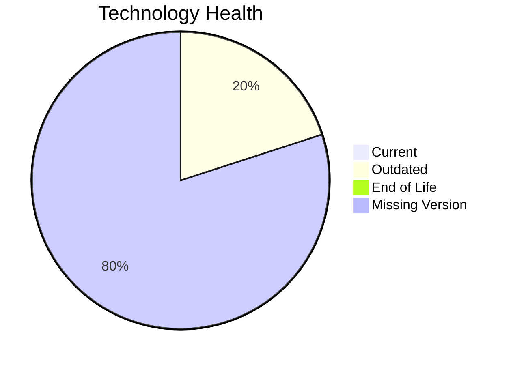

# Application Report: LegacyFinApp-026

**ID:** app026  
**Generated:** 2026-05-14

## Overview

| Attribute | Value |
|-----------|-------|
| Owner | unknown |
| Environment | On-Premise |
| Business Criticality | Critical |
| Users | 150 |
| Servers | sv38 |

## Technology Stack

| Component | Technology | Version | Status |
|-----------|-----------|---------|--------|
| os | AIX 7.2 | 7.2 | 🟡 OUTDATED |
| database | DB2 | 2 | ⚪ NO_KNOWLEDGE |
| language | FORTRAN 2018 | 2018 | ⚪ NO_KNOWLEDGE |
| framework | Framework | unknown | ⚪ NO_KNOWLEDGE |
| app_server | Application Server | unknown | ⚪ NO_KNOWLEDGE |

## Complexity Assessment

**Score:** 5/10 — **MEDIUM**  
**Confidence:** 8

**Reasoning:** Tech age 3/10 (0 EOL, 1 outdated components), integrations 1 interfaces and 0 dependencies, infrastructure 1 servers/2 environments, criticality Critical, architecture score 8/10, data score 9/10.

## Modernization Scenarios

### Applicable Scenarios

#### ✅ Operating System Update
- **Cost:** €1006 (one-time)
- **Savings:** €500/year
- **Reasoning:** AIX 7.2 requires upgrade/security patching.
#### ✅ Switch to standard Linux Operating System
- **Cost:** €302 (one-time)
- **Savings:** €400/year
- **Reasoning:** Current OS (AIX 7.2) is non-standard for Linux consolidation.
#### ✅ Application Migration to Cloud Infrastructure (Lift & Shift)
- **Cost:** €5028 (one-time)
- **Savings:** €2700/year
- **Reasoning:** Application appears on-premise and is a cloud migration candidate.
#### ✅ Application Containerization
- **Cost:** €100568 (one-time)
- **Savings:** €90000/year
- **Reasoning:** Containerization could improve portability and operations.
#### ✅ Application Refactoring and De-coupling
- **Cost:** €251420 (one-time)
- **Savings:** €135000/year
- **Reasoning:** Monolithic/tightly integrated footprint suggests refactoring benefits.

### Not Applicable / Other

| Scenario | Status | Reason |
|----------|--------|--------|
| Switch to ARM-based CPU | NOT_APPLICABLE | On-premise hosting makes ARM migration less direct. |
| Applications Server replacement | NOT_APPLICABLE | No dedicated application server indicated. |
| Upgrade Legacy Databases | LACK_OF_DATA | Database lifecycle could not be determined. |
| Switch DB Engine to open-source database solution | APPLICABLE | Proprietary database engine indicates open-source migration opportunity. |
| Update outdated components | APPLICABLE | Outdated or EOL components identified in technology assessment. |

## Financial Summary

| Metric | Value |
|--------|-------|
| Total One-Time Cost | €358324 |
| Total Yearly Savings | €228600 |
| Break-Even | 1.6 years |
