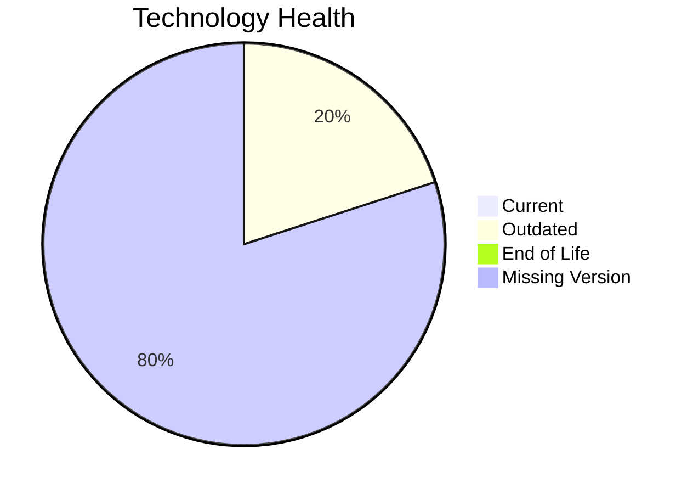

# Application Report: LegacyFinApp-026

**ID:** app026  
**Generated:** 2026-05-17

## Overview

| Attribute | Value |
|-----------|-------|
| Owner | unknown |
| Environment | On-Premise |
| Business Criticality | Critical |
| Users | 150 |
| Servers | sv38 |

## Technology Stack

| Component | Technology | Version | Status |
|-----------|-----------|---------|--------|
| Operating System | AIX 7.2 | 7.2 | 🟡 OUTDATED |
| Database | DB2 | 2 | ⚪ NO_KNOWLEDGE |
| Language | FORTRAN 2018 | 2018 | ⚪ NO_KNOWLEDGE |
| Framework | Unknown Framework | N/A | ⚪ NO_KNOWLEDGE |
| App Server | None | N/A | ⚪ NO_KNOWLEDGE |

## Complexity Assessment

**Score:** 5/10 — **MEDIUM**  
**Confidence:** 6

Tech age 4/10 (EOL=0, outdated=1, unknown=4); integration 3/10 (1 interfaces); infrastructure 5/10 (1 servers, 2 envs); criticality 5/10 (Critical); architecture 9/10 (arch=1-Tier, containerized=No, ci/cd=No); data 5/10 (1 DB(s), storage≈1500GB).

## Modernization Scenarios

### Applicable Scenarios

#### ✅ Operating System Update
- **Priority:** High
- **Effort:** Low
- **Effects:** security
- **Cost:** €1006 (one-time)
- **Savings:** €500/year
- **Reasoning:** Operating system is outdated/EOL in technology assessment.

#### ✅ Switch to standard Linux Operating System
- **Priority:** Medium
- **Effort:** Medium
- **Effects:** agility, security, cost
- **Cost:** €302 (one-time)
- **Savings:** €400/year
- **Reasoning:** Application runs on proprietary/non-standard Unix OS.

#### ✅ Application Migration to Cloud Infrastructure (Lift & Shift)
- **Priority:** High
- **Effort:** Low
- **Effects:** security, agility
- **Cost:** €5028 (one-time)
- **Savings:** €2700/year
- **Reasoning:** Application remains on-premise and is candidate for lift-and-shift.

#### ✅ Application Refactoring and De-coupling
- **Priority:** High
- **Effort:** High
- **Effects:** agility, cost, sustainability
- **Cost:** €251420 (one-time)
- **Savings:** €135000/year
- **Reasoning:** High coupling/complexity indicates refactoring and decoupling potential.

#### ✅ Switch DB Engine to open-source database solution
- **Priority:** High
- **Effort:** Medium
- **Effects:** cost
- **Cost:** €N/A (one-time)
- **Savings:** €N/A/year
- **Reasoning:** Commercial database engine detected; open-source switch may reduce licensing.

#### ✅ Update outdated components
- **Priority:** High
- **Effort:** High
- **Effects:** security, agility, cost
- **Cost:** €N/A (one-time)
- **Savings:** €N/A/year
- **Reasoning:** Technology assessment found outdated/EOL components.

### Not Applicable / Other

| Scenario | Status | Reason |
|----------|--------|--------|
| Switch to ARM-based CPU | BLOCKED | Legacy/proprietary dependencies suggest ARM migration constraints. |
| Applications Server replacement | LACK_OF_DATA | No reliable application-server lifecycle evidence. |
| Application Containerization | LACK_OF_DATA | Containerization readiness data insufficient. |
| Upgrade Legacy Databases | LACK_OF_DATA | Database version/support data missing. |

## Financial Summary

| Metric | Value |
|--------|-------|
| Total One-Time Cost | €257756 |
| Total Yearly Savings | €138600 |
| Break-Even | 1.9 years |
